# Unix环境高级编程

## 第3章 文件IO

- 不带缓冲的IO：每个read和write都调用内核中的一个系统调用

### 3.3 open和openat

- `int openat(int fd, const char *path, int oflag, ... /* mode_t mode */`，openat是POSIX.1最新版本中新增的一类函数，希望解决两个问题：

  - 同一进程中的所有线程共享相同的当前工作目录，因此很难让同一进程的多个不同线程在同一时间工作在不同的目录中。openat可以让线程可以使用相对路径名打开目录中的文件，而不再只能打开当前工作目录

  - 避免time-of-check-to-time-of-use（TOCTTOU）错误

  - [关于TOCTTOU攻击的简介](https://www.cnblogs.com/liqiuhao/p/9450093.html)
  
    ```c
    if (access("file", W_OK) != 0)
      	exit(1);
    fd = open("file", "O_WRONLY");
    // actually, writing over /etc/passwd
  write(fd, buffer, sizeof(buffer));
    ```
  
    ```c
    // 攻击代码
    // after the access check
    symlink("/etc/passwd", "file");
    // before the open, "file" points to the password database
    ```

### 3.6 lseek

- lseek可以用来确定所涉及的文件是否可以设置偏移量。如果文件描述符指向的是一个管道、FIFO或网络套接字，则lseek返回-1，并将errno设置为ESPIPE

- 文件偏移量可以大于文件的当前长度，在这种情况下，对该文件的下一次写将加长该文件，并在文件中构成一个空洞，这一点是允许的。位于文件中但没有写过的字节都被读为0
- 文件中的空洞并不要求在磁盘上占用存储区。具体处理方式与文件系统的实现有关，当定位到超出文件尾端之后写时，对于新写的数据需要分配磁盘块，但是对于原文件尾端和新开始写位置之前的部分则不需要分配磁盘块

### 3.10 文件共享

- 内核使用3种数据结构表示打开文件

  - 每个进程的记录项只能够包含一张打开的文件描述符表。每个描述符占用一项，包括
    - 文件描述符标志（close_on_exec，执行时关闭）
    - 指向一个文件表项的指针
  - 内核为所有打开的文件维持一张文件表。每个文件表项包括
    - 文件状态标志（读、写、添加、同步和非阻塞等）
    - 当前文件偏移量
    - 指向该文件v节点表项的指针
  - 每个打开文件（或设备）都有一个v节点结构。v节点表项包括
    - 文件类型和对次文件进行各种操作函数的指针
    - 指向该文件的i节点的指针

  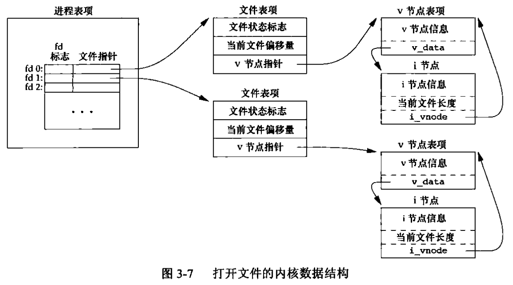

- 两个进程各自打开同一个文件

  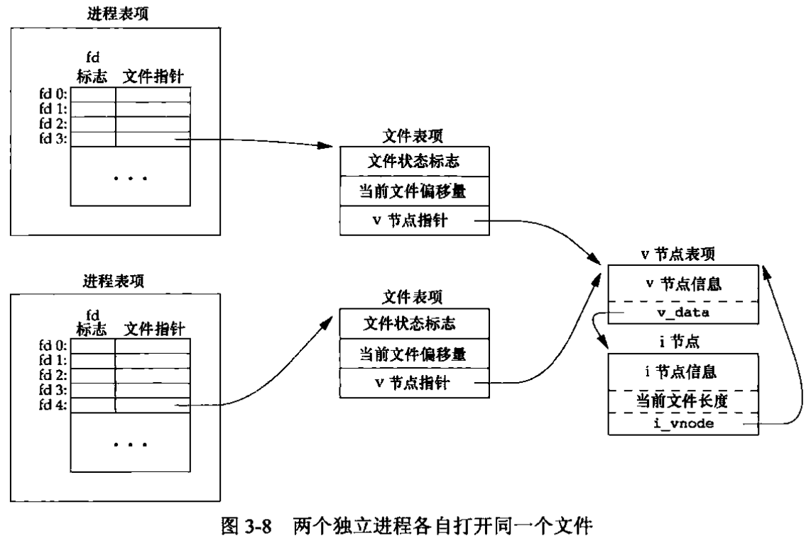

- 文件描述符标志和文件状态标志在作用范围方面的区别
  - 文件描述符标志只用于一个进程的一个描述符
  - 文件状态标志应用于指向该给定文件表项的任何进程中的所有描述符

### 3.11 原子操作

- 两个进程追加数据到一个文件造成的竞争问题
  - 早期的“先定位到文件尾端，然后写”的操作会造成两个进程之间形成竞争，因为在两个函数调用之间，内核有可能会临时挂起进程
  - 解决方法是提供一种原子操作，即在打开文件时设置O_APPEND标志，这样使得内核在每次写操作之前，都将进程的当前偏移量设置到该文件的尾端处，于是在每次写之前就不需要再调用lseek

- pread和pwrite
  - `ssize_t pread(int fd, void *buf, size_t nbytes, off_t offset)`
  - 调用pread相当于调用lseek后调用read，但是pread又与这种顺序调用有下列重要区别：
    - 调用pread时，无法中断其定位和读操作
    - 不再更新当前文件的偏移量

- 创建一个文件
  - 如果open函数同时指定O_CREATE和O_EXCL选项，那么当该文件存在时，open函数将失败。检查文件是否存在和创建文件这两个操作是作为一个原子操作执行的，如果没有这样一个原子操作，那么会造成两个进程的竞争问题

### 3.12 dup和dup2

- dup和dup2可用来复制一个现有的文件描述符

- dup(1)后的内核数据结构

  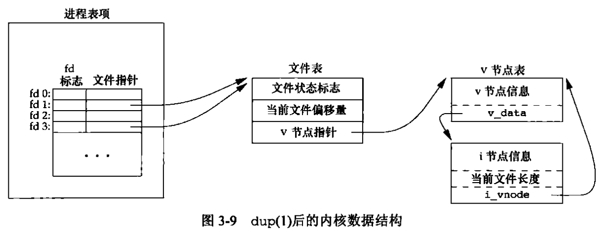

  - 因为两个文件描述符指向同一文件表项，所以它们共享同一文件状态标志，以及同一当前文件偏移量

- dup(fd)等价于fcntl(fd, F_DUPFD, 0)

- dup2(fd)不完全等价于

  ```c
  close(fd2);
  fcntl(fd, F_DUPFD, fd2)
  ```

  - dup2是一个原子操作，而close和fcntl包括两个函数调用。有可能在close和fcntl之间调用了信号捕获函数，它可能修改文件描述符。如果不同的线程改变了文件描述符的话也会出现相同的问题
  - dup2和fcntl有一些不同的errno

### 3.13 sync、fsync和fdatasync

- 传统的Unix系统实现在内核中设有缓冲区高速缓存和页高速缓存，大多数磁盘IO通过缓冲区进行。当我们向文件写入数据时，内核通常先将数据复制到缓冲区中，然后排入队列。晚些时候再写入磁盘，这种方式被称为延迟写
- 通常，当内核需要重用缓冲区来存放其他磁盘块数据时，它会把所有延迟写数据块写入磁盘。为了保证磁盘上实际文件系统与缓冲区中内容的一致性，Unix系统提供了sync、fsync和fdatasync三个函数
  - `int fsync(int fd)`，fsync只由文件描述符fd指定的一个文件起作用，并且等待写磁盘操作结束才返回
  - `int fdatasync(int fd)`，fdatasync类似于fsync，但它只影响文件的数据部分。而除数据外，fsync还会同步更新文件的属性
  - `void sync()`，sync只是将所有修改过的块缓冲区排入写队列，然后就返回它，它并不等待实际写磁盘操作结束。通常，称为update的系统守护进程周期性地调用sync函数

### 3.14 fcntl

- `int fcntl(int fd, int cmd, ... /* arg */)`

- fcntl可以改变已经打开文件的属性。fcntl有以下5种功能
  - 复制一个已有的描述符，cmd=F_DUPFD或F_DUPFD_CLOEXEC
  - 获取/设置文件描述符标志
  - 获取/设置文件状态标志
  - 获取/设置异步IO所有权
  - 或者/设置记录锁

### 3.15 ioctl

- `int ioctl(int fd, int request, ...)`
- ioctl是IO操作的杂物箱
- 每个设备驱动程序可以定义它自己专用的一组ioctl命令，系统则为不同种类的设备提供通用的ioctl命令

### 3.16 /dev/fd

- /dev/fd目录的目录项是名为0、1、2等的文件。打开/dev/fd/n等效于复制描述符n（假设描述符n是打开的）
- 在`fd = open(""/dev/fd/0", mode)`中，大多数系统忽略它所指定的mode，而另外一些系统则要求mode必须是所引用的文件初始打开时所使用的打开模式的一个子集。描述符fd与0共享同一文件表项
  - Linux实现中的/dev/fd是个例外。它把文件描述符映射成指向底层物理文件的符号链接。例如，当打开/dev/fd/0时，事实上正在打开与标准输入关联的文件，，因此返回的新文件描述符的模式与/dev/fd文件描述符的模式其实并不相关

- 某些系统提供/dev/stdin、/dev/stdout、/dev/stderr，这些等价于/dev/fd/0、/dev/fd/1和/dev/fd2
  - /dev/fd文件主要由shell使用，它允许使用路径名座位调用参数的程序，能用处理其他路径名的相同方式处理标准输入和输出。例如，cat命令对命令行参数采取了一种特殊处理，它将单独的一个字符“-”解释为标准输入，例如`filter file2 | cat file1 - file3 | lpr`，首先cat读file1，接着读其标准输入，然后读file3。如果支持/dev/fd，则可以删除cat对“-”的特殊处理：`filter file2 | cat file1 /dev/fd/0 file3 | lpr`

## 第4章 文件和目录

### 4.2 stat、fstat、lstat、fstatat

- lstat类似于stat，但是当命名的文件是一个符号链接时，lstat返回该符号链接的有关信息，而不是由该符号链接引用的文件的信息

### 4.3 文件类型

- 普通文件
- 目录文件
- 块特殊文件
  - 这种类型的文件提供对设备（如磁盘）带缓冲的访问，每次访问以固定长度为单位进行
- 字符特殊文件
  - 这种类型的文件提供对设备不带缓冲的访问，每次访问长度可变。系统中的所有设备要么是字符特殊文件，要么是块特殊文件

- FIFO
  - 用于进程间通信，有时也称为命名管道

- 套接字
  - 用于进程间的网络通信，或一台宿主机上进程之间的非网络通信

- 符号链接

### 4.4 用户ID和组ID

- 与一个进程相关联的ID有6个或更多
  - 实际用户ID和实际组ID标识我们究竟是谁。这两个字段在登录时取自口令文件中的登录项
  - 有效用户ID、有效组ID以及附属组ID决定了我们的文件访问权限
  - 保存的设置用户ID和保存的设置组ID在执行一个程序时包含了有效用户ID和有效组ID的副本

- 通常，有效用户ID等于实际用户ID，有效组ID等于实际组ID
- 当执行一个程序文件时，进程的有效用户ID通常就是实际用户ID，有效组ID通常是实际组ID。但是可以在文件模式字（st_mode）中设置一个特殊标志，其含义是“当执行此文件时，将进程的有效用户ID设置为文件所有者的用户ID（st_uid）”。与此类似地，在文件模式中可以设置另一位，它将执行此文件的进程的有效组ID设置为文件的组所有者ID（st_gid）。在文件模式中，这两位被称为设置用户ID位和设置组ID位

### 4.5 文件访问权限

- 所有文件类型都有访问权限

- 每个文件有9个访问权限位，可将它们分成3类

  

  - 当用名字打开任一类型的文件时，对该名字中包含的每一个目录，包括它可能隐含的当前工作目录都应具有执行权限。这就是为什么对于目录其执行权限位常被称为搜索位的原因。注意，对于目录的读权限和执行权限的意义是不相同的。读权限允许我们读目录，获得在该目录中所有文件名的列表
  - 为了在open函数中对一个文件指定O_TRUNC标志，必须对该文件具有写权限
  - 为了在一个目录中创建一个新文件，必须对包含该文件的目录具有写权限和执行权限
  - 为了删除一个现有文件，必须对包含该文件的目录具有写权限和执行权限，对该文件本身则不需要有读、写权限
  - 如果用7个exec函数中的任何一个执行某个文件，都必须对该文件具有执行权限。该文件还必须是一个普通文件

- 进程每次打开、创建或删除一个文件时，内核就进行文件访问权限测试，而这种测试可能涉及文件的所有者（st_uid和st_gid）、进程的有效ID（有效用户ID和有效组ID）以及进程的附属组（若支持的话）。两个所有者ID是文件的属性，而两个有效ID和附属组ID则是进程的性质。内核按顺序执行以下4步测试：
  - 若进程的有效用户ID是0（root），则允许访问
  - 若进程的有效用户ID等于文件的所有者ID，那么如果所有者适当的访问权限位被设置，则允许访问；否则拒绝访问。即，若进程为读/写/执行而打开该文件，则用户读/写/执行位应为1
  - 若进程的有效组ID或进程的附属组ID之一等于文件的组ID，那么如果适当的访问权限位被设置，则允许访问；否则拒绝访问
  - 若其他用户适当的访问权限位被设置，则允许访问；否则拒绝访问

### 4.6 新文件和目录的所有权

- 新文件的用户ID设置为进程的有效用户ID
- 关于组ID，POSIX.1允许实现下列之一作为新文件的组ID
  - 新文件的组ID可以是进程的有效组ID
  - 新文件的组ID可以是它所在目录的组ID

### 4.7 access和faccessat

- access和faccessat是按实际用户ID和实际组ID进行访问权限测试的
- 例如，当一个进程使用设置用户ID或设置组ID功能作为另一个用户（或组）运行时，就可能会有这种需要。即使一个进程可能已经通过设置用户ID以root权限允许，它仍可能想验证其实际用户ID能否访问一个给定的文件

### 4.8 umask

- umask为进程设置文件模式创建屏蔽字，并返回之前的值

- 当编写创建新文件的程序时，如果我们想确保指定的访问权限位已经激活，那么必须在进程运行时修改umask值

### 4.9 chmod、fchmod和fchmodat

```c
int chmod(const char *pathname, mode_t mode);
int fchmod(int fd, mode_t mode);
int fchmodat(int fd, const char *pathname, mode_t mode, int flag);
```

- 更改现有文件的访问权限

- 为了改变一个文件的权限位，进程的有效用户ID必须等于文件的所有者ID，或者该进程必须具有root权限

- 参数mode是下图所示常量的按位或

  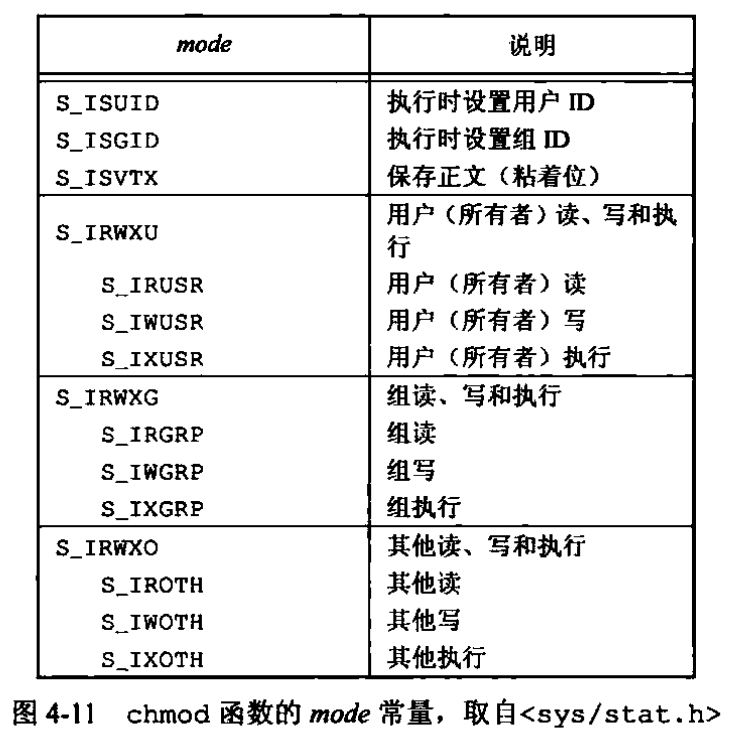

### 4.10 粘着位

- S_ISVTX

### 4.11 chown、fchown、fchownat、lchown

- 用于更改文件的用户ID和组ID。如果两个参数owner或group中的任意一个是-1，则对应的ID不变

### 4.12 文件长度

- stat结构成员st_size表示以字节为单位的文件长度。此字段只对普通文件、目录文件和符号链接有意义
  - 对于普通文件，其文件长度可以是0
  - 对于目录，文件长度通常是一个数的整倍数
  - 对于符号链接，文件长度是在文件名中的实际字节数

- 现在，大多数现代Unix系统提供字段st_blksize和st_blocks。其中，第一个是对文件I/O较合适的块长度，第二个是所分配的实际512字节块块数

### 4.13 文件截断

- truncate和ftruncate将一个现有的文件长度截断为length。多则截断，少则补足

### 4.14 文件系统

- 我们可以把一个磁盘分成一个或多个分区，每个分区可以包含一个文件系统。i节点是固定长度的记录项，它包含有关文件的大部分信息
  - 每个i节点中都有一个链接计数，其值是指向该i节点的目录项数。在stat结构中，链接计数包含在st_nlink成员中，其基本数据类型是nlink_t。这种链接类型称为硬链接
  - 另外一种链接类型称为符号链接，其i节点中的文件类型是S_IFLINK，于是系统知道这是一个符号链接
  - i节点包含了文件有关的所有信息：文件类型、文件访问权限位、文件长度和指向文件数据块的指针等。stat结构中的大多数信息都取自i节点。只有两项重要数据存放在目录项中：文件名和i节点编号
  - 因为目录项中的i节点编号指向同一文件系统中的相应i节点，一个目录项不能指向另一个文件系统的i节点。这就是为什么ln不能跨越文件系统的原因
  - 当在不更换文件系统的情况下为一个文件命名时，该文件的实际内容并未移动，只需要构造一个指向现有i节点的新目录项，并删除老的目录项。例如，未将文件/usr/lib/foo重命名为/usr/foo，如果目录/usr/lib和/usr在同一文件系统中，则文件foo的内容无需移动

### 4.15 link、linkat、unlink、unlinkat、remove

- link和linkat中设涉及的创建新目录项和增加链接计数操作应当是一个原子操作
- unlink和unlinkat删除目录项，并将有pathname所引用的链接计数减1
  - 只有当链接计数达到0时，该文件的内容才可被删除。另一个条件也会阻止删除文件的内容——只要有进程打开了该文件，其内容也不能删除。关闭一个文件时，内核首先检查打开该文件的进程个数，如果这个计数达到0，内核再去检查其链接计数，如果计数也是0，那么就删除该文件的内容

### 4.16 rename、renameat

### 4.17 符号链接

- 引入符号链接的原因是为了避开硬链接的一些限制
  - 硬链接通常要求链接和文件位于同一文件系统中
  - 只有root用户才能创建指向目录的硬链接（在底层文件系统支持的情况下）

- 使用符号链接可能在文件系统中引入循环。大多数查找路径名的函数在这种情况发生时都将出错返回，errno值为ELOOP

### 4.18 创建和读取符号链接

- symlink和symlinkat函数创建一个符号链接
- 因为open函数跟随符号链接，所以需要有一种方法打开该链接本身，并读该链接中的名字。readlink和readlinkat函数提供了这种功能

### 4.19 文件的时间

- 对每个文件维护3个时间字段，它们的意义如下图

  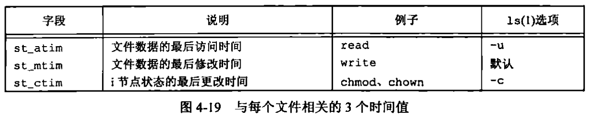

### 4.23 chdir、fchdir和getcwd

- 每个进程都有一个当前工作目录。当用户登录到Unix系统时，其当前工作目录通常是口令文件中该用户登录项的第6个字段——用户的起始目录。当前工作目录是进程的一个属性，起始目录则是登录名的一个属性
- 因为当前工作目录是进程的一个属性，所以它只影响调用chdir的进程本身，而不影响其他进程

- 因为内核必须维护当前工作目录的信息，所以我们应能获得其当前值。遗憾的是，内核为每个进程只保存指向该目录v节点的指针等目录本身的信息，并不保存该目录的完整路径名。我们需要一个函数，它从当前工作目录（.）开始，用..找到其上一级目录，然后读其目录项，直到该目录项中的i节点编号与工作目录i节点编号相同，这样就找到了其对应的文件名。按照这种方法，逐层上移，直到遇到根，这样就得到了当前工作目录完整的绝对路径名。很幸运，函数getcwd就提供了这种功能

### 4.24 设备特殊文件

- 每个文件系统所在的存储设备都由其主、次设备号表示。主设备号标识设备驱动程序，有时编码为与其通信的外设板；次设备号标识特定的子设备。一个磁盘驱动器经常包含若干个文件系统，在同一磁盘驱动器上的各文件系统通常具有相同的主设备号，但是次设备号却不同
- 我们通常可以使用两个宏：major和minor来访问主、次设备号，大多数实现都定义这两个宏
- 系统中与每个文件名关联的st_dev值是文件系统的设备号，该文件系统包含了这一文件名以及与其对应的i节点
- 只有字符特殊文件和块特殊文件才有st_rdev值。此值包含实际设备的设备号

### 4.25 文件访问权限位小结

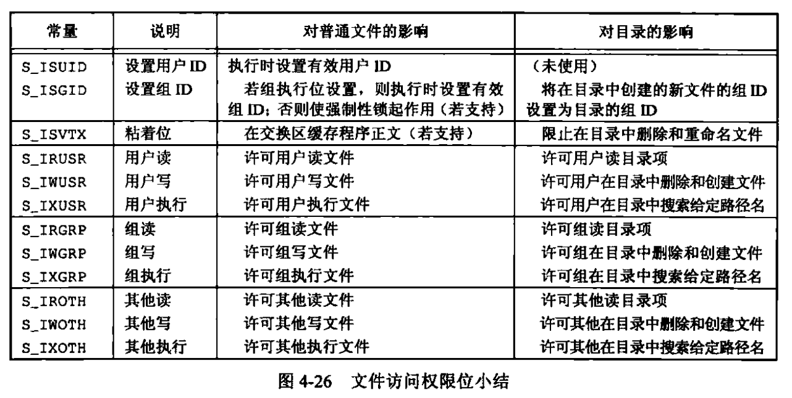

## 第5章 标准IO库

### 5.4 缓冲

- 标准IO库提供缓冲的目的是尽可能的减少使用read和write调用的次数。它也对每个IO流自动地进行缓冲管理，从而避免了应用程序需要考虑这一点所带来的麻烦
- 标准IO提供了以下3种类型的缓冲
  - 全缓冲。在这种情况下，在填满标准IO缓冲区后才进行实际IO操作
  - 行缓冲。在这种情况下，当在输入和输出中遇到换行符时，标准IO库执行IO操作。当流涉及一个终端时，通常使用行缓冲
  - 不带缓冲

- 标准错误流stderr通常是不带缓冲的
- ISO C要求下列缓冲特征
  - 当且仅当标准输入和标准输出并不指向交互式设备时，它们才是全缓冲的
  - 标准错误绝不会是全缓冲的

- 可以使用setbuf函数打开或关闭缓冲机制，使用setvbuf精确地说明所需的缓冲类型

### 5.9 二进制IO

- fread和fwrite
- 二进制IO的基本问题是，它只能用于读在同一系统上已写的数据，其原因是
  - 在一个结构中，同一成员的偏移量可能随编译程序和系统的不同而不同
  - 用来存储多字整数和浮点值的二进制格式在不同的系统结构间也可能不同

## 第6章 系统数据文件和信息

### 6.3 阴影口令

- 加密口令是经单向加密算法处理过的用户口令副本

### 6.4 组文件

- 在Unix系统中，对组的使用已经做了些更改。在V7中，每个用户任何时刻都只属于一个组。当用户登录时，系统就按口令文件记录项中的数组值ID，赋给他实际组ID。可以在任何时候执行newgrp以更改组ID。如果newgrp命令执行成功，则实际组ID就更改为新的组ID，它将被用于后续的文件访问权限检查

- 附属组ID的概念引入后，我们不仅可以属于口令文件记录项中组ID所对应的组，也可以属于多至16个另外的组。文件访问权限检查相应被修改为：不仅将进程的有效组ID与文件的组ID相比较，而且也将所有附属组ID与文件的组ID进行比较

- 使用附属组ID的优点是不必再显式地经常更改组。一个用户会参与多个项目，因此也就要同时属于多个组，此类情况是常有的

## 第7章 进程环境

### 7.2 main函数

- 当内核执行C程序时（使用一个exec函数），在调用main前先调用一个特殊的启动例程。可执行程序文件将此启动例程指定为程序的起始地址——这是由链接器设置的，而链接器则由C编译器调用。启动例程从内核取得命令行参数和环境变量值，然后为按上述方式调用main函数做好安排

### 7.3 进程终止

- 有8种方式使进程终止
  - 5种正常终止
    - 从main返回
    - 调用exit
    - 调用\_exit或\_Exit
    - 最后一个线程从其启动例程返回
    - 从最后一个线程调用pthread_exit
  - 3种异常终止
    - 调用abort
    - 接到一个信号
    - 最后一个线程对取消请求做出响应

- 启动例程是这样编写的，使得从main返回后立即调用exit函数，用C代码形式可表示为`exit(main(argc, argv))`

#### 1. 退出函数

- \_exit和\_Exit立即进入内核，exit则先进行一些清理处理，然后然后内核
- 由于历史原因，exit函数总是执行一个标准IO库的清理关闭操作：对于所有打开流调用fclose函数

#### 2. atexit

- 使用atexit来设置终止处理程序
- exit调用这些函数的顺序与他们登记时候的顺序相反。同一函数如若登记多次，也会被调用多次
- exit首先调用各终止处理程序，然后关闭（通过fclose）所有打开流

- 下图显示了一个C程序是如何启动的，以及它终止的各种方式

  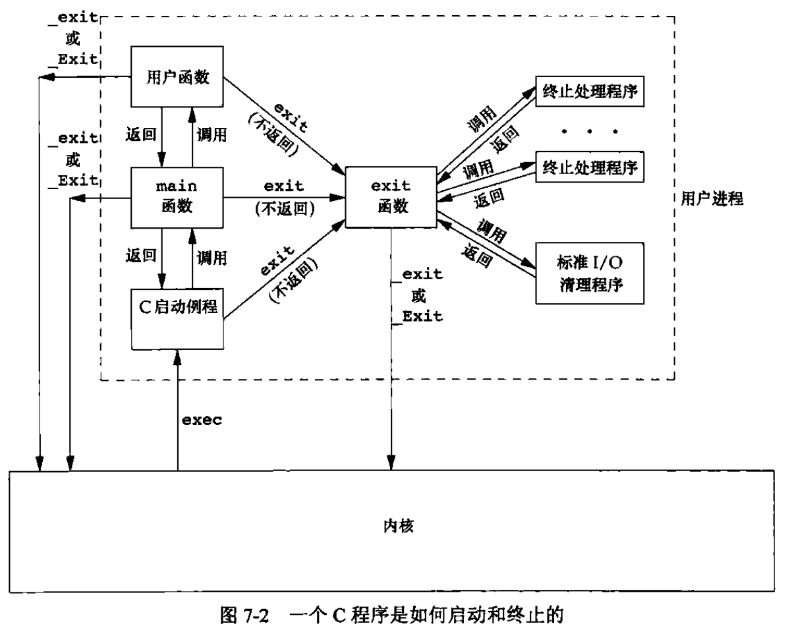

- 内核使程序执行的唯一方法是调用一个exec函数。进程自愿终止的唯一方法是显式或隐式地（通过调用exit）调用\_exit或\_Exit。进程也可非自愿的由一个信号使其终止 （上图中没有显示）

### 7.5 环境表

- 每个程序都接收到一张环境表

  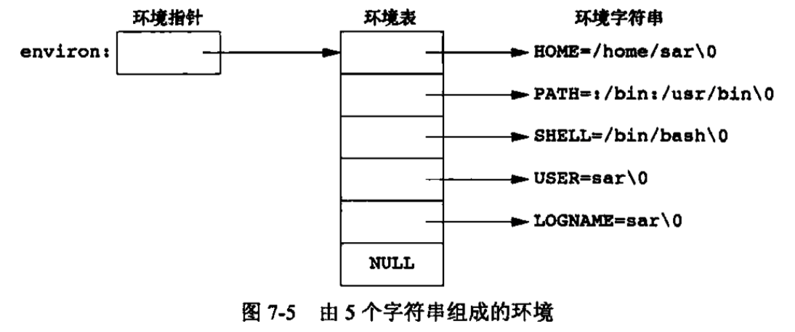

- 全局变量environ包含了环境表指针数组的地址`extern char **environ`

### 7.6 C程序的存储空间布局

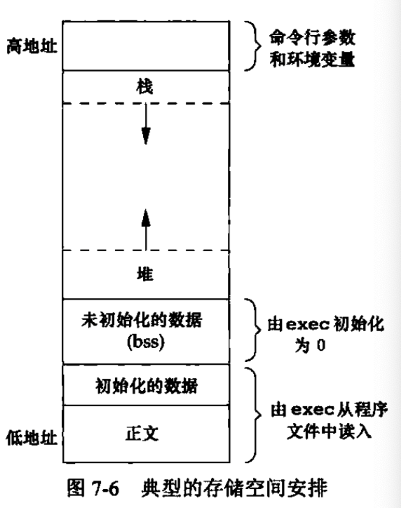

- C程序由下列几部分组成
  - 正文段：这是由CPU执行的机器指令部分。通常，正文段是可共享的，所以即使是频繁执行的程序（如文本编辑器、C编译器和shell等）在存储器中也只需有一个副本。另外，正文段常常是只读的
  - 初始化数据段
  - 未初始化数据段（bss段）
  - 栈
  - 堆

### 7.7 共享库

### 7.8 存储空间分配

- 替代的存储空间分配程序
  - libmalloc
  - vmalloc
  - quick-fit
  - jemalloc
  - TCMalloc
  - alloca

### 7.9 环境变量

- 修改环境表时是如何操作的
  - 删除：删除一个字符串很简单，只要现在环境表中找到该指针，然后将所有后续指针都向环境表首部顺次移动一个位置
  - 修改一个现有的name
    - 如果新value的长度少于或等于现有value的长度，则只要将新字符串复制到原字符串所用的空间中
    - 如果新value的长度大于原长度，则必须调用malloc为新字符串分配空间，然后将新字符串复制到该空间中，接着使环境表中针对name的指针指向新分配区
  - 增加一个新的name：首先，必须调用malloc为新name=value字符串分配空间，然后将该字符串复制到此空间中
    - 如果这是第一次增加一个新name，则必须调用malloc为新的指针表分配空间。接着，将原来的环境表复制到新分配区，并将指向新name=value字符串的指针存放在该指针表的表尾。然后又将一个空指针存放在其后。最后使envrion指向新指针表
    - 如果这不是第一次增加一个新name，则可知以前已调用malloc在堆中为环境表分配了空间，所以只要调用realloc，以分配比原空间多存放一个指针的空间。然后将name=value字符串的指针存放在该表表尾，后面跟着一个空指针

### 7.10 setjmp和longjmp

#### 1. 自动变量、寄存器变量和易失变量

- 在调用longjmp返回后，这些变量的值是保持为调用longjmp时的值，还是回滚到以前调用setjmp时的值？
  - 答案是不确定的

- 如果有一个自动变量，而又不想使其值回滚，则可定义其为具有volatile属性
- 声明为全局变量或静态变量的值在指向longjmp时保持不变

- 如果要编写一个使用非局部跳转的可移植程序，则必须使用volatile属性

### 7.11 getrlimit和setrlimit

- 查询和更改进程的资源限制

## 第8章 进程控制

### 8.2 进程标识

- ID为0的进程通常是调度进程，常常被称为交换进程（swapper）。该进程是内核的一部分，它并不执行任何磁盘上的程序，因此也被称为系统进程
- ID为1的进程通常是init进程，在自举过程结束时由内核调用。该进程的程序文件在较新版本的Unix系统中是/sbin/init。此进程负责在自举内核后启动一个Unix系统。init通常读取与系统有关的初始化文件（/etc/rc*文件或/etc/inittab文件，以及在/etc/init.d中的文件），并将系统引导到一个状态。init进程绝不会终止。它是一个普通的用户进程（与交换进程不同，它不是内核进程），但它以root特权运行

### 8.3 fork

- 子进程获得父进程数据空间、堆和栈的副本。父进程和子进程共享正文段

- 写时复制

- fork与IO函数之间的交互关系

  - write函数是不带缓冲的，而标准IO库是带缓冲的（如果标准输出连到终端设备，则它是行缓冲的；否则它是全缓冲的）

  - 考虑以下程序，以交互方式运行该程序时，只得到一行hello，其原因是标准输出缓冲区由换行符冲洗。但当将标准输出重定向到一个文件时，却得到两行hello。其原因是，在fork之前调用了printf一次，但当调用fork时，该行数据仍在缓冲区中，然后在父进程数据空间复制到子进程时，该缓冲区数据也被复制到子进程中，此时父进程和子进程各自有了带该行内容的缓冲区。当进程终止时，其缓冲区的内容都被写到相应文件中

    ```c
    int main()
    {
        printf("hello\n");
        if (fork() == 0)
        {
            // child
        }
        else
        {
            // parent
        }
        return 0;
    }
    ```

  - 在重定向父进程的标准输出时，子进程的标准输出也被重定向。实际上，fork的一个特性是父进程的所有文件描述符都被复制到了子进程中。我们说“复制”，是因为对每个文件描述符来说，就好像执行了dup函数。父进程和子进程每个相同的打开描述符共享一个文件表现

  - 父进程和子进程共享同一个文件偏移量

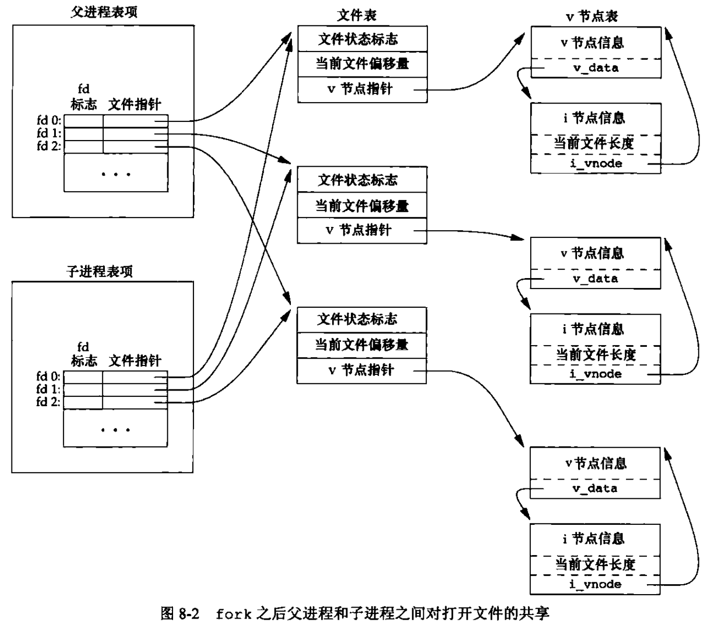

- 在fork之后处理文件描述符有以下两种常见的情况
  - 父进程等待子进程完成
  - 父进程和子进程各自执行不同的程序段。在这种情况下，在fork之后，父进程和子进程各自关闭它们不需要使用的文件描述符，这样就不会干扰对方使用的文件描述符。这种方法是网络服务进程经常使用的

- fork有以下两种用法
  - 一个父进程希望复制自己，使父进程和子进程同时执行不同的代码段。这在网络服务进程中是常见的
  - 一个进程要执行一个不同的程序。这对shell是常见的情况。在这种情况下，子进程从fork返回后立即调用exec

### 8.4 vfork

- vfork函数的调用序列和返回值与fork相同，但两者语义不同
- vfork用于创建一个新进程，而该进程的目的是exec一个新程序
- vfork与fork一样都创建一个子进程，但是它不将父进程的地址空间完全复制到子进程中，因为子进程会立即调用exec（或exit），于是也就不会引用该地址空间。不过在子进程调用exec或exit之前，它在父进程的空间中运行。这种优化方式在某些Unix系统的实现中提高了效率，但如果子进程修改数据、进行函数调用、或者没有调用exec或exit就返回都可能会带来未知的结果（实现采用写时复制技术以提高fork之后跟随exec的效率，但是不复制比部分复制还是要快一些）
- vfork与fork之间的另一个区别是：vfork保证子进程先运行，在它调用exec或exit之后父进程才可能被调度运行（如果在调用这两个函数之前子进程依赖父进程的进一步动作，则会导致死锁）

### 8.5 函数exit

- 5种正常终止
  - 在main内执行return语句，这等效于调用exit
  - 调用exit。此函数由ISO C定义，其操作包括调用各种终止处理程序，然后关闭所有标准IO流等。因为ISO C并不处理文件描述符、多进程（父进程和子进程）以及作业控制，所以这一定义对Unix系统而言是不完整的
  - 调用\_exit或\_Exit。ISO C定义_Exit，其目的是为进程提供一种无需运行终止处理程序或信号处理程序而终止的方法。对标准IO流是否进行冲洗，这取决于实现。在Unix系统中，\_Exit和\_exit是同义的，并不冲洗标准IO流。\_exit函数由exit调用，它处理Unix系统特定的细节
  - 进程的最后一个线程在其启动例程中执行return语句。但是，该线程的返回值不用作进程的返回值。当最后一个线程从其启动例程返回时，该进程以终止状态0返回
  - 进程的最后一个线程调用pthread_exit

- 3种异常终止
  - 调用abort。它产生SIGABRT信号
  - 当进程接收到某些信号时。信号可由进程自身（如调用abort）、其它进程或内核产生
  - 最后一个线程对“取消”请求作出响应。默认情况下，“取消”以延迟方式发生：一个线程要求取消另一个线程，若干时间之后，目标线程终止

- 不管进程如何终止，最后都会执行内核中的同一段代码。这段代码为相应进程关闭所有打开的描述符，释放它所使用的存储器等

- 对于上述任意一种终止情形，该终止进程的父进程都能用wait或waitpid取得其终止状态

### 8.6 wait和waitpid

- 当一个进程正常或异常终止时，内核就向其父进程发送SIGCHLD信号
- 调用wait或waitpid的进程可能会发生什么
  - 如果其所有子进程都还在运行，则阻塞
  - 如果一个子进程已终止，正等待父进程获取其终止状态，则取得该子进程的终止状态立即返回
  - 如果它没有任何子进程，则立即出错返回

- waitpid函数提供了wait函数没有提供的3个功能
  - waitpid可等待一个特定的进程，而wait则返回任一终止子进程的状态
  - waitpid提供了一个wait的非阻塞版本。有时希望获取一个子进程的状态，但不想阻塞
  - waipid通过WUNTRACED和WCONTINUED选项支持作业控制

- 如果一个进程fork一个子进程，但不要它等待子进程终止，也不希望子进程处于僵死状态直到父进程终止，实现这一要求的诀窍是调用fork两次

### 8.9 竞争条件

- 如果一个进程要等待其父进程终止。则可使用下列形式的循环

  ```c
  while (getpid() != 1)
    sleep(1);
  ```

### 8.10 exec

- exec只是用磁盘上的一个新程序替换了当前进程的正文段、数据段和栈段
- 对打开的文件的处理与每个描述符的执行时关闭（close-on-exec）标志值有关。进程中每个打开描述符都有一个执行时关闭标志（FD_CLOEXEC）。若设置了此标志，则在执行exec时关闭该描述符；否则该描述符仍打开。除非特地用fcntl设置了该执行时关闭标志，否则系统默认操作是在exec后仍保持这种描述符打开
- POXIS.1明确要求在exec时关闭打开目录流
- 在exec前后实际用户ID和实际组ID保持不变，而有效ID是否改变取决于所执行程序文件的设置用户ID和设置组ID位是否设置。如果新程序的设置用户ID位已设置，则有效用户ID变成程序文件的所有者ID；否则有效用户ID不变。对组ID的处理方式与此相同

- 7个exec函数之间的关系

  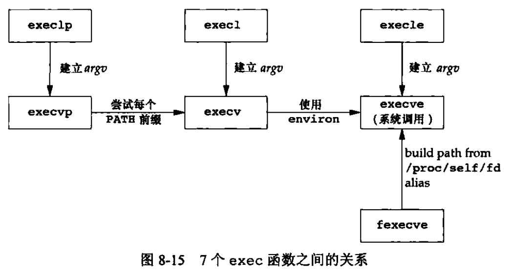

### 8.11 更改用户ID和更改组ID

- 更改用户ID的规则
  - 若进程具有root权限，则setuid函数将实际用户ID、有效用户ID以及保存的设置用户ID设置为uid
  - 若进程没有root权限，但是uid等于实际用户ID或保存的设置用户ID，则setuid只将有效用户ID设置为uid，不更改实际用户ID和设置用户ID

- 注意点
  - 只有root用户进程可以更改实际用户ID
  - 仅当程序文件设置了设置用户ID位时，exec函数才设置有效用户ID
  - 保存的设置用户ID是由exec复制有效用户ID而得到的。如果设置了文件的设置用户ID位，则在exec根据文件的用户ID设置了进程的有效用户ID以后，这个副本就被保存起来了

- 更改3用户ID的不同方法

  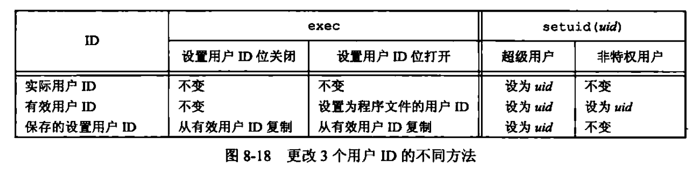

- TODO

### 8.12 解释器文件

- 解释器文件是文本文件，其起始行的形式是`#! pathname [optional-argument]`

- 内核使用exec函数的进程实际执行的并不是该解释器文件，而是在该解释器文件第一行中pathname所指定的文件

- TODO

### 8.13 system

- system在其实现中调用了fork、exec和waitpid，因此有3种返回值
  - fork失败或者waitpid返回除EINTR之外的出错，则system返回-1，并且设置errno以提示错误类型
  - 如果exec失败（表示不能执行shell），则其返回值如同shell执行了exit(127)一样
  - 否则所有3个函数都成功，那么system的返回值是shell的终止状态

- TODO

### 8.14 进程会计

- TODO

## 第9章 进程关系

### 9.5 会话

- 会话是一个或多个进程组的集合

## 第10章 信号

- 信号是软件中断

### 10.2 信号概念

- 很多条件可以产生信号
  - 当用户按某些终端键时，引发终端产生的信号
  - 硬件异常产生信号
  - 进程调用kill(2)可将任意信号发送给另一个进程或进程组
  - 用户可用kill(1)命令将信号发送给其他进程
  - 当检测到某种软件条件已经发生，并应将其通知有关进程时也产生信号

- 在某个信号出现时，可以告诉内核按下列3种方式之一进行处理
  - 忽略此信号。SIGKILL和SIGSTOP不能被忽略
  - 捕捉信号。SIGKILL和SIGSTOP不能被捕捉
  - 执行系统默认动作

### 10.3 signal

#### 1. 程序启动

- exec函数将原先设置为要捕捉的信号都更改为默认动作，其他信号的状态则不变（一个进程原先要捕捉的信号，当其执行一个新程序后，就不能再捕捉了，因为信号捕捉函数的地址很可能在所执行的新程序文件中已无意义）

#### 2. 进程创建

- 当一个进程调用fork时，其子进程继承父进程的信号处理方式。因为子进程在开始时复制了父进程内存映像，所以信号捕捉函数的地址在子进程中是有意义的

### 10.4 不可靠的信号

- 在早期的Unix系统版本中，信号是不可靠的。不可靠在这里指的是，信号可能会丢失。同时，进程对信号的控制能力也很差，它能捕捉信号或忽略它。有时用户希望通知内核阻塞某个信号：不要忽略该信号，在其发生时记住它，然后在进程做好了准备时再通知它。这种阻塞信号的能力当时并不具备

### 10.5 中断的系统调用

- 早期Unix系统的一个特性是：如果进程在执行一个低速系统调用而阻塞期间捕捉到一个信号，则该系统调用就被中断而不再继续执行。该系统调用返回出错，其errno设置为EINTR。这样处理是因为一个信号发生了，进程捕捉到它，这意味着已经发生了某种事情，所以是个好机会应当唤醒阻塞的系统调用

- 为了支持这种特性，将系统调用分成两类
  - 低速系统调用：可能会使进程永远阻塞的一类系统调用，包括
    - 如果某些文件类型）（如读管道、终端设备和网络设备）的数据不存在，则读操作可能会使调用者永远阻塞
    - 如果这些数据不能被相同的类型文件立即接受，则写操作可能会使调用者永远阻塞
    - 在某种条件发生之前打开某些类型文件，可能会发生阻塞（例如要打开一个终端设备，需要先等待与之连接的调制解调器应答）
    - pause函数和wait函数
    - 某些ioctl操作
    - 某些进程间通信函数
  - 其他系统调用

### 10.6 可重入函数

- 进程捕捉到信号并对其进行处理时，进程正在执行的正常指令序列就被信号处理程序临时中断，它首先执行该信号处理程序中的指令。如果从信号处理程序返回（例如没有调用exit或longjmp），则继续执行在捕捉到信号时进程正在执行的正常指令序列（这类似于发生硬件中断时所做的）。但在信号处理程序中，不能判断捕捉到信号时进程执行到何处。如果进程正在执行malloc，在其堆中分配另外的存储空间，而此时由于捕捉到信号而插入执行该信号处理程序，其中又调用malloc，这时会发生什么。这可能会对进程造成破坏，因为malloc通常为它所分配的存储区维护一个链表，而插入执行信号处理程序时，进程可能正在更改此链表
- Single Unix Specification说明了在信号处理程序中保证调用安全的函数。这些函数是可重入的并被称为是异步信号安全的。除了可重入以外，在信号处理操作期间，它会阻塞任何会引起不一致的信号发送

- 不可重入函数
  - 已知它们使用静态数据结构
  - 它们调用malloc或free
  - 它们是标准IO函数。标准IO库的很多实现都以不可重入方式使用全局数据结构

- 如果在信号处理程序中调用一个非可重入函数，则其结果是不可预测的

### 10.8 可靠信号术语和语义

### 10.9 kill和raise

- kill函数将信号发送给进程或进程组
- raise函数则允许进程向自身发送信号

- 对于非超级用户，其基本规则是发送者的实际用户ID或有效用户ID必须等于接受者的实际用户ID或有效用户ID。如果实现支持_POSIX_SAVED_IDS，则检查接受者的保存设置用户ID（而不是有效用户ID）。在对权限进行测试时也有一个特例：如果被发送的信号是SIGCONF，则进程可将它发送给属于同一会话的任一其他进程

### 10.10 alarm和pause

- 除了用来实现sleep函数外，alarm还常用于对可能阻塞的操作设置时间上限值。例如，程序中有一个读低速设备的可能阻塞的操作，我们希望超过一定时间量后就停止执行该操作

## 第14章 高级IO

### 14.2 非阻塞IO

- 对于一个给定的描述符，有两种为其指定非阻塞IO的方法
  - 如果调用open获得描述符，则可指定O_NONBLOCK标志
  - 对于一个已经打开的描述符，则可调用fcntl，由该函数打开O_NONBLOCK文件状态标志

### 14.3 记录锁

- 记录锁的功能是，当第一个进程正在读或修改文件的某个部分时，使用记录锁可以阻止其他进程修改同一个文件区域。更准确的名字可能应该是字节范围锁

- POSIX.1的fcntl记录锁

  - `fcntl(nit fd, int cmd, .../* struct flock *flockptr */)`

  - 对于记录锁，cmd是F_GETLK、F_SETLK或F_SETLKW，第三个参数是一个指向flock结构的指针，flock结构如下所示

    ```c
    struct flock {
      short l_type; // F_RDLCK, F_WRLCK, F_UNLCK
      short l_whence; // SEEK_SET, SEEK_CUR, SEEK_END
      off_t l_start;
      off_t l_len;
      pid_t pid; // returned with F_GETLK
    };
    ```

- 关于记录锁的自动继承和释放有3条规则
  - 锁与进程和文件两者相关联
    - 当一个进程终止时，它所建立的锁全部释放
    - 无论一个描述符何时关闭，该进程通过这一描述符引用的文件上的任何一把锁都会释放
  - 由fork产生的子进程不继承父进程所设置的锁。对于通过fork从父进程处继承过来的描述符，子进程需要调用fcntl才能获得它自己的锁
  - 在执行exec后，新程序可以继承原执行程序的锁。但是注意，如果对一个文件描述符设了执行时关闭标志，那么当作为exec的一部分关闭该文件描述符时，将释放相应文件的所有锁

- FreeBSD实现

  - 关于记录锁的FreeBSD数据结构图如下

    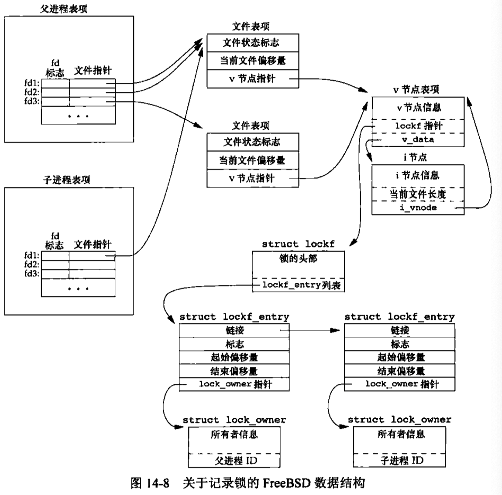

### 14.4 IO多路复用

#### 14.4.1 select和pselect

- `int select(int maxfdpl, fd_set *restrict readfds, fd_set *restrict writefds, fd_set *restrict exceptfds, struct timeval *restrict tvptr)`
  - `tvptr == NULL`
    - 永远等待，如果捕捉到一个信号则中断此无限期等待。当所指定的描述符中的一个已准备好或捕捉到一个信号则返回。如果捕捉到一个信号，则select返回-1，errno设置为EINTR
  - `tvptr->tv_sec == 0 && tvptr->tv_usec == 0`
    - 不等待。测试所有指定的描述符并立即返回。这是轮询系统找到多个描述符状态而不阻塞select函数的方法
  - `readfds, writefds, exceptfds`
    - 这3个描述符集说明了我们关心的可读、可写或处于异常条件的描述符集
    - 每个描述符集存储在一个fd_set的数据类型中。这个数据类型是由实现选择的，它可以为每一个可能的描述符保持一位
    - 这3个描述符集中的任意一个（或全部）可以是空指针，这表示对相应条件并不关心。如果所有3个指针都是NULL，则select提供了比sleep更精确的定时器
  - maxfdpl的意思是最大文件描述符编号值加1。这个参数实际上是要检查的描述符数（从描述符0开始）
  - select有3个可能的返回值
    - 返回值-1表示出错。例如，在所指定的描述符一个都没准备好时捕捉到一个信号。在这种情况下，一个描述符集都不修改
    - 返回值0表示没有描述符准备好
    - 一个正返回值说明了已经准备好的描述符数。该值是3个描述符集中已准备好的描述符数之和，所以如果同一描述符已准备好读和写，那么在返回值中会对其计两次数
  - 对于“准备好”含义的具体说明
    - 若对readfds中的一个描述符进行的read操作不会阻塞，则认为此描述符是准备好的
    - 若对writefds中的一个描述符进行的write操作不会阻塞，则认为此描述符是准备好的
    - 若对exceptfds中的一个描述符有一个未决异常条件，则认为此描述符是准备好的。现在，异常条件包括：在网络连接上到达带外的数据，或者在处于数据包模式的伪终端上发生了某些条件。普通文件的文件描述符总是返回准备好
  - 一个描述符阻塞与否并不影响select是否阻塞，理解这一点很重要。也就是说，如果希望读一个非阻塞描述符，并且以超时值为5秒调用select，则select最多阻塞5秒。相类似，如果指定一个无限的超时值，则在该描述符数据准备好，或捕捉到一个信号之前，select会一直阻塞
  - 如果在一个描述符上碰到了文件尾端，则select会认为该描述符是可读的。然后调用read，它会返回0，这是Unix提示到达文件尾端的方法

- `int pselect(int maxfdpl, fd_set *restrict readfds, fd_set *restrict writefds, fd_set *restrict exceptfds, const struct timespec *restrict tsptr, const sigset_t *restrict sigmask)`
  - pselect可使用可选信号屏幕字。若sigmask不为NULL，在调用pselect时，以原子操作的方式安装该信号屏幕字。在返回时，恢复以前的信号屏蔽字

#### 14.4.2 poll

- `int poll(struct pollfd fdarrray[], nfds_t nfds, int timeout)`

  - pollfd结构如下

    ```c
    struct pollfd {
      int fd;
      short events; // events of interest on fd
      short revents; // events that occurred on fd
    };
    ```

  - events和revents标志

    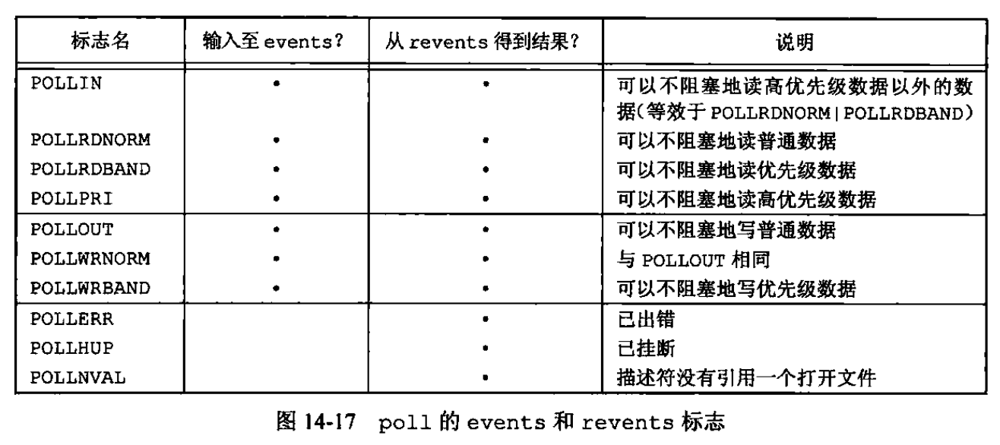

    - 前4行测试的是可读性，接下来的3行测试的是可写性，最后3行测试的是异常条件。最后3行是由内核在返回时设置的，即使在events字段中没有指定这3个值，如果相应条件发生，在revents中也会返回它们
    - 当一个描述符被挂断（POLLHUP）后，就不能再写描述符，但是有可能仍然可以从该描述符读取到数据

  - timeout的取值

    - 为-1时：永远等待
    - 为0时：不等待
    - 大于0时：等待最多timeout毫秒

  - 理解文件尾端与挂断之间的区别是很重要的。如果我们正从终端输入数据，并键入文件结束符，那么就会打开POLLIN，于是我们就可以读文件结束指示（read返回0）。revents中的POLLHUP不会打开。但如果正在读调制解调器，并且电话线已挂断，我们将接到POLLHUP通知

### 14.5 异步IO