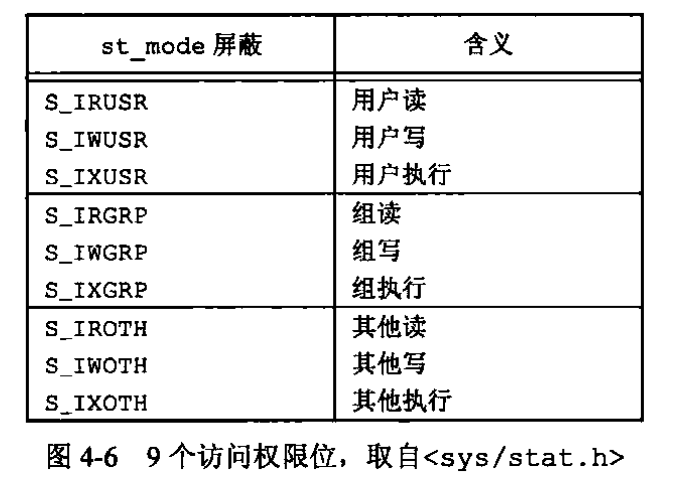

# Unix环境高级编程

## 第3章 文件IO

- 不带缓冲的IO：每个read和write都调用内核中的一个系统调用

### 3.3 open和openat

- `int openat(int fd, const char *path, int oflag, ... /* mode_t mode */`，openat是POSIX.1最新版本中新增的一类函数，希望解决两个问题：

  - 同一进程中的所有线程共享相同的当前工作目录，因此很难让同一进程的多个不同线程在同一时间工作在不同的目录中。openat可以让线程可以使用相对路径名打开目录中的文件，而不再只能打开当前工作目录

  - 避免time-of-check-to-time-of-use（TOCTTOU）错误

    ```c
    if (access("file", W_OK) != 0)
      	exit(1);
    fd = open("file", "O_WRONLY");
    // actually, writing over /etc/passwd
    write(fd, buffer, sizeof(buffer));
    ```

    ```c
    // 攻击代码
    // after the access check
    symlink("/etc/passwd", "file");
    // before the open, "file" points to the password database
    ```

### 3.6 lseek

- lseek可以用来确定所涉及的文件是否可以设置偏移量。如果文件描述符指向的是一个管道、FIFO或网络套接字，则lseek返回-1，并将errno设置为ESPIPE

- 文件偏移量可以大于文件的当前长度，在这种情况下，对该文件的下一次写将加长该文件，并在文件中构成一个空洞，这一点是允许的。位于文件中但没有写过的字节都被读为0
- 文件中的空洞并不要求在磁盘上占用存储区。具体处理方式与文件系统的实现有关，当定位到超出文件尾端之后写时，对于新写的数据需要分配磁盘块，但是对于原文件尾端和新开始写位置之前的部分则不需要分配磁盘块

### 3.10 文件共享

- 内核使用3种数据结构表示打开文件

  - 每个进程的记录项只能够包含一张打开的文件描述符表。每个描述符占用一项，包括
    - 文件描述符标志（close_on_exec，执行时关闭）
    - 指向一个文件表项的指针
  - 内核为所有打开的文件维持一张文件表。每个文件表项包括
    - 文件状态标志（读、写、添加、同步和非阻塞等）
    - 当前文件偏移量
    - 指向该文件v节点表项的指针
  - 每个打开文件（或设备）都有一个v节点结构。v节点表项包括
    - 文件类型和对次文件进行各种操作函数的指针
    - 指向该文件的i节点的指针

  

- 两个进程各自打开同一个文件

  

- 文件描述符标志和文件状态标志在作用范围方面的区别
  - 文件描述符标志只用于一个进程的一个描述符
  - 文件状态标志应用于指向该给定文件表项的任何进程中的所有描述符

### 3.11 原子操作

- 两个进程追加数据到一个文件造成的竞争问题
  - 早期的“先定位到文件尾端，然后写”的操作会造成两个进程之间形成竞争，因为在两个函数调用之间，内核有可能会临时挂起进程
  - 解决方法是提供一种原子操作，即在打开文件时设置O_APPEND标志，这样使得内核在每次写操作之前，都将进程的当前偏移量设置到该文件的尾端处，于是在每次写之前就不需要再调用lseek

- pread和pwrite
  - `ssize_t pread(int fd, void *buf, size_t nbytes, off_t offset)`
  - 调用pread相当于调用lseek后调用read，但是pread又与这种顺序调用有下列重要区别：
    - 调用pread时，无法中断其定位和读操作
    - 不再更新当前文件的偏移量

- 创建一个文件
  - 如果open函数同时指定O_CREATE和O_EXCL选项，那么当该文件存在时，open函数将失败。检查文件是否存在和创建文件这两个操作是作为一个原子操作执行的，如果没有这样一个原子操作，那么会造成两个进程的竞争问题

### 3.12 dup和dup2

- dup和dup2可用来复制一个现有的文件描述符

- dup(1)后的内核数据结构

  
  - 因为两个文件描述符指向同一文件表项，所以它们共享同一文件状态标志，以及同一当前文件偏移量

- dup(fd)等价于fcntl(fd, F_DUPFD, 0)

- dup2(fd)不完全等价于

  ```c
  close(fd2);
  fcntl(fd, F_DUPFD, fd2)
  ```

  - dup2是一个原子操作，而close和fcntl包括两个函数调用。有可能在close和fcntl之间调用了信号捕获函数，它可能修改文件描述符。如果不同的线程改变了文件描述符的话也会出现相同的问题
  - dup2和fcntl有一些不同的errno

### 3.13 sync、fsync和fdatasync

- 传统的Unix系统实现在内核中设有缓冲区高速缓存和页高速缓存，大多数磁盘IO通过缓冲区进行。当我们向文件写入数据时，内核通常先将数据复制到缓冲区中，然后排入队列。晚些时候再写入磁盘，这种方式被称为延迟写
- 通常，当内核需要重用缓冲区来存放其他磁盘块数据时，它会把所有延迟写数据块写入磁盘。为了保证磁盘上实际文件系统与缓冲区中内容的一致性，Unix系统提供了sync、fsync和fdatasync三个函数
  - `int fsync(int fd)`，fsync只由文件描述符fd指定的一个文件起作用，并且等待写磁盘操作结束才返回
  - `int fdatasync(int fd)`，fdatasync类似于fsync，但它只影响文件的数据部分。而除数据外，fsync还会同步更新文件的属性
  - `void sync()`，sync只是将所有修改过的块缓冲区排入写队列，然后就返回它，它并不等待实际写磁盘操作结束。通常，称为update的系统守护进程周期性地调用sync函数

### 3.14 fcntl

- `int fcntl(int fd, int cmd, ... /* arg */)`

- fcntl可以改变已经打开文件的属性。fcntl有以下5种功能
  - 复制一个已有的描述符，cmd=F_DUPFD或F_DUPFD_CLOEXEC
  - 获取/设置文件描述符标志
  - 获取/设置文件状态标志
  - 获取/设置异步IO所有权
  - 或者/设置记录锁

### 3.15 ioctl

- `int ioctl(int fd, int request, ...)`
- ioctl是IO操作的杂物箱
- 每个设备驱动程序可以定义它自己专用的一组ioctl命令，系统则为不同种类的设备提供通用的ioctl命令

### 3.16 /dev/fd

- /dev/fd目录的目录项是名为0、1、2等的文件。打开/dev/fd/n等效于复制描述符n（假设描述符n是打开的）
- 在`fd = open(""/dev/fd/0", mode)`中，大多数系统忽略它所指定的mode，而另外一些系统则要求mode必须是所引用的文件初始打开时所使用的打开模式的一个子集。描述符fd与0共享同一文件表项
  - Linux实现中的/dev/fd是个例外。它把文件描述符映射成指向底层物理文件的符号链接。例如，当打开/dev/fd/0时，事实上正在打开与标准输入关联的文件，，因此返回的新文件描述符的模式与/dev/fd文件描述符的模式其实并不相关

- 某些系统提供/dev/stdin、/dev/stdout、/dev/stderr，这些等价于/dev/fd/0、/dev/fd/1和/dev/fd2
  - /dev/fd文件主要由shell使用，它允许使用路径名座位调用参数的程序，能用处理其他路径名的相同方式处理标准输入和输出。例如，cat命令对命令行参数采取了一种特殊处理，它将单独的一个字符“-”解释为标准输入，例如`filter file2 | cat file1 - file3 | lpr`，首先cat读file1，接着读其标准输入，然后读file3。如果支持/dev/fd，则可以删除cat对“-”的特殊处理：`filter file2 | cat file1 /dev/fd/0 file3 | lpr`

## 第4章 文件和目录

### 4.2 stat、fstat、lstat、fstatat

- lstat类似于stat，但是当命名的文件是一个符号链接时，lstat返回该符号链接的有关信息，而不是由该符号链接引用的文件的信息

### 4.3 文件类型

- 普通文件
- 目录文件
- 块特殊文件
  - 这种类型的文件提供对设备（如磁盘）带缓冲的访问，每次访问以固定长度为单位进行
- 字符特殊文件
  - 这种类型的文件提供对设备不带缓冲的访问，每次访问长度可变。系统中的所有设备要么是字符特殊文件，要么是块特殊文件

- FIFO
  - 用于进程间通信，有时也称为命名管道

- 套接字
  - 用于进程间的网络通信，或一台宿主机上进程之间的非网络通信

- 符号链接

### 4.4 用户ID和组ID

- 与一个进程相关联的ID有6个或更多
- 实际用户ID和实际组ID
  - 标识我们究竟是谁。这两个字段在登录时取自口令文件中的登录项

- 有效用户ID、有效组ID以及附属组ID决定了我们的文件访问权限
- 保存的设置用户ID和保存的设置组ID在执行一个程序时包含了有效用户ID和有效组ID的副本

### 4.5 文件访问权限

- 所有文件类型都有访问权限

- 每个文件有9个访问权限位，可将它们分成3类

  
  - 当用名字打开任一类型的文件时，对该名字中包含的每一个目录，包括它可能隐含的当前工作目录都应具有执行权限。这就是为什么对于目录其执行权限位常被称为搜索位的原因。注意，对于目录的读权限和执行权限的意义是不相同的。读权限允许我们读目录，获得在该目录中所有文件名的列表
  - 为了在open函数中对一个文件指定O_TRUNC标志，必须对该文件具有写权限
  - 为了在一个目录中创建一个新文件，必须对包含该文件的目录具有写权限和执行权限
  - 为了删除一个现有文件，必须对包含该文件的目录具有写权限和执行权限，对该文件本身则不需要有读、写权限
  - 如果用7个exec函数中的任何一个执行某个文件，都必须对该文件具有执行权限。该文件还必须是一个普通文件