# CSAPP

## 第1章 计算机系统漫游

### 1.9.2 并发和并行

#### 线程级并发

- 超线程，有时称为同时多线程（simultaneous multi-threading），是一项允许一个CPU执行多个控制流的技术
- 它涉及CPU某些硬件有多个备份，比如程序计数器和寄存器文件，而其他的硬件部分只有一份，比如执行浮点算数运算的单元
- 常规的处理器需要大约20,000个时钟周期做不同线程的切换，而超线程的处理器可以在单个周期的基础上决定要执行哪一个线程。这使得CPU能够更好地利用它的处理资源。比如，假设一个线程必须等到某些数据被装载到高速缓存中，那CPU就可以继续去执行另一个线程
- 举例来说，Intel Core i7处理器可以让每个核执行两个线程，所以一个4核的系统实际上可以并行地执行8个线程

#### 指令级并行

- 现代处理器可以同时执行多条指令的属性称为指令级并行

#### 单指令、多数据并行

- 许多现代处理器拥有特殊的硬件，允许一条指令产生多个可以并行执行的操作，即SIMD并行

### 1.10 小结

- 操作系统提供三个基本的抽象
  - 文件是对I/O设备的抽象
  - 虚拟内存是对主存核磁盘的抽象
  - 进程是处理器、主存和I/O设备的抽象

## 第2章 信息的表示和处理

### 2.1.3 寻址核字节顺序

- 小端：最低有效字节在最前面
- 大端：最高有效字节在最前面

## 第4章 处理器体系结构

### 4.4 流水线的通用原理

- 流水线化的一个重要特征就是提高了系统的吞吐量，不过它也会轻微地增加延迟

## 第5章 优化程序性能

### 5.1 优化编译器的能力和局限性

- 编译器必须很小心地对程序只使用安全的优化，也就是说对于程序可能遇到的所有可能的情况，在C语言标准提供的保证之下，优化后得到的程序和未优化的版本有一样的行为

  ```c
  void twiddle1(long *xp, long *yp)
  {
    *xp += *yp;
    *xp += *yp;
  }
  
  void twiddle2(long *xp, long *yp)
  {
    *xp += 2 * *yp;
  }
  ```

  twiddle1需要6次内存引用，而twiddle2只需要3次，因此twiddle2的效率更高一些。然而，如果xp等于yp，那么二者的行为就不一致。因此，编译器无法将前者优化为后者

- 这种两个指针可能指向同一个内存位置的情况称为内存别名使用。在只执行安全的优化中，编译器必须假设不同的指针可能会指向内存中同一个位置。这造成了一个主要的妨碍优化的因素，这也是严重限制编译器产生优化代码机会的程序的一个方面

- 第二个妨碍优化的因素是函数调用

  ```c
  long f();
  
  long func1()
  {
    return f() + f() + f() + f();
  }
  
  long func2()
  {
    return 4 * f();
  }
  ```

  需要注意到，f函数可能有个副作用，导致func2与func1的行为不一致。编译器会假设最糟的情况，并保持所有的函数调用不变

### 5.2 表示程序性能

- 引入度量标准每元素的周期数（Cycles Per Element，CPE），作为一种表示程序性能并指导我们改进代码的方法
- 一个过程所需要的时间可以用一个常数加上一个与被处理元素成正比的因子来描述（可以使用最小二乘拟合法）
- 我们更愿意用每个元素的周期数而不是每次循环的周期数来度量，这是因为像循环展开这样的技术使得我们能够用较少的循环完成计算，而我们最终关心的是，对于给定的向量长度，程序运行的速度如何。我们将精力集中在减小计算的CPE上

## 5.4 消除循环的低效率

- 代码移动：这类优化包括识别要执行多次（例如在循环里）但是计算结果不会改变的计算。因而可以将计算移动到代码前面不会被多次求值的部分。优化编译器会试着进行代码移动，不幸的是，对于会改变在哪里调用函数或调用多少次的变换，编译器通常会非常小心。它们不能可靠地发现一个函数是否会有副作用，因而假设函数会有副作用

### 5.5 减少过程调用

### 5.6 消除不必要的内存引用

### 5.7 理解现代处理器

- 随着试图进一步提高性能，必须考虑利用处理器微体系结构的优化，也就是处理器用来执行指令的底层系统设计
- 在实际的处理器中，是同时对多条指令求值的，这个现象称为指令级并行。在某些设计中，可能有100或更多条指令在处理中。采用一些精细的机制来确保这种并行执行的行为，正好能获得机器级程序要求的顺序语义模型的效果。现代微处理器取得的了不起的功绩之一是：它们采用复杂而奇异的微处理器结构，其中，多条指令可以并行地执行，同时又呈现出一种简单的顺序执行指令的表象
- 两种下届描述了程序的最大性能
  - 当一系列操作必须按照严格顺序执行时，就会遇到延迟界限（latency bound）
  - 吞吐量界限（throughput bound）刻画了处理器功能单元的原始计算能力

### 5.8 循环展开

- 循环展开能够从两个方面改进程序的性能
  - 首先，它减少了不直接有助于程序结果的操作的数量，例如循环索引计算和条件分支
  - 第二，它提供了一些方法，可以进一步变化代码，减少整个计算中关键路径上的操作数量

- 2✖️1循环展开

  ```c
  void combine5(vec_ptr v, data_t *dest)
  {
    long i;
    long length = vec_length(v);
    long limit = length - 1;
    data_t *data = get_vec_start(v);
    data_t acc = IDENT;
    
    for (i = 0; i < limit; i += 2)
    {
      acc = (acc OP data[i]) OP data[i + 1];
    }
    for (; i < length; i++)
    {
      acc = acc OP data[i];
    }
    *dest = acc;
  }
  ```

### 5.9 提高并行性

- 执行加法和乘法的功能单元是完全流水线化的，这意味着它们可以每个时钟周期开始一个新操作，并且有些操作可以被多个功能单元执行。硬件具有以更高速率执行乘法和加法的潜力，但是代码不能利用这种能力，即使是循环展开也不能，这是因为我们将累计值放在一个单独的变量acc中。在前面的计算完成之前，都不能计算acc的新值。虽然计算acc新值的功能单元能够每个时钟周期开始一个新的操作，但是它只会每L个周期开始一条新操作，这里L是合并操作的延迟

#### 5.9.1 多个累积变量

- 对于一个可结合和可交换的合并运算来说，比如整数加法或乘法，我们可以通过将一组合并运算分割成两个或更多的部分，并在最后合并结果来提高性能

  ```c
  void combine6(vec_ptr v, data_t *dest)
  {
    long i;
    long length = vec_length(v);
    long limit = length - 1;
    data_t *data = get_vec_start(v);
    data_t acc0 = IDENT;
    data_t acc1 = IDENT;
    
    for (i = 0; i < limit; i += 2)
    {
      acc0 = acc0 OP data[i];
      acc1 = acc1 OP data[i + 1];
    }
    for (; i < length; i++)
    {
      acc0 = acc0 OP data[i];
    }
    *dest = acc0 OP acc1;
  }
  ```

  combine6既使用了两次循环展开，以使每次迭代合并更多的元素，也使用了两路并行，将索引值为偶数的元素累积在变量acc0中，而索引值为奇数的元素累积在变量acc1中。因此，我们将其称为2✖️2循环展开

#### 5.9.2 重新结合变换

- 重新结合变换。2✖️1a循环展开

  ```c
  void combine5(vec_ptr v, data_t *dest)
  {
    long i;
    long length = vec_length(v);
    long limit = length - 1;
    data_t *data = get_vec_start(v);
    data_t acc = IDENT;
    
    for (i = 0; i < limit; i += 2)
    {
      acc = acc OP (data[i] OP data[i + 1]);
    }
    for (; i < length; i++)
    {
      acc = acc OP data[i];
    }
    *dest = acc;
  }
  ```

## 第6章

### 6.4 高速缓存存储器

#### 6.4.1 通用的高速缓存存储器组织结构

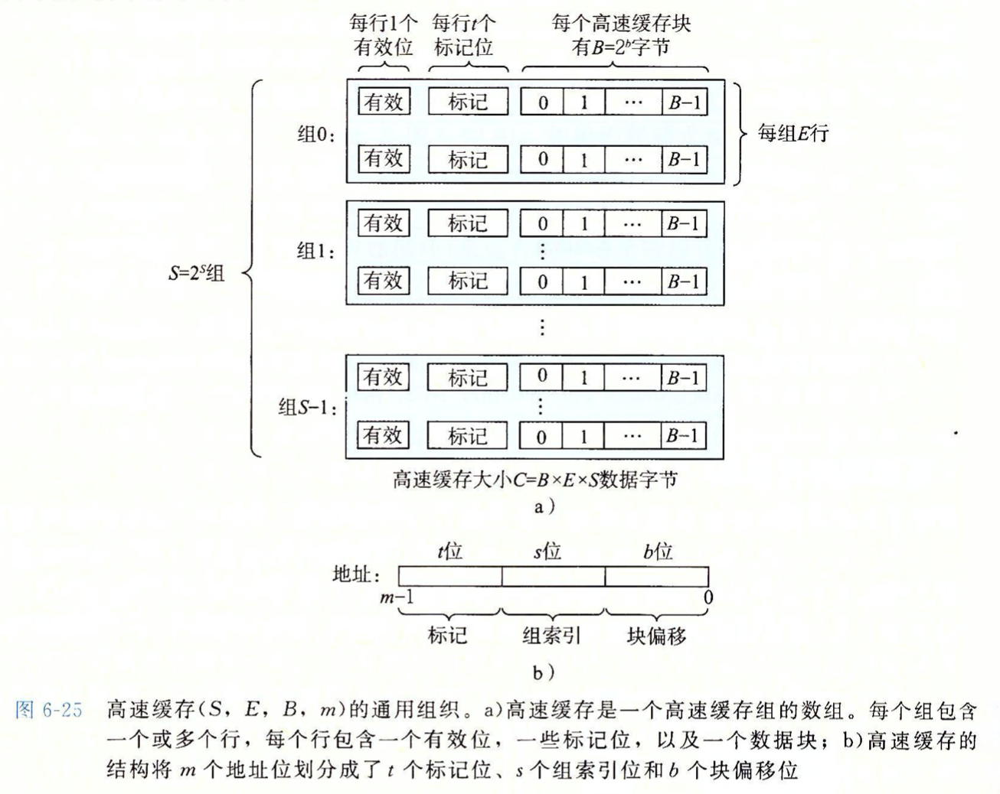

- 一般而言，高速缓存的结构可以用元组`(S, E, B, m)`来描述。高速缓存的大小或容量C指的是所有块的大小的和。标记位和有效位置不包括在内。因此`C=S*E*B`

#### 6.4.2 直接映射高速缓存

- 每个组只有一行的高速缓存称为直接映射高速缓存（direct-mapped cache）

- 高速缓存确定一个请求是否名字，然后抽取出被请求的字的过程，分为三步：

  - 组选择
  - 行匹配
  - 字选择

  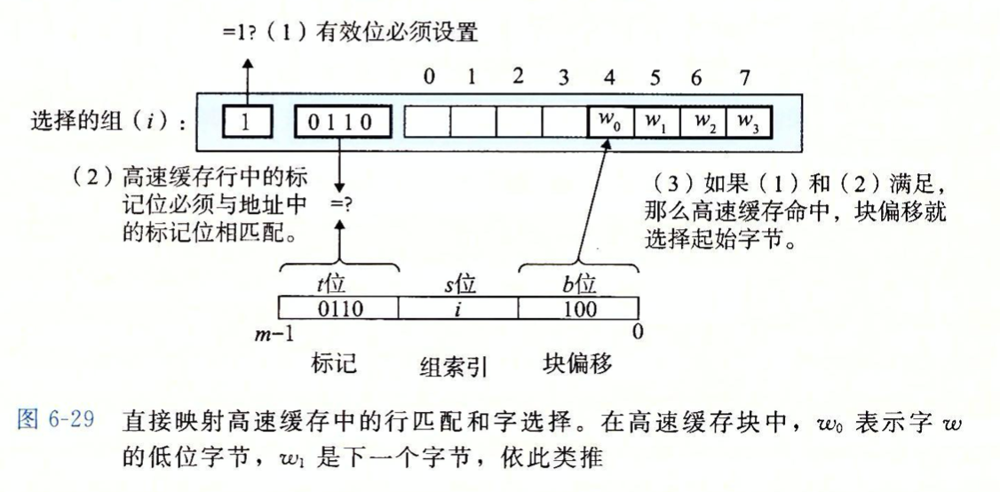

- 标记位和索引位连起来唯一地标识了内存中的每个块

- 因为内存块数大于高速缓存组数，所以多个块会映射到同一个高速缓存组（即它们有相同的组索引）

- 映射到同一个高速缓存组的块由标记位唯一地标识

- 抖动：高速缓存反复地加载和驱逐相同的高速缓存块的组

- 为什么用中间的位来做组索引，而不用高位：

  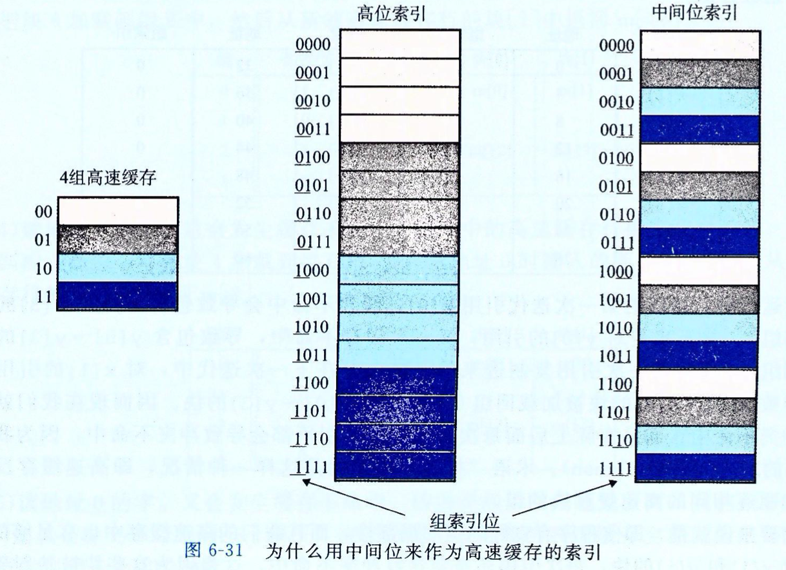

#### 6.4.3 组相联高速缓存

- 一个`1<E<C/B`的高速缓存通常称为E路组相联高速缓存（set associative cache）

#### 6.4.4 全相联高速缓存

- 全相联高速缓存（fully associative cache）是由一个包含所有高速缓存行的组（即E=C/B）组成的。全相联高速缓存只有一个组
- 因为高速缓存电路必须并行地搜索许多相匹配的标记，构造一个又大又快的相联高速缓存很困难，而且很昂贵。因此，全相联高速缓存只适合做小的高速缓存，例如虚拟内存系统中的翻译备用缓冲期（TLB），它缓存页表项

#### 6.4.5 有关写的问题

- 一个问题是，怎么将高速缓存的更新同步到下一层存储中
  - 直写（write-through）
    - 直写的缺点是每次写都会引起总线流量
  - 写回（write-back）
    - 写回能显著地减少总线流量，但是它的缺点是增加了复杂性。高速缓存必须为每个高速缓存行维护一个额外的修改位，表明这个高速缓存块是否被修改过

- 另一个问题是如何处理写不命中
  - 写分配（write-allocate）
    - 加载相应的低一层中的块到高速缓存中，然后更新这个高速缓存块。写分配试图利用写的空间局部性，但是缺点是每次不命中都会导致一个块从低一层传送到高速缓存
  - 非写分配
    - 避开高速缓存，直接把这个字写到低一层中

- 直写高速缓存通常是非写分配的。写回高速缓存通常是写分配的
- 建议采用一个使用写回和写分配的高速缓存模型，原因：
  - 通常，由于较长的传送时间，存储器层次结构中较低层的缓存更可能使用写回，而不是直写
  - 它与处理读的方式相对称，因为写回写分配试图利用局部性。因此，我们可以在高层次上开发我们的程序，展示良好的空间和时间局部性，而不是试图为某一个存储器系统进行优化

#### 6.4.6 一个真实的高速缓存层次结构剖析

- i-cache：只保存指令的高速缓存
- d-cache：只保存程序数据的高速缓存
- 统一的高速缓存：既保存指令又包含数据

#### 6.4.7 高速缓存参数的性能影响

- 衡量指标
  - 不命中率
  - 命中率
  - 命中时间：从高速缓存传送一个字到CPU所需的时间，包括组选择、行确认和字选择的时间
  - 不命中处罚：由于不命中所需要的额外的时间

- 高速缓存大小的影响
  - 较大的高速缓存可能会提高命中率
  - 使大存储器运行得更快总是要难一些的，结果，较大的高速缓存可能会增加命中时间。这解释了为什么L1高速缓存比L2高速缓存小，以及为什么L2比L3小

- 块大小的影响
  - 较大的块能利用程序中可能存在的空间局部性，帮助提高命中率
  - 对于给定的高速缓存大小，块越大就意味着高速缓存行越少，这会损害时间局部性比空间局部性更好的程序中的命中率
  - 较大的块对不命中的处罚也有负面影响，因为块越大，传送时间就越长

- 相联度的影响
  - 较高的相联度（也就是E的值较大）会降低高速缓存由于冲突不命中出现抖动的可能性
  - 较高的相联度实现起来很昂贵，而且很难使之速度变快。每一行需要更多的标记位，每一行需要额外的LRU状态位和额外的控制逻辑
  - 较高的相联度会增加命中时间，因为复杂性增加了
  - 还会增加不命中处罚，因为选择牺牲行的复杂性也增加了

- 写策略的影响
  - 直写高速缓存比较容易实现，而且能使用独立于高速缓存的写缓冲区，用来更新内存
  - 此外，读不命中开销没这么大，因为它们不会触发内存写
  - 写回高速缓存引起的传送比较少，它允许更多的到内存的带宽用于执行DMA的I/O设备
  - 此外，越往层次结构下面走，传送时间增加，减少传送的数量就变得更加重要。一般而言，高速缓存越往下面，越可能使用写回而不是直写

#### 6.5 编写高速缓存友好的代码

- 一般而言，如果一个高速缓存的块大小为B字节，那么一个步长为k的引用模式（k是以字为单位的）平均每次循环迭代会有min(1, (wordsize*k)/B)次缓存不命中。当k=1时，它取最小值
- 因此
  - 对局部变量的反复引用是友好的，因为编译器能够将它们缓存在寄存器文件中（时间局部性）
  - 步长为1的引用模式是友好的，因此存储器层次结构中所有层次上的缓存都是将数据存储为连续的块（空间局部性）

### 6.6 综合：高速缓存对程序性能的影响

#### 6.6.3 在程序中利用局部性

- 将注意力集中在内循环上，大部分计算和内存访问都发生在这里
- 通过按照数据对象存储在内存中的顺序、以步长为1的来读数据，从而使得程序中的空间局部性最大
- 一旦从存储器中读入了一个数据对象，就尽可能多地使用它，从而使得程序中的时间局部性最大

## 第7章 链接

### 7.2 静态链接

- 像Linux ld程序这样的静态链接器以一组可重定位目标文件和命令行参数作为输入，生成一个完全链接的、可以加载和运行的可执行目标文件作为输出
- 为了构造可执行文件，链接器必须完成两个任务
  - 符号解析（symbol resolution）：符号解析的目的是将每个符号引用正好和一个符号定义关联起来
  - 重定位（relocation）：编译器和汇编器生成从地址0开始的代码和数据节。链接器通过把每个符号定义与一个内存位置关联起来，从而重定位这些节，然后修改所有对这些符号的引用，使得它们指向这个内存位置。链接器使用汇编器产生的重定位条目（relocation entry）的详细指令，不加甄别地执行这样的重定位

### 7.3 目标文件

- 目标文件有三种形式
  - 可重定位目标文件
  - 可执行目标文件
  - 共享目标文件

- X86-64 Linux和Unix系统使用可执行可链接格式（Executable and Linkable Format，ELF）

### 7.4 可重定位目标文件

- 一个典型的ELF可重定位目标文件的格式

  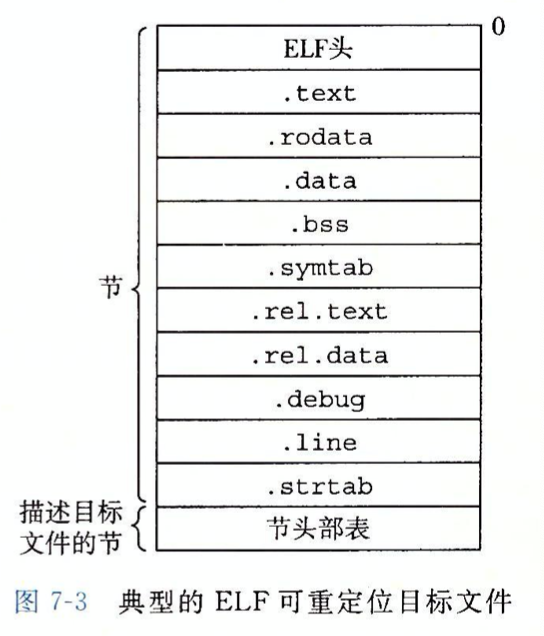
  - ELF头以一个16字节的序列开始，这个序列描述了生成该文件的系统的字的大小和字节顺序。ELF头剩下的部分包含帮助链接器语法分析和解释目标文件的信息。其中包括ELF头的大小、目标文件的类型、机器类型、节头部表（section header table）的文件偏移，以及节头部表中条目的大小和数量
  - 不同节的位置和大小是由节头部表描述的，其中目标文件中每个节都有一个固定大小的条目
  - .text节：已编译程序的机器代码
  - .rodata节：只读数据，比如printf中的格式串
  - .data节：已初始化的全局和静态C变量
  - .bss节：未初始化的全局和静态C变量，以及所有被初始化为0的全局或静态变量。在目标文件中这个节不占据实际的空间，它仅仅是一个占位符。目标文件格式区分已初始化和未初始化变量是为了空间效率：在目标文件中，未初始化变量不需要占据任何实际的磁盘空间。运行时，在内存中分配这些变量，初始值为0
  - .symtab节：一个符号表，它存放在程序中定义和引用的函数和全局变量的信息。和编译器中的符号表不同，.symtab符号表不包含局部变量的条目
  - .rel.text节：
  - .rel.data节：
  - .debug节
  - .line节：
  - .strtab节

### 7.5 符号和符号表

- 每个可重定位目标模块m都有一个符号表，它包含m定义和引用的符号的信息，在链接器的上下文中，有三种不同的符号
  - 由m定义并能被其他模块引用的全局符号，对应于非静态的C函数和全局变量
  - 由其他模块定义并被模块m引用的全局符号。对应于在其他模块中定义的非静态C函数和全局变量
  - 只被模块m定义和引用的局部符号，对应于带static属性的C函数和全局变量

- .symtab节中包含ELF符号表。这张符号表包含一个条目的数组

  ```c
  typedef struct {
    int name; // String table offset
    char type:4, // Function or data
      	 binding:4; // Local or global
    char reserved;
    short section; // Section header index
    long value; // Section offset or absolute address
    long size; // Object size in bytes
  } Elf64_Symbol;
  ```

  TODO

### 7.6 符号解析

- 链接器解析符号引用的方法是将每个引用与它输入的可重定位目标文件的符号表中的一个确定的符号关联起来
- 当编译器遇到一个不是在当前模块中定义的符号时，会假设该符号是在其他某个模块中定义的，生成一个链接器符号表条目，并把它交给链接器处理。如果链接器在它的任何输入模块中都找不到这个被引用的符号，就输出一条错误信息并终止
- 函数重载的问题
  - 编译器将每个唯一的方法和参数列表组合编码成一个对链接器来说唯一的名字。这种编码过程叫重整（mangling），而相反的过程叫做恢复（demangling）
  - C++和Java使用兼容的重整策略

#### 7.6.1 链接器如何解析多重定义的全局符号

- 在编译时，编译器向汇编器输出每个全局符号，或者是强或者是弱，而汇编器把这个信息隐含地编码在可重定位目标文件的符号表里
- 函数和已初始化的全局变量是强符号，未初始化的全局变量是弱符号
- Linux链接器使用下面的规则来处理多重定义的符号名
  - 规则1：不允许有多个同名的强符号
  - 如果一个强符号和多个弱符号同名，那么选择强符号
  - 如果有多个弱符号同名，那么从这些弱符号中任意选择一个

### 7.6.2 与静态库链接

- 所有的编译系统都提供一种机制，将所有相关的目标模块打包称为一个单独的文件，称为静态库，它可以用做链接器的输入。当链接器构造一个输出的可执行文件时，它只复制静态库里被应用程序引用的目标模块
- 如果不使用静态库，编译器开发人员会使用什么方法来向用户提供标准函数
  - 一种方法是让编译器辨认出对标准函数的调用，并直接生成相应的代码。这种方法将给编译器增加显著的复杂性，而且每次添加、删除或修改一个标准函数时，就需要一个新的编译器版本
  - 另一种方法是将所有的标准C函数都放在一个单独的可重定位目标模块中，应用程序员可以把这个模块链接到他们的可执行文件中。这种方法一个很大的缺点是系统中每个可执行文件现在都包含着标准函数集合的完全副本，这对磁盘空间是很大的浪费，对内存也是极度浪费。另一个大的缺点是，对任何标准函数的任何改变，无论多么小的改变，都要去库的开发人员重新编译整个源文件
  - 我们可以通过为每个标准函数创建一个独立的可重定位文件，把它们存放在一个为大家都知道的目录中来解决其中的一些问题。然而，这种方法要求应用程序员显式地链接合适的目标模块到它们的可执行文件中，这是一个容易出错而且耗时的过程

- 

## 第8章 异常控制流

- 异常控制流（Exceptional Control Flow，ECF）
- 异常控制流发生在计算机系统的各个层次
  - 硬件层
  - 操作系统层
  - 应用层

### 8.1 异常

- 异常是异常控制流的一种形式，它一部分由硬件实现，一部分由操作系统实现
- 异常包括：
  - 和当前指令的执行直接相关的事件：虚拟内存缺页、算术溢出、一条指令试图处以零
  - 和当前指令的执行没有关系的事件：一个系统定时器产生信号、一个I/O请求完成

- 当异常处理程序完成处理后，根据引起异常的事件类型，会发生以下3种情况的一种
  - 处理程序将控制返回给当前指令
  - 处理程序将控制返回给下一条指令
  - 处理程序终止被中断的线程

#### 8.1.1 异常处理

- 异常号
  - 由处理器的设计者分配的：被零除、缺页、内存访问违例、断点、算术运算溢出
  - 由操作系统内核的设计者分配的：系统调用、来自外部I/O的信号

- 异常表
  - 异常表的起始地址放在一个叫做异常表基址寄存器的特殊CPU寄存器里
- 异常与过程调用的区别
  - 过程调用时，在跳转到处理程序之前，处理器将返回地址压入栈中。然而，根据异常的类型，返回地址要么是当前指令，要么是下一条指令
  - 处理器也把一些额外的处理器状态压到栈里，在处理程序返回时，重新开始执行被中断的程序需要这些状态。比如，x86-64系统会将包含当前条件码的EFLAGS寄存器和其他内容压入栈中
  - 如果控制从用户程序转移到内核，所有这些项目都被压到内核栈中，而不是压到用户栈中
  - 异常处理程序运行在内核模式下，这意味着它们对所有的系统资源都有完全的访问权限

- 一旦硬件触发了异常，剩下的工作就是由异常处理程序在软件中完成。在处理程序处理完事件之后，它通过执行一条特殊的“从中断返回”指令，可选地返回到被中断的程序，该指令将适当的状态弹回到处理器的控制和数据寄存器中，如果异常中断的是一个用户程序，就将状态恢复为用户模式，然后将控制返回给被中断的程序

#### 8.1.2 异常的类别

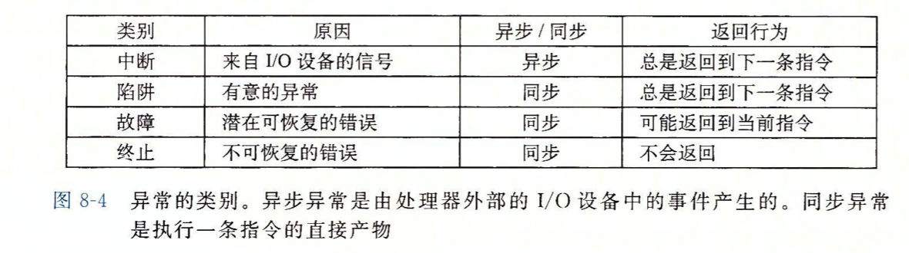

- 中断（interrupt）
  - 硬件中断的异常处理程序常常称为中断处理程序
  - I/O设备，例如网络适配器、磁盘控制器和定时器芯片，通过向处理器芯片上的一个引脚发信号，并将异常号放到系统总线上，来触发中断，这个异常号标识了引起中断的设备
  - 在当前指令完成执行后，处理器注意到中断引脚的电压变高了，就从系统总线读取异常号，然后调用适当的中断处理程序

- 陷阱和系统调用（trap）
  - 陷阱是有意的异常，是执行一条指令的结构。陷阱最重要的用途是在用户程序和内核之间提供一个像过程一样的接口，叫做系统调用
  - 处理器提供了一条特殊的syscall n指令

- 故障（fault）
  - 故障是由错误情况引起的，它可能能够被故障处理程序修正。当故障发生时，处理器将控制转移给故障处理程序。如果处理程序能够修正这个错误情况，它就将控制返回到引起故障的指令，从而重新执行它。否则，处理程序返回到内核中的abort例程，abort例程会终止引起故障的应用程序
  - 一个典型的故障示例是缺页异常

- 终止（abort）
  - 终止是不可恢复的致命错误造成的结果，通常是一些硬件错误，比如DRAM或者SRAM位被损坏时发生的奇偶错误。处理程序将控制返回给一个abort例程，该例程会终止这个应用程序

#### 8.1.3 Linux/x86-64系统中的异常

- 故障和终止
  - 除法错误：浮点异常（Float exception）
  - 一般保护故障：通常是因为一个程序引用了一个未定义的虚拟内存区域，或者因为程序试图写一个只读的文本段。断故障（Segmentation fault）
  - 机器检查：机器检查是在导致故障的指令执行中检测到致命的硬件错误时发生的

- 系统调用

  ```c
  int main()
  {
    write(1, "hello, world\n", 13);
    _exit(0);
  }
  ```

  ```assembly
  .section .data
  string:
  	.ascii "hello, world\n"
  string_end:
  	.equ len, string_end - string
  .section .text
  .global main
  main:
  	movq $1, %rax # write is system call 1
  	movq $1, %rdi # Arg1: stdout has descriptor 1
  	movq $string, %rsi # Arg2
  	movq $len, %rdx # Arg3
  	syscall
  	
  	movq $60, %rax # _exit is system call 60
  	movq $0, $rdi # Arg1
  	syscall
  ```

### 8.2 进程

#### 8.2.3 私有地址空间

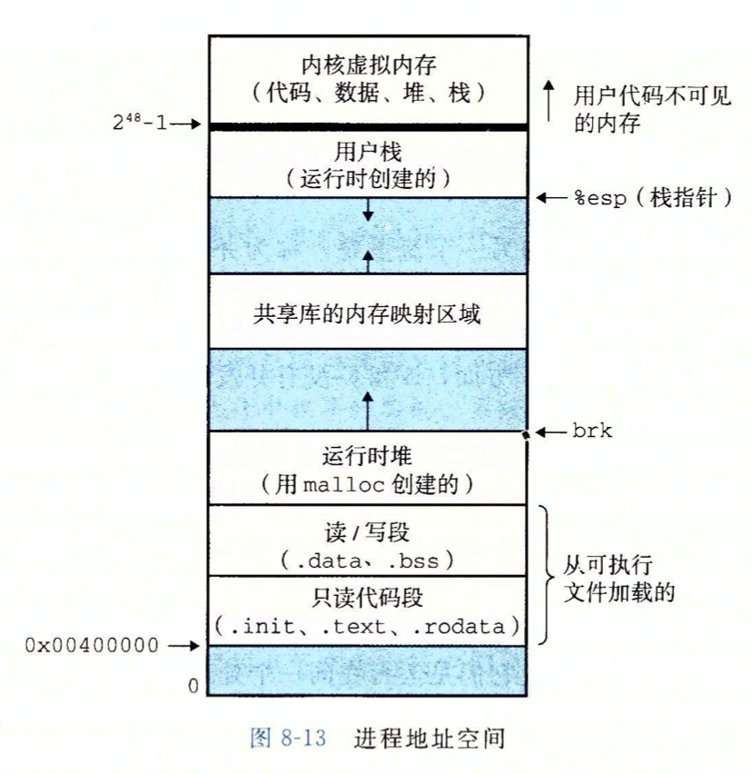

#### 8.2.4 用户模式和内核模式

- 处理器通常是用某个控制寄存器中的一个模式位来提供这种功能，该寄存器描述了进程当前享有的特权。当设置了模式位时，进程就运行在内核模式中

- Linux提供了一种聪明的机制，叫做/proc文件系统，它允许用户模式进程访问内核数据结构的内容。/proc文件系统将许多内核数据结构的内容输出为一个用户程序可以读的文本文件的层次结构。比如，可以使用/proc文件系统找出一般的系统属性，如/proc/cpuinfo，或者某个特殊的进程使用的内存段`/proc/<process-id>/maps`。2.6版本的Linux内核引入/sys文件系统，它输出关于系统总线和设备的额外的低层信息

#### 8.2.5 上下文切换

- 内核为每个进程维持一个上下文。上下文就是内核重新启动一个被抢占的进程所需的状态。它由一些对象的值组成，这些对象包括通用目的寄存器、浮点寄存器、程序计数器、用户栈、状态寄存器、内核栈和各种内核数据结构，比如描述地址空间的页表、包含有关当前进程信息的进程表，以及保护进程已打开文件的信息的文件表
- 当内核代表用户执行系统调用时，可能会发生上下文切换
- 中断也可能引发上下文切换

### 8.4 进程控制

#### 8.4.2 创建和终止进程

- 从程序员的角度，我们可以认为进程总是处于下面三种状态之一
  - 运行：进程要么在CPU上执行，要么在等待被执行且最终会被内核调度
  - 停止。进程的执行被挂起，且不会被调度。当收到SIGSTOP、SIGTSTP、SIGTTIN或者SIGTTOU信号时，进程就停止，并且保持停止知道它收到一个SIGCONT信号，在这个时刻，进程再次开始运行（信号是一种软件中断的形式）
  - 终止。进程永远地停止了。进程会因为三种原因终止：1）收到一个信号，该信号的默认行为是终止进程；2）从主程序返回；3）调用exit函数

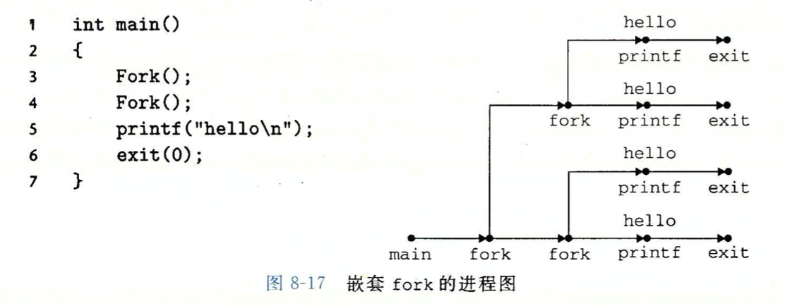

#### 8.4.3 回收子进程

- 当一个进程由于某种原因终止时，内核并不是立即把它从系统中清除。相反，进程被保存在一种已终止的状态中，知道被它的父进程回收。当父进程回收已终止的子进程时，内核将子进程的退出状态传递给父进程，然后抛弃已终止的进程，从此时开始，该进程就不存在了。一个终止了但还未被回收的进程称为僵死进程（zombie）

- 如果一个父进程终止了，内核会安排init进程称为它的孤儿进程的养父。init进程不会终止，是所有进程的祖先。如果父进程没有回收它的僵死子进程就终止了，那么内核会安排init进程去回收它们。不过，长时间运行的程序，比如shell或者服务器，总是应该回收它们的僵死子进程。即使僵死子进程没有运行，它们仍然消耗系统的内存资源

- 参考：[Linux回收子进程](https://www.jianshu.com/p/8be8b636c9c8)

- `pid_t waitpid(pit_t pid, int* statusp, int options)`

- 使用waitpid函数不按照特定的顺序回收僵死子进程

  ```c
  #include "csapp.h"
  #define N 2
  
  int main()
  {
    int status, i;
    pid_t pid;
    
    for (i = 0; i < N; i++)
      if ((pid = Fork()) == 0)
        exit(100+i);
    
    while ((pid = waitpid(-1, &status, 0)) > 0) {
      if (WIFEXITED(status))
        printf("child %d terminated normally with exit status=%d\n", pid, WEXITSTATUS(status));
      else
        printf("child %d terminated abnormally\n", pid);
    }
    
    if (errno != ECHILD)
      unix_error("waitpid error");
    
    exit(0)
  }
  ```

#### 8.4.4 让进程休眠

- 如果请求的时间量已经到了，sleep函数返回0，否则返回还剩下的要休眠的秒数。后一种情况是可能的，如果因为sleep函数被一个信号而过早地返回
- pause函数让调用者休眠，直到该进程收到一个信号

#### 8.4.5 加载并运行程序

- `int execve(const char *filename, const char *argv[], const char *envp[])`

- 在execve加载了filename之后，它调用7.9节中描述的启动代码。启动代码设置栈，并将控制传递给新程序的主函数。当main开始执行时，用户栈的组织结构如图：

  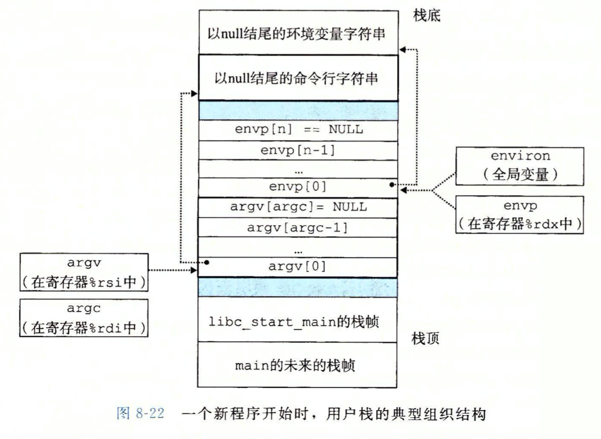

- fork和execve的区别

  - fork函数在新的子进程中运行相同的程序，新的子进程是父进程的一个复制品
  - execve函数在当前进程的上下文中加载并运行一个新的程序，它会覆盖当前进程的地址空间，但并没有创建一个新的进程。新的程序仍然有相同的PID，并且继承了调用execve函数时已打开的所有文件描述符

### 8.5 信号

- Linux信号是一种更高层（相比于低层异常机制）的软件形式的异常，它运行进程和内核中断其他进程

- 一个信号就是一条小消息，它通知进程系统中发生了一个某种类型的事件

- Linux系统上支持的30种不同类型的信号

  

- 每种信号类型都对应于某种系统事件。低层的硬件异常是由内核异常处理程序处理的，正常情况下，对用户进程而言是不可见的

- 信号提供了一种机制，通知用户进程发生了这些异常。比如，如果一个进程试图除以0，那么内核就发送给它一个SIGFPE信号。一个进程可以通过向另一个进程发送SIGKILL信号强制终止它

#### 8.5.1 信号术语

- 传送一个信号到目的进程是由两个不同步骤组成的
  - 发送信号
    - 内核通过更新目的进程上下文中的某个状态，发送一个信号给目的进程
    - 发送信号的原因可以有如下两种原因：1）内核检测到一个系统事件，比如除零错误或者子进程终止；2）一个进程调用了kill函数，显式地要求内核发送一个信号给目的进程。一个进程可以发送信号给它自己
  - 接收信号

- 一个发出而没有被接收的信号叫做待处理信号（pending signal）。在任何时刻，一种类型至多只会有一个待处理信号。一个进程可以有选择性地阻塞接收某种信号。当一种信号被阻塞时，它仍可以被发送，但是产生的待处理信号不会被接收，直到进程取消对这种信号的阻塞
- 一个待处理信号最多只能被接收一次。内核为每个进程在pending位向量中维护着待处理信号的集合，而在blocked位向量中维护着被阻塞的信号集合。只要传送了一个类型为k的信号，内核就会设置pending中的第k位，而只要接收了一个类型为k的信号，内核就会清除pending中的第k位

#### 8.5.2 发送信号

- 进程组
  - 每个进程都只属于一个进程组
  - 默认地，一个子进程和它的父进程同属于一个进程组

#### 8.5.3 接收信号

- 当内核把进程p从内核模式切换到用户模式时，它会检查进程p的未被阻塞的待处理信号的集合（pending&~blocked）。如果这个集合为空，那么内核将控制传递到p的逻辑控制流的下一条指令。然而，如果集合是非空的，那么内核选择集合中的某个信号k（通常是最小的k），并且强制p接收信号k。收到这个信号会触发进程采取某种行为。一旦进程完成了这个行为，那么控制就传递回p的逻辑控制流的下一条指令
- 每个信号类型都有一个预定义的默认行为，是下面的一种
  - 进程终止
  - 进程终止并转储内存
  - 进程停止直到被SIGCONT信号重启
  - 进程忽略该信号

- 进程可以使用signal函数修改和信号相关联的默认行为
  - `sighandler_t signal(int signum, sighandler_t handler)`
  - 如果handler不是SIG_IGN或SIG_DFL，那么handler就是用户定义的函数的地址，这个函数被称为信号处理程序
  - 当一个进程捕获了一个类型为k的信号时，会调用为信号k设置的处理程序，一个整数参数被设置为k。这个参数允许同一个处理函数捕获不同类型的信号

- 信号处理程序可以被其他信号处理程序中断

#### 8.5.4 阻塞和解除阻塞信号

- Linux提供阻塞信号的隐式和显式的机制
  - 隐式阻塞机制：内核默认阻塞任何当前处理程序正在处理信号类型的待处理信号
  - 显式阻塞机制：应用程序可以使用sigprocmask函数和它的辅助函数，明确地阻塞和解除选定的信号

#### 8.5.5 编写信号处理程序

- 安全的信号处理
  - 处理程序要尽可能简单
  - 在处理程序中只调用异步信号安全的函数。所谓异步信号安全的函数能够被信号处理程序安全地调用，原因有二：要么它是可重入的（例如只访问局部变量），要么它不能被信号处理程序中断
  - 保存和恢复errno。在进入处理程序时把errno保存在一个局部变量中，在处理程序返回前恢复它。这样做的目的是避免干扰主程序中其他依赖errno的部分
  - 阻塞所有的信号，保护共享全局数据结构的访问。这条规则的原因是从主程序访问一个数据结构d通常需要一系列的指令，如果指令序列被访问d的处理程序中断，那么处理程序可能会发现d的状态不一样，得到不可预知的结果
  - 用volatile声明全局变量。考虑一个处理程序和一个main函数，它们共享一个全局变量g。处理程序更新g，main周期性地读g。对于一个优化编译器而言，main中g的值看上去从来没有变化过，因为使用缓存在寄存器中的g副本来满足对g的每次引用是很安全的。如果这样，main函数可能永远都无法看到处理程序更新过的值
  - 用sig_atomic_t声明标志。在常见的处理程序中，处理程序会写全局标志来记录收到了信号。主程序周期性地读这个标志，响应信号，再清除该标志。对于通过这种方式来共享的标志，C提供一种整型数据类型sig_atomic_t，对它的读和写保证会是原子的（不可中断的），因为可以用一条指令来实现它们`volatile sig_atomic_t flag`，因此它们是不可中断的，所以可以安全地读和写sig_atomic_t变量，而不需要暂时阻塞信号。注意，这里对原子性的保证只适用于单个的读和写，不适用于像flag++或flag=flag+10这样的更新，因为它们可以需要多条指令

- 正确的信号处理
  - 存在一个待处理信号只是暗示自进程最后一次收到一个信号以来，至少已经有一个这种类型的信号被发送了

- 可移植的信号处理

#### 8.5.6 同步流以避免讨厌的并发错误

#### 8.5.7 显式地等待信号

- `int sigsuspend(const sigset_t *mask)`
- sigsuspend函数暂时用mask替换当前的阻塞集合，然后挂起该进程，直到收到一个信号，其行为要么是允许一个处理程序，要么是终止该进程。如果它的行为是终止，那么该进程不从suspend返回就直接终止。如果它的行为是运行一个处理程序，那么sigsuspend从处理程序返回，恢复调用sigsuspend时原有的阻塞集合

### 8.6 非本地跳转

- 非本地跳转（nonlocal jump），它将控制直接从一个函数转移到另一个当前正在执行的函数，而不需要经过正常的调用-返回序列

- `int setjmp(jmp_buf env)`函数在env缓冲区保存当前调用环境，以供后面的longjmp使用，并返回0.调用环境包括程序计数器、栈指针和通用目的寄存器

- `void longjmp(jmp_buf env, int retval)`函数从env缓冲区中恢复调用环境，然后出发一个从最近一次初始化env的setjmp调用的返回。然后setjmp返回，并带有非零的返回值retval

- setjmp只被调用一次，但返回多次：一次是当第一次调用setjmp，而调用环境保存在缓冲区env中时，一次是为每个相应的longjmp调用。另一方面，longjmp函数被调用一次，但从不返回

- 非本地跳转的一个重要应用就是允许从一个深层嵌套的函数调用中立即返回，通常是由检测到某个错误情况引起的。如果在一个深层嵌套的函数调用中发现了一个错误情况，我们可以使用非本地跳转直接返回到一个普通的本地化的错误处理程序，而不是费力地解开调用栈

  ```c
  #include "csapp.h"
  
  jmp_buf buf;
  
  int error1 = 0;
  int error2 = 1;
  
  void foo(void), bar(void);
  
  int main()
  {
    switch(setjmp(buf)) {
      case 0:
        foo();
        break;
      case 1:
        printf("Detected an error1 condition in foo\n");
        break;
      case 2:
        printf("Detected an error2 condition in foo\n");
        break;
      default:
        printf("Unknown error condition in foo\n");
    }
    exit(0);
  }
  
  void foo(void)
  {
    if (error1)
      longjmp(buf, 1);
    bar();
  }
  
  void bar(void)
  {
    if (error2)
      longjmp(buf, 2);
  }
  ```

- C++和Java提供的异常机制是较高层次的，是C语言中setjmp和longjmp函数的更加结构化的版本。可以把try语句中catch子句看作类似于setjmp函数。相应地，throw语句就类似于longjmp函数

## 第9章 虚拟内存

### 9.3 虚拟内存作为缓存的工具

- 在任意时刻，虚拟页面的集合都分为三个不相交的子集

  - 未分配的：VM系统还未分配（或者创建）的页。未分配的块没有任何数据和它们相关联，因此也就不占用任何磁盘空间
  - 缓存的：当前已缓存在物理内存中的已分配页
  - 未缓存的：未缓存在物理内存中的已分配页

  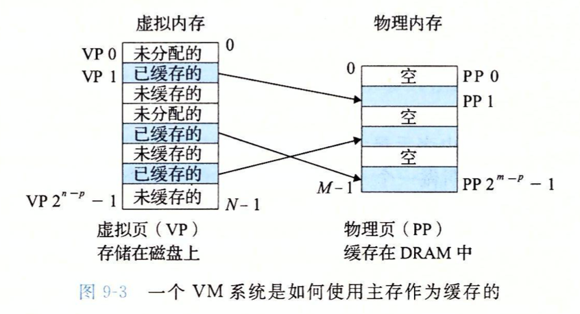

#### 9.3.1 DRAM缓存的组织结构

- 因为大的不命中处罚和访问第一个字节的开销，虚拟页往往很大，通常是4KB-2MB
- 由于大的不命中处罚，DRAM缓存是全相联的，即任何虚拟页都可以放置在任何物理页中
- 不命中时的替换策略页很重要，因为替换了虚拟页的处罚页非常之高。因此，于硬件对SRAM缓存相比，操作系统对DRAM缓存使用了更复杂精密的替换算法
- 因为对磁盘的访问时间很长，DRAM缓存总是使用写回，而不是直写

### 9.4 虚拟内存作为内存管理的工具

- 简化链接
  - 独立的地址空间允许每个进程的内存映像使用相同的基本格式，而不管代码和数据实际存放在物理内存的何处。这样的一致性极大地简化了链接器的设计和实现，允许链接器生成完全链接的可执行文件，这些可执行文件是独立于物理内存中代码和数据的最终位置的
- 简化加载
  - 要把目标文件中的.text和.data节加载到一个新创建的进程中，Linux加载器为代码和数据段分配虚拟页，把它们标记为无效的，将页表条目指向目标文件中适当的位置。加载器从不从磁盘到内存实际复制任何数据。在每个页初次被引用时，要么是CPU取指令时引用的，要么是一条正在执行的指令引用一个内存位置时引用的，虚拟内存会按照需要自动地调入数据页
- 简化共享
  - 操作系统通过将不同进程中适当的虚拟页面映射到相同的物理页面，从而安排多个进程共享这部分代码的一个副本。而不是在每个进程中都包括单独的内核和C标准库的副本

- 简化内存分配
  - 当一个运行在用户进程中的程序要求额外的堆空间时，操作系统分配一个适当数字（例如k）个连续的虚拟内存页面，并且将它们映射到物理内存中任意位置的k个任意的物理页面。由于页表的工作方式，操作系统没有必要分配k个连续的物理内存页面。页面可以随机地分散在物理内存中

### 9.5 虚拟内存作为内存保护的工具

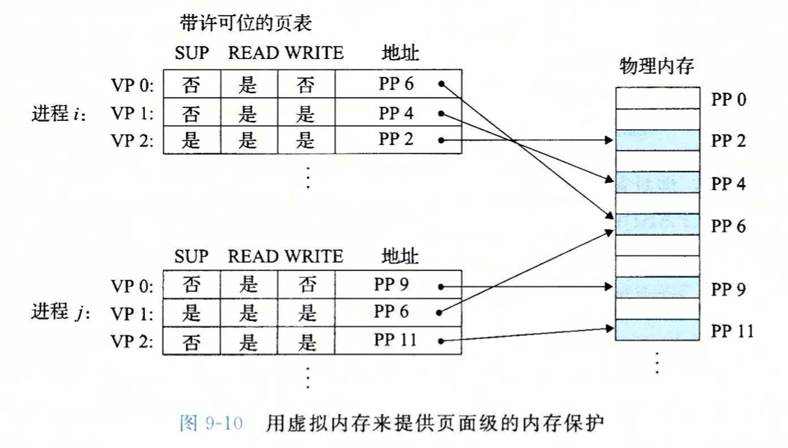

### 9.6 地址翻译

- 当页面命中时，CPU硬件执行的步骤
  - 第1步：处理器生成一个虚拟地址，并把它传送给MMU
  - 第2步：MMU生成PTE（Page Table Entry）地址，并从高速缓存/主存请求得到它
  - 第3步：高速缓存/主存向MMU返回PTE
  - 第4步：MMU构造物理地址，并把它传送给高速缓存/主存
  - 第5步：高速缓存/主存返回所请求的数据字处理器

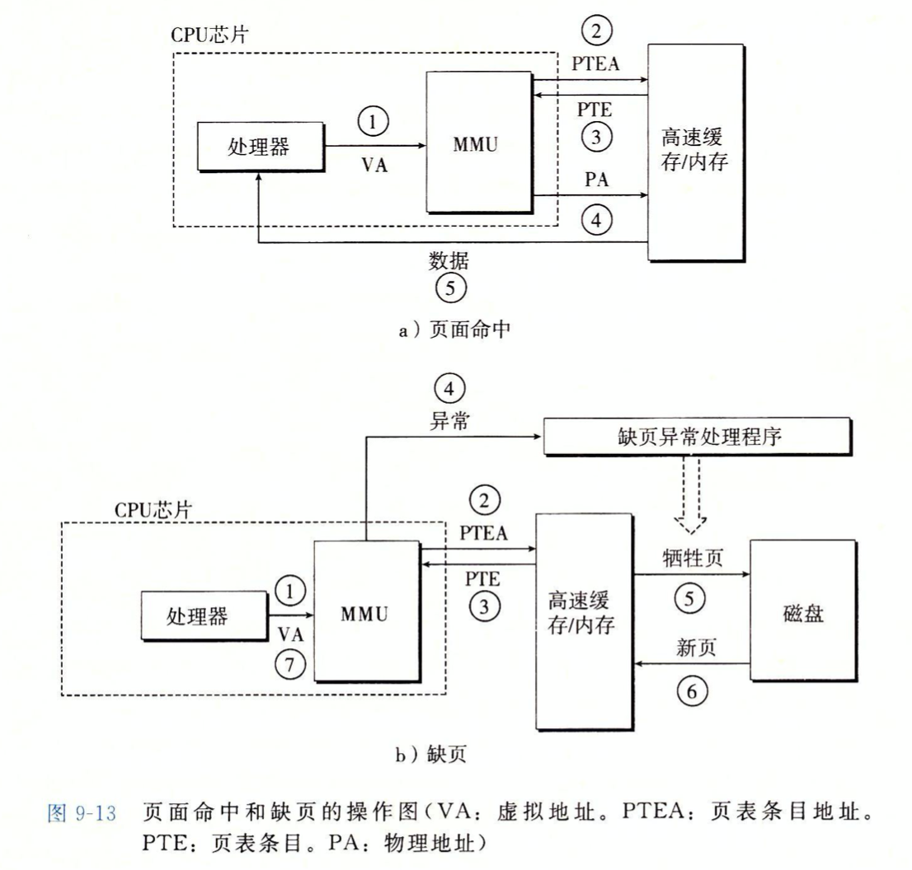

- 页面命中完全是由硬件来处理的，与之不同的是，处理缺页要求硬件和操作系统协作完成：
  - 第1步到第3步：同上
  - 第4步：PTE中的有效位是零，所以MMU触发了一次异常，传递CPU中的控制到操作系统内核中的缺页异常处理程序
  - 第5步：缺页处理程序确定出物理内存中的牺牲页，如果这个页面已经被修改了，则把它换出到磁盘
  - 第6步：缺页处理程序页面调入新的页面，并更新内存中的PTE
  - 第7步：缺页处理程序返回到原来的进程，再次执行导致缺页的指令。CPU将引起缺页的虚拟地址重新发送给MMU

#### 9.6.1 结合高速缓存和虚拟内存

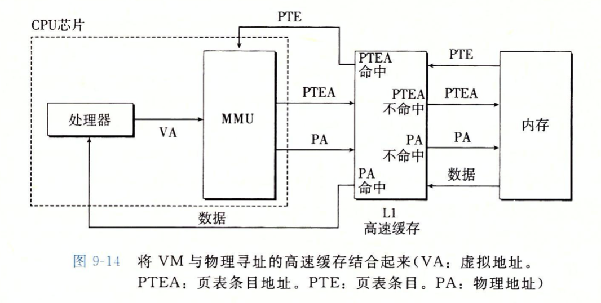

#### 9.6.2 利用TLB加速地址翻译

- MMU中的TLB，Translation Lookaside Buffer，翻译后备缓冲器

- TLB是一个小的，虚拟地址的缓存，其中每一行都保存着一个由单个PTE组成的块。TLB通常有高度的相联度

  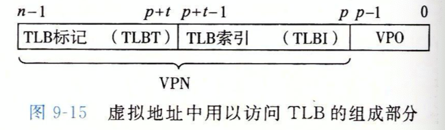

- 用于组选择和行匹配的索引和标记字段是从虚拟地址的虚拟页号中提取出来的
- 当TLB命中时所包括的步骤。这里的关键点是，所有的地址翻译都是在芯片上的MMU中执行的，因此非常快
  - 第1步：CPU产生一个虚拟地址
  - 第2步和第3步：MMU从TLB中取出相应的PTE
  - 第4步：MMU将这个虚拟地址翻译成一个物理地址，并且将它发送到高速缓存/主存
  - 第5步：高速缓存/主存将所请求的数据字返回给CPU

- 当TLB不命中时，MMU必须从L1缓存中取出相应的PTE，新取出的PTE存放在TLB中，可能会覆盖一个已经存在的条目

  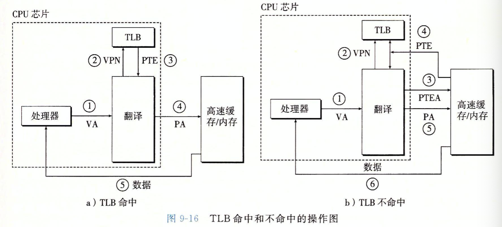

#### 9.6.3 多级页表

- 用来压缩页表的常用方法是使用层次结构的页表

  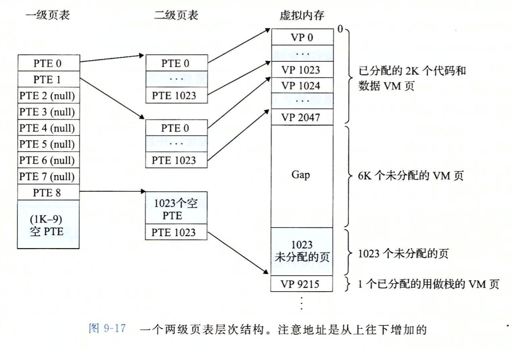

- 这种方法从两个方面减少了内存要求

  - 如果一级页表中的一个PTE是空的，那么相应的二级页表就根本不会存在。这代表着一种巨大的潜在节约
  - 只有一级页表才需要总是在主存中；虚拟内存系统可以在需要时创建、页面调入或调出二级页表，这就减少了主存的压力；只有最经常使用的二级页表才需要缓存在主存中

- k级页表层次结构的地址翻译

  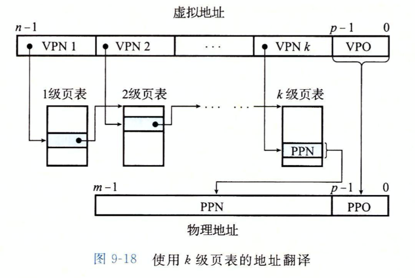

### 9.7 案例研究：Intel Core i7/Linux内存系统

#### 9.7.1 Core i7地址翻译

- Core i7的内存系统

  

- Core i7地址翻译的概况

  

#### 9.7.2 Linux虚拟内存系统

- 一个Linux进程的虚拟地址内存

  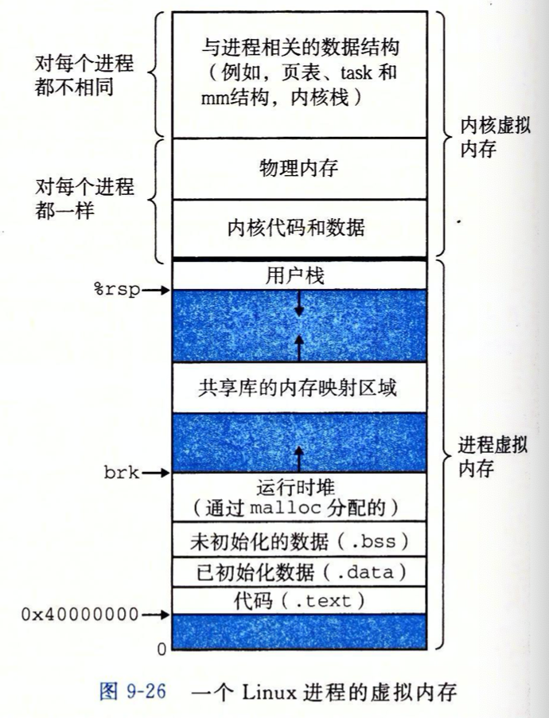

- Linux虚拟内存区域

  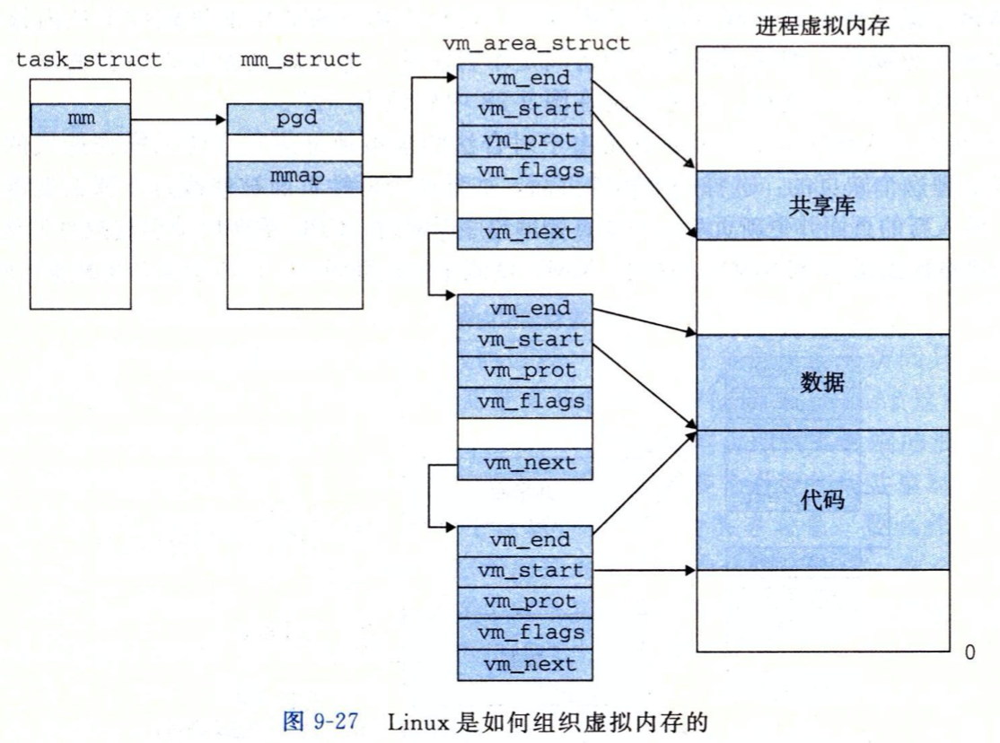

  - Linux将虚拟内存组织成一些区域（也叫做段）。一个区域就是已经存在着的（已分配的）虚拟内存的连续片，这些页是以某种方式相关联的
  - 区域的概念很重要，因为它允许虚拟地址空间有间隙。内核不用记录那些不存在的虚拟页，而这样的页也不占用内存、磁盘或者内核本身中的任何资源
  - 内核为系统中的每个进程维护一个单独的任务结构task_struct。任务结构中的元素包含或者指向内核允许该进程所需要的所有信息，例如PID、指向用户栈的指针、可执行目标文件的名字，以及程序计数器
  - 任务结构中的一个条目指向mm_struct，它描述了虚拟内存的当前状态。其中pgd指向第一级页表的基址，而mmap指向一个vm_area_struct（区域结构）的链表，其中每个vm_area_struct都描述了当前虚拟地址空间的一个区域。当内核运行这个进程时，就将pgd存放在CR3控制寄存器中

- Linux缺页异常处理
  - 缺页异常导致控制转移到内核的缺页处理程序，处理程序随后就指向下面的步骤
    - 虚拟地址A是合法的吗，换句话说，A在某个vm_area_struct定义的区域内吗。缺页处理程序搜索vm_area_struct链表，把A和每个vm_area_struct中的vm_start和vm_end做比较。如果这个指令是不合法的，那么缺页处理程序就触发一个段错误，从而终止这个进程
    - 试图进行的内存访问是否合法，换句话说，进程是否有读、写或者执行这个区域内页面的权限。例如，这个缺页是不是由一条试图对这个代码段里的只读页面进行写操作的存储指令造成的，这个缺页是不是因为一个运行在用户模式中的进程试图从内核虚拟内存中读取字造成的。如果试图进行的访问是不合法的，那么缺页处理程序会触发一个保护异常，从而终止这个进程
    - 缺页是由于对合法的虚拟地址进行合法的操作造成的

### 9.8 内存映射

- Linux通过将一个虚拟内存区域与一个磁盘上的对象关联起来，以初始化这个虚拟内存区域的内容，这个过程称为内存映射（memory mapping）。虚拟内存区域可以映射到两种类型的对象中的一种
  - Linux文件系统中的普通文件：一个区域可以映射到一个普通磁盘文件的连续部分，例如一个可执行目标文件
  - 匿名文件：一个区域也可以映射到一个匿名文件，匿名文件是由内核创建的，包含的全是二进制零

- 无论在哪种情况，一旦一个虚拟页面被初始化了，它就在一个由内核维护的专门的交换文件之间换来换去。交换文件也叫做交换空间或者交换区域。在任何时刻，交换空间都限制着当前运行着的进程能够分配的虚拟页面的总数

#### 9.8.1 再看共享对象

- 一个对象可以被映射到内存的一个区域，要么作为共享对象，要么作为私有对象
  - 如果一个进程将一个共享对象映射到它的虚拟地址空间的一个区域内，那么这个进程对这个区域的任何写操作，对于那些也把这个共享对象映射到它们虚拟内存的其他进程而言，也是可见的。而且，这些变化也会反应在磁盘上的原始对象中
  - 另一方面，对于一个映射到私有对象的区域做的改变，对于其他进程来说是不可见的，并且进程对这个区域所做的任何写操作都不会反应在磁盘上的对象中

- 一个共享对象

  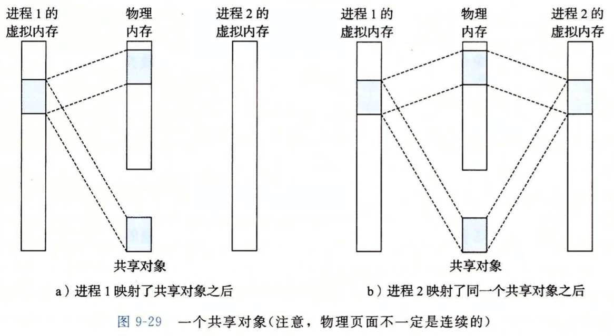

  - 因为每个对象都有一个唯一的文件名，内核可以迅速地判定进程1已经映射了这个对象，而且可以使进程2的页表条目指向相应的物理页面。关键点在于即使对象被映射到了多个共享区域，物理内存中也只需要存放共享个对象的一个副本

- 私有对象使用一种叫做写时复制（copy-on-write）的巧妙技术被映射到虚拟内存中

  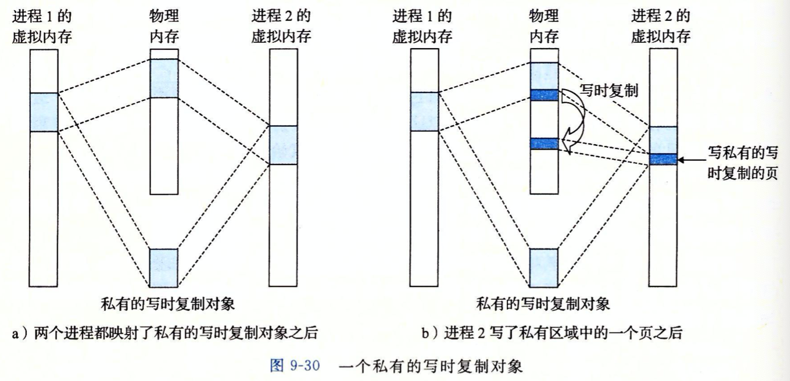
  - 对于每个映射私有对象的进程，相应私有区域的页表条目都被标记为只读，并且区域结构被标记为私有的写时复制。只要没有进程试图写它自己的私有区域，它们就可以继续共享物理内存中对象的一个单独副本
  - 然而，只要有一个进程试图写私有区域内的某个页面，那么这个写操作就会触发一个保护故障。当故障处理程序注意到保护异常是由于进程试图写私有的写时复制区域中的一个页面而引起的，它就会在物理内存中创建这个页面的一个新副本，更新页表条目指向这个新的副本，然后恢复这个页面的可写权限。当故障处理程序返回时，CPU重新执行这个写操作，现在在创建的页面上这个写操作就可以正常执行了

#### 9.8.2 再看fork函数

- 当fork函数被当前进程调用时，内核为新进程创建各种数据结构，并分配给它一个唯一的PID。为了给这个新进程创建虚拟内存，它创建了当前进程的mm_struct、区域结构和页表的原样副本。它将两个进程中的每个页面都标记为只读，并将两个进程中的每个区域结构都标记为私有的写时复制
- 当这两个进程中的任一个后来进行写操作时，写时复制机制就会创建新页面

#### 9.8.3 再看execve函数

- `execve("a.out", NULL, NULL)`，加载并运行a.out需要以下几个步骤

  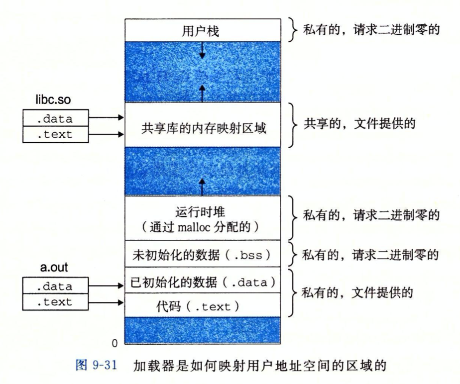

  - 删除已存在的用户区域：删除当前进程虚拟地址的用户部分中已存在的区域结构
  - 映射私有区域：为新程序的代码、数据、bss和栈区创建新的区域结构。所有这些新的区域都是私有的、写时复制的
  - 映射共享区域：如果a.out程序与共享对象（或目标）链接，比如标准C库libc.so，那么这些对象都是动态链接到这个程序的，然后再映射到用户虚拟地址空间中的共享区域内
  - 设置程序计数器，使之指向代码区域的入口点。下一次调度这个进程时，它将从这个入口点开始执行。Linux将根据需要换如代码和数据页面

#### 9.8.4 使用mmap函数的用户级内存映射

- `void* mmap(void* start, size_t length, int prot, int flags, int fd, off_t offset)`
  
- mmap函数要求内核创建一个新的虚拟内存区域，最好是从地址start开始的一个区域，并将文件描述符fd指定的对象的一个连续的片映射到这个新的区域。连续的对象片大小为length字节，从距文件开始处偏移量为offset字节的地方开始
  
- 使用mmap将一个任意大小的磁盘文件复制到stdout

  ```c
  #include "csapp.h"
  
  // mmapcopy - uses mmap to copy file to stdout
  void mmapcopy(int fd, int size)
  {
    char* bufp;
    bufp = Mmap(NULL, size, PROT_READ, MAP_PRIVATE, fd, 0);
    Write(1, bufp, size);
    return;
  }
  
  // mmapcopy driver
  int main(int argc, char** argv)
  {
    struct stat stat;
    int fd;
    
    if (argc != 2)
    {
      printf("usage: %s <filename>\n", argv[0]);
      exit(0);
    }
    
    fd = Open(argv[1], O_RDONLY, 0);
    fstat(fd, &stat);
    mmapcopy(fd, stat.st_size);
    exit(0);
  }
  ```

### 9.9 动态内存分配

- 动态内存分配器维护着一个进程的虚拟内存区域，称为堆。对于每个进程，内核维护着一个变量brk，它指向堆的顶部
- 分配器将堆视为一组不同大小的块（block）的集合来维护。每个快就是一个连续的虚拟内存片（chunk），要么是已分配的，要么是空闲的
- 分配器有两种基本风格
  - 显式分配器：要求应用显式地释放任何已分配的块
  - 隐式分配器：要求分配器检测一个已分配块何时不再被程序所使用，那么就释放这个块。隐式分配器也叫做垃圾收集器

#### 9.9.1 malloc和free函数

- 动态内存分配器，例如malloc，可以通过使用mmap和munmap函数，显式地分配和释放堆内存，或者还可以使用sbrk函数。sbrk函数通过将内核的brk指针增加incr来扩展和收缩堆

#### 9.9.3 分配器的要求和目标

- 约束条件
  - 处理任意请求序列
  - 立即响应请求
  - 只使用堆
  - 对齐块：分配器必须对齐块，使得它们可以保存任何类型的数据对象
  - 不修改已分配的块：分配器只能操作或者改变空闲块。特别是，一旦块被分配了，就不允许修改或者移动它了。因此，诸如压缩已分配块这样的技术是不允许使用的

- 目标
  - 最大化吞吐率
  - 最大化内存利用率

#### 9.9.4 碎片

- 有两种形式的碎片
  - 内部碎片：是在一个已分配块比有效载荷大时发生的。很多原因都可能造成这个问题。例如，一个分配器的实现可能对已分配块强加一个最小的大小值，而这个大小要比某个请求的有效载荷大。或者，分配器可能增加块大小以满足对齐约束条件
  - 外部碎片：是当空闲空间合计起来足够满足一个分配请求，但是没有一个单独的空闲块足够大可以来处理这个请求时发生的

#### 9.9.5 实现问题

- 一个实际的分配器要在吞吐率和利用率之间把握好平衡，就必须考虑以下几个问题
  - 空闲块组织：如何记录空闲块
  - 放置：如何选择一个合适的空闲块来放置一个新分配的块
  - 分割：在将一个新分配的块放到某个空闲块之后，我们如何处理这个空闲块中的剩余部分
  - 合并：如何处理一个刚过被释放的块

#### 9.9.6 隐式空闲链表

- 空闲块是通过头部中的大小字段隐含地连接着的。分配器可以通过遍历堆中所有的块，从而间接地遍历整个空闲块的集合
- 系统对齐要求和分配块对齐格式的选择会对分配器上的最小块大小有强制的要求。例如，如果我们假设一个双字的对齐要求，那么每个块的大小都必须是双字的倍数

#### 9.9.7 放置已分配的块

- 放置策略
  - 首次适配
  - 下一次适配
  - 最佳适配

#### 9.9.10 合并空闲块

- 何时执行合并
  - 立即合并
  - 推迟合并

#### 9.9.11 带边界标记的合并

- 使用边界标记的堆块的格式

  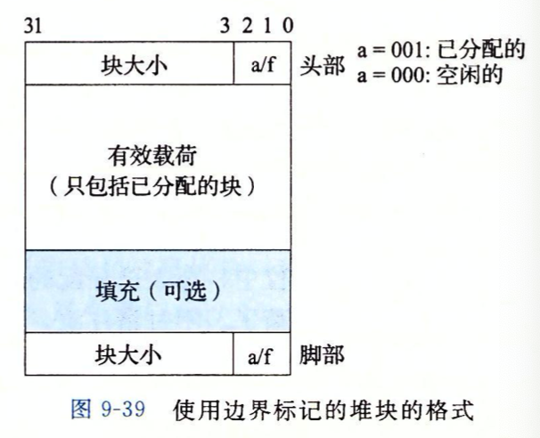

- 边界标记的概念是简单优雅的，它对许多不同类型的分配器和空闲链表组织都是通用的
- 边界标记也存在一个潜在的缺陷：它要求每个块都保持一个头部和一个脚部，在应用程序操作许多小块时，会产生显著的内存开销
- 有一种非常聪明的边界标记的优化方法，能够使得在已分配块中不再需要脚部
  
  - 如果我们把前面块的已分配/空闲位存放在当前块中多出来的低位中，那么已分配的块就不需要脚部了，这样我们就可以将这个多出来的空间用作有效载荷了

#### 9.9.13 显式空闲链表

- 对于隐式空闲链表，块分配与堆块的总数呈线性关系，所以对于通用的分配器，隐式空闲链表是不合适的

- 使用双向空闲链表的堆块格式

  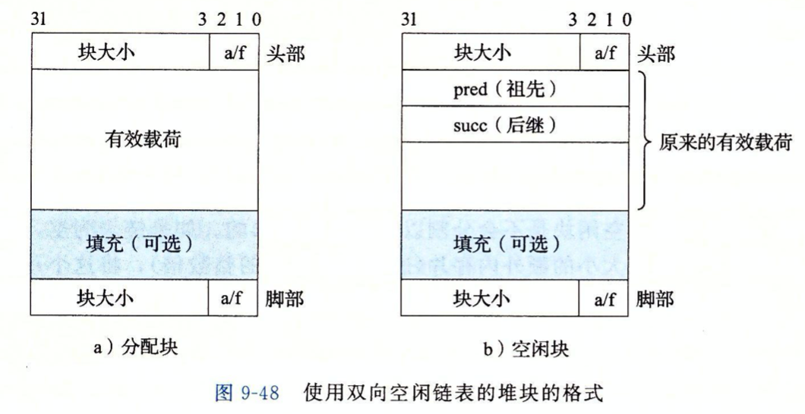

- 使用双向空闲链表而不是隐式空闲链表，使首次适配的分配时间从块总数的线性时间减少到了空闲块数量的线性时间。不过，释放一个块的时间可以是线性的，页可能是个常数，这取决于我们所选择的空闲链表中块的排序策略
- 一般而言，显式链表的缺点是空闲块必须足够大，以保护所有需要的指针，以及头部和可能的脚部。这就导致了更大的最小块大小，页潜在提高了内部碎片的程度

#### 9.9.14 分离的空闲链表

- 一种流行的减少分配时间的方法，通常称为分离存储，就是维护多个空闲链表，其中每个链表中的块有大致相等的大小。一般的思路是将所有可能的块大小分成一些等价类，也叫做大小类

- 简单分离存储
  - 每个大小类的空闲链表包含大小相等的块，每个块的大小就是这个大小类中最大元素的大小
- 分离适配
  - 每个空闲链表是和一个大小类相关联的，并且被组织成某种类型的显式或隐式链表。每个链表包含潜在的大小不同的块，这些块的大小是大小类的成员
  - 分离适配方法是一种常见的选择，C标准库中提供的GNU malloc包就是采用的这种方法，因为这种方法既快速，对内存的使用也很有效率

- 伙伴系统
  - 伙伴系统是分离适配的一种特例，其中每个大小类都是2的幂

### 9.10 垃圾收集

#### 9.10.1 垃圾收集器的基本知识

- 垃圾收集器将内存视为一张可达图。该图中的节点被分为一组根节点和一组堆节点。每个堆节点对英语堆中的一个已分配块。根节点对应于这样一种不再堆中的位置，它们中包含指向堆中的指针。这些位置可以是寄存器、栈里的变量，或是虚拟内存中读写数据区域内的全局变量
- 垃圾收集器的角色是维护可达图的某种表示，并通过释放不可达节点且将它们返回给空闲链表，来定期地回收它们

#### 9.10.2 Mark & Sweep垃圾收集器

- Mark&Sweep垃圾收集器由标记（mark）阶段和清除（sweep）阶段组成。标记阶段标记出根节点的所有可达的和已分配的后继，而后面的清除阶段释放每个未被标记的已分配块。块头部中的空闲的低位中的一位通常用来表示这个块是否被标记了

- TODO

## 第10章 系统级I/O

### 10.2 文件

- 每个Linux文件都有一个类型来表明它在系统中的角色
  - 普通文件
  - 目录：是包含一组链接的文件，其中每个链接都将一个文件名映射到一个文件，这个文件可能是另一个目录
  - 套接字
  - 命名管道（named pipe）
  - 符号链接（symbolic link）
  - 字符和块设备

- 作为其上下文的一部分，每个进程都有一个当前工作目录来确定其在目录层次结构中的当前位置

#### 10.3 打开和关闭文件

- `int open(char* filename, int flags, mode_t mode)`
  - flags参数指明了进程打算如何访问这个文件
  - mode参数指定了新文件的访问权限位。作为上下文的一部分，每个进程都有一个umask，它是通过umask函数来设置的。当进程通过带某个mode参数的open函数调用来创建一个新文件时，文件的访问权限位被设置为`mode & ~umask`

#### 10.4 读和写文件

- 在某些情况下，read和write传送的字节比应用程序要求的少。这些不足值不表叔有错误，出现这样情况的原因有
  - 读时遇到EOF
  - 从终端读文本行。如果打开的文件是与终端相关联的，那么每个read函数将一次传送一个文本行，返回的不足值等于文本行的大小
  - 读和写网络套接字。如果打开的文件对应于网络套接字，那么内部缓存约束和较长的网络延迟会引起read和write返回不足值
  - 对Linux管道调用read和write时，也有可能出现不足值

### 10.8 共享文件

- 内核用三个相关的数据结构来表示打开的文件
  - 描述符表：每个进程都有它独立的描述符表，它的表项是由进程打开的文件描述符来索引的。每个打开的描述符表项指向文件表中的一个表项
  - 文件表：打开文件的集合是由一张文件表来表示的。所有的进程共享这张表。每个文件表的表项组成包括当前的文件位置、引用计数以及一个指向v-node表中对应表项的指针。关闭一个描述符会减少相应的文件表表项中的引用计数。内核不会删除这个文件表表项，直到它的引用计数为0
  - v-node表：同文件表一样，所有的进程共享这张v-node表，每个表项包含stat结构中的大多数信息

- 典型的打开文件的内核数据结构，没有共享

  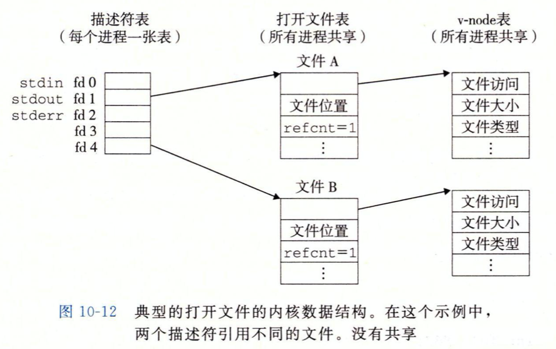

- 文件共享

  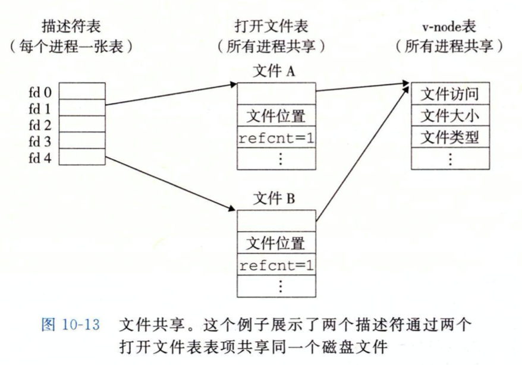

- 子进程如何继承父进程的打开文件，初始状态为典型的打开文件的内核数据结构，没有共享

  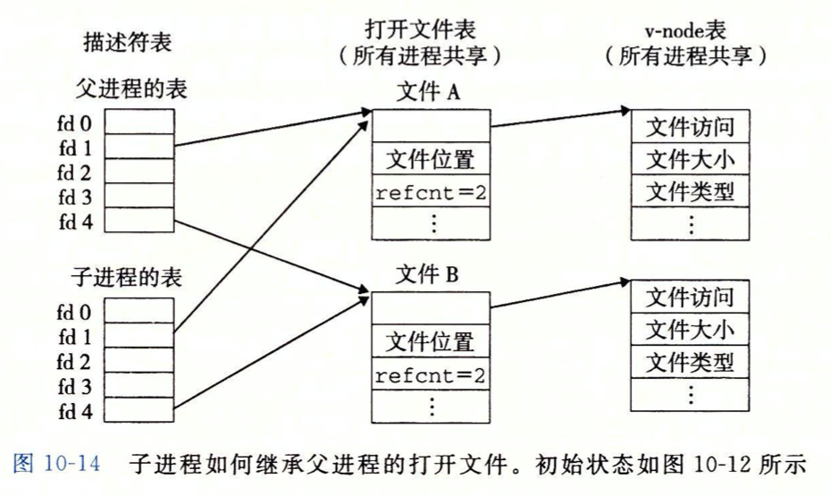

### 10.9 I/O重定向

- `int dup2(int oldfd, int newfd)`函数复制描述符表表项oldfd到描述符表表项newfd，覆盖描述符表表项newfd以前的内容。如果newfd已经打开了，dup2会在复制oldfd之前关闭newfd

## 第11章 网络编程

- TODO

## 第12章 并发编程

### 12.1 基于进程的并发编程

- 一个构造并发服务器的自然方法就是，在父进程中接受客户端连接请求，然后创建一个新的子进程来为每个客户端提供服务
- 假设我们有两个客户端和一个服务器，服务器正在监听一个监听描述符（比如描述符3）上的连接请求。现在假设服务器接受了客户端1的连接请求，并返回一个已连接描述符（比如描述符4）。在接受连接请求之后，服务器派生出一个子进程，这个子进程获得服务器描述符表的完整副本。子进程关闭它的副本中的监听描述符3，而父进程关闭它的已连接描述符4的副本，因为不再需要这些描述符了
- 因为父、子进程中的已连接描述符都指向同一个文件表表项，所以父进程关闭它的已连接描述符的副本是至关重要的。否则，将永不会释放已连接描述符4的文件表条目，而且由此引起的内存泄漏将最终耗光可用的内存，使系统崩溃

### 12.2 基于I/O多路复用的并发编程

- 使用select函数，要求内核挂起进程，只有在一个或多个I/O事件发生后，才将控制返回给应用程序

#### 12.2.1 基于I/O多路复用的并发事件驱动服务器

- I/O多路复用可以用做并发事件驱动程序的基础

### 12.3 基于线程的并发编程

- 基于线程的逻辑流结合了基于进程和基于I/O多路复用的流的特性