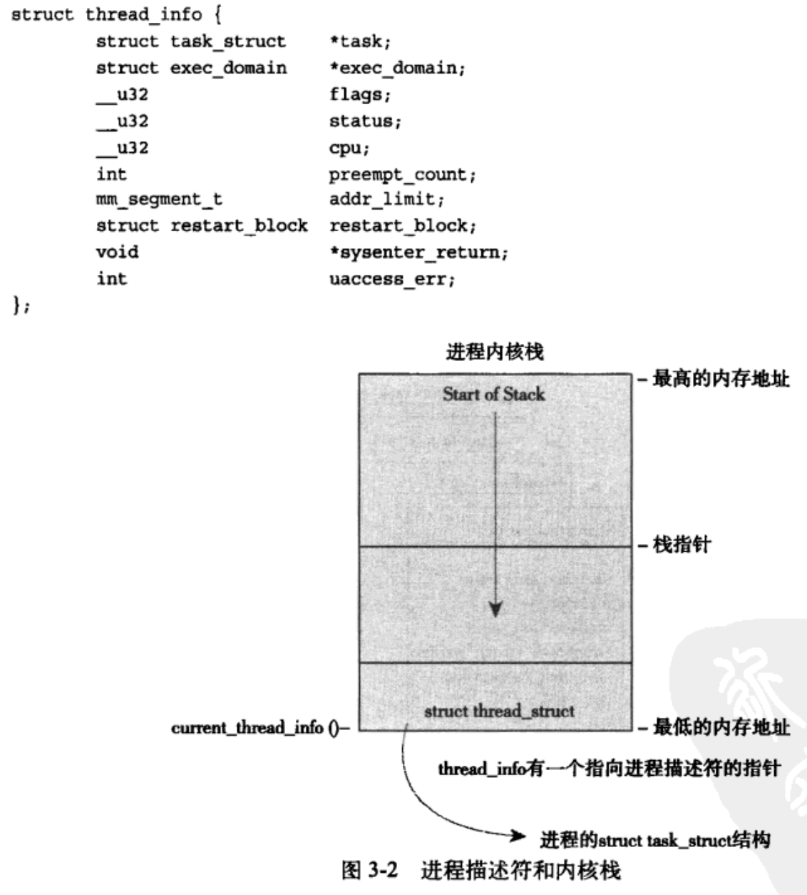

# Linux内核设计与实现

## 第1章 Linux内核简介

### 1.4 Linux内核和传统Unix内核的比较

- 单内核与微内核设计之比较
  - 单内核
    - 把内核从整体上作为一个单独的大过程来实现，同时也运行在一个单独的地址空间上
  - 微内核
    - 微内核的功能被划分为多个独立的过程，每个过程叫做一个服务器
    - 理想情况下，只有强烈请求特权服务的服务器才运行在特权模式下，其他服务器都运行在用户空间
    - 所有的服务器都保持独立并运行在各自的地址空间上，因此，就不可能像单模块内核那样直接调用函数，而是通过消息传递处理微内核通信：系统采用了进程间通信（IPC）机制

- Linux是一个单内核
  - 汲取了微内核的精华
    - 模块化设计、抢占式内核、支持内核线程、动态状态内核模块
  - 规避了微内核设计上性能损失的缺陷
    - 让所有事情都运行在内核态，直接调用函数，无须消息传递

- Linux内核与传统Unix系统之间的差异
  - Linux支持动态加载内核模块
  - Linux支持对称多处理（SMP）机制
  - Linux内核可以抢占
  - Linux支持内核线程
  - Linux提供具有设备类的面向对象的设备模型、热插拔事件，以及用户空间的设备文件系统（sysfs）

## 第3章 进程管理

### 3.2 进程描述符及任务结构

- 内核把进程的列表存放在叫做任务队列（task list）的双向循环链表中。链表的每一项都是类型为task_struct、称为进程描述符的结构。进程描述符中包含一个具体进程的所有信息

- 进程描述符和内核栈

  

#### 3.2.3 进程状态

- 系统中的每个进程都必然处于五种进程状态中的一种
  - TASK_RUNNING：进程是可执行的。或者正在执行，或者在运行队列中等待执行
  - TASK_INTERRUPTIBLE：进程正在睡眠，等待某些条件达成。处于此状态的进程也会因为接收到信号而提前备唤醒并随时准备投入运行
  - TASK_UNINTERRUPTIBLE：与TASK_INTERRUPTIBLE相似，不同的是，即使接收到信号也不会被唤醒。处于此状态的进程对信号不做响应
  - __TASK_TRACED：被其他进程跟踪的进程。例如通过ptrace对调试程序进行跟踪
  - __TASK_STOPPED：进程停止执行。进程没有投入运行也能不能投入运行，通常发生在接收到SIGSTOP、SIGTSTP、SIGTTIN、SIGTTOU等信号的时候

### 3.3 进程创建

#### 3.3.1 写时拷贝

- fork的实际开销就是复制父进程的页表以及给子进程创建唯一的进程描述符

#### 3.3.2 fork

#### 3.3.3 vfork

- 除了不拷贝父进程的页表项外，vfork与fork的功能相同。子进程作为父进程的一个单独线程在它的地址空间里运行，父进程被阻塞，直到子进程退出或执行exec

### 3.4 线程在Linux中的实现

- Linux把所有线程都当作进程来实现。内核并没有准备特别的调度算法或是定义特别的数据结构来表示线程。相反，线程仅仅被视为一个与其他进程共享某些资源的进程。每个线程都拥有唯一属于自己的task_struct，所以在内核中，它看起来就像是一个普通的进程

#### 3.4.2 内核线程

- 内核经常需要在后台执行一些操作。这种任务可以通过内核线程完成——独立运行在内核空间的标准进程
- 内核线程和普通的进程间的区别在于内核线程没有独立的地址空间，它们只在内核空间运行，从来不切换到用户空间去

## 第4章 进程调度

### 4.3 策略

#### 4.3.2 进程优先级

- Linux采用了两种不同的优先级范围
  - nice值：-20到19
  - 实时优先级：0到99

#### 4.3.3 时间片

- Linux的CFS（完全公平调度算法）调度器并没有直接分配时间片到进程，它是将处理器的使用比划分给了进程