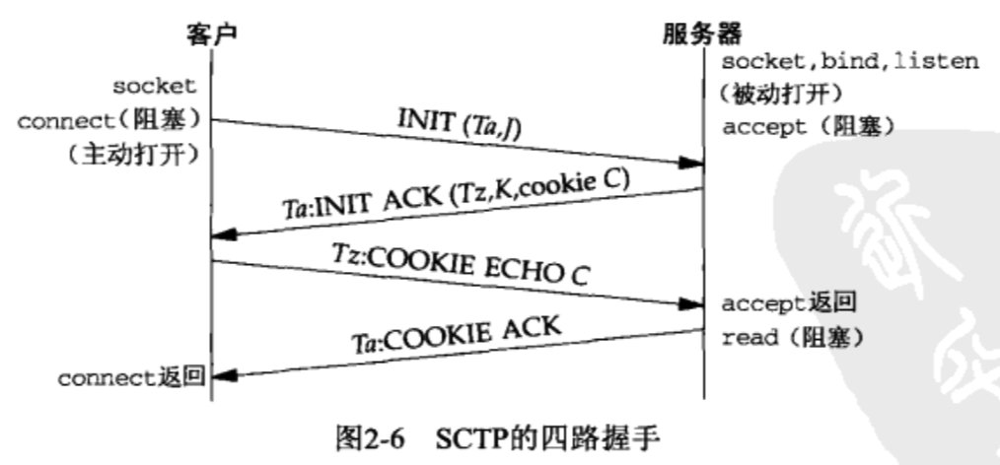

# UNP卷1：套接字联网API

## 第2章 传输层：TCP、UDP和SCTP

### 2.1 概述

- SCTP（Stream Control Transmission Protocol，流控制传输协议）与TCP类似之处在于它也是一个可靠的传输协议，但它还提供消息边界、传输级别多宿（multihoming）支持以及将对首阻塞（head-of-line blocking）减少到最小的一种方法

### 2.2 总图

- TCP/IP协议概况

  

### 2.6 TCP连接的建立和终止

#### 2.6.1 三次握手

#### 2.6.2 TCP选项

- 每一个SYN可以有多个TCP选项
  - MSS（Maximum Segment Size）选项。可以使用TCP_MAXSEG套接字选项提取和设置这个TCP选项
  - 窗口规模选项。这个新选项指定TCP首部中的通告窗口必须扩大的位数。在一个TCP连接上使用窗口规模的前提是它的两个断系统必须都支持这个选项。可以使用SO_RCVBUF套接字选项设置这个TCP选项
  - 时间戳选项

#### 2.6.3 四次挥手

#### 2.6.4 TCP状态转换图

#### 2.6.5 观察分组

- TCP连接的分组交换

  

  - 服务器对客户端请求的确认是伴随其应答发送的，这种做法称为捎带（piggybacking），它通常在服务器处理请求并产生应答的时间少于20ms时发生

### 2.7 TIME_WAIT状态

- 停留在TIME_WAIT状态的持续时间是MSL（Maximum Segment Lifetime）的两倍，有时候称之为2MSL

- TIME_WAIT状态有两个存在的理由
  - 可靠地实现TCP全双工连接的终止
    - 执行主动关闭的那一断是处于TIME_WAIT状态的那一断，因为可能不得不重传最终那个ACK
  - 允许老的重复分节在网络中消逝
    - 解决这样的问题：A主机的P1端口和B主机的P2端口之间有一个连接，在这个连接关闭后，在这两个端口之间建立了一个新的连接。为了避免来自上一个连接的老的重复分组在上一个连接终止后再出现，从而被误认为是新连接的分组
    - 为了做到这一点，TCP将不给处于TIME_WAIT状态的连接发起新的连接
    - 我们假设，具有最大跳限（hop limit）（255）的分组在网络中存在的时间不可能超过MSL秒。因此2MSL足以让某个方向上的分组最多存活MSL秒即被丢弃，另一个方向上的应答最多存活MSL秒也被丢弃

### 2.8 SCTP关联的建立和终止

#### 2.8.1 四路握手

#### 2.8.2 关联终止

- TODO

### 2.9 端口号

- 众所周知的端口：0-1023
- 已登记的端口：1024-49151
- 动态的或私用的端口：49152-65535（49152这个魔数是65536的四分之三）

### 2.11 缓冲区大小及限制

#### 2.11.1 TCP输出

- 应用进程写数据到一个TCP套接字中时发生的步骤
  - 每一个TCP套接字有一个发送缓冲区，可以使用SO_SNDBUF选项来更改该缓冲区的大小
  - 当某个应用进程调用write时，内核从该应用进程的缓冲区中复制所有数据到所写套接字的发送缓冲区
  - 如果该套接字的发送缓冲区容不下该应用进程的所有数据，该应用进程将被投入睡眠（这里假设该套接字是阻塞的）
  - 内核将不从write返回，直到应用进程缓冲区中的所有数据都复制到套接字发送缓冲区
  - 因此，从写一个TCP套接字的write调用成功返回仅仅表示我们可以重新使用原来的应用进程缓冲区，并不代表对端的TCP或应用进程已接收到数据
  - 这一端的TCP提取套接字发送缓冲区中的数据并把它发送给对端TCP，其过程基于TCP数据传送的所有规则。对端TCP必须确认收到数据，伴随来自对端的ACK的不断到达，本端TCP至此才能从套接字缓冲区中丢弃已确认的数据
  - 本端TCP以MSS大小或更小的块把数据传递给IP，同时给每个数据块安上一个TCP首部以构成TCP分节。其中MSS或是由对端通告的值，或是536（若对端未发送一个MSS选项。536时IPv4最小重组缓冲区字节数576减去IPv4首部字节数20和TCP首部字节数20的结果）
  - IP给每个TCP分节安上一个IP首部以构成相应的数据链路。IP可能在把数据报传递给数据链路之前将其分片
  - 每个数据链路都有一个输出队列，如果该队列已满，那么新到的分组将被丢弃，并沿协议栈向上返回一个错误：从数据链路到IP，再从IP到TCP。TCP将注意到这个错误，并在以后的某个时刻重传相应的分片

#### 2.11.2 UDP输出

- 应用进程写数据到一个UDP套接字中时发生的步骤
  - 任何UDP套接字都有发送缓冲区大小，可以使用SO_SNDBUF更改它。不过它仅仅是可以写到该套接字的UDP数据报的大小上限，如果一个应用进程写一个大于套接字发送缓冲区大小的数据报，内核将返回该进程一个EMSGSIZE错误。既然UDP是不可靠的，它不必保存应用进程数据的一个副本，因此无需一个真正的发送缓冲区
  - 这一端的UDP简单地给来自用户的数据报安上它的8字节首部以构成UDP数据报，然后传递给IP
  - IPv4或IPv6给UDP数据报安上相应的IP首部以构成IP数据报，执行路由操作确定外出接口，然后或者直接把数据报加入数据链路层输出队列（如果适合MTU），或者分片后再把每个片段加入数据链路层输出队列
  - 如果某个UDP应用进程发送大数据报，那么它们相比TCP应用数据更有可能被分片，因为TCP会把应用数据划分成MSS大小的块，而UDP却没有对等的手段
  - 从写一个UDP套接字的write调用返回表示所写的数据报或其所有片段已被加入数据链路层的输出队列。如果该队列没有足够的空间存放该数据报或它的某个片段，内核通常会返回一个ENOBUFS错误给它的应用进程

#### 2.11.3 SCTP输出

- TODO

## 第3章 套接字编程简介

### 3.2 套接字地址结构

#### 3.2.5 套接字地址结构的比较

### 3.4 字节排序函数

- 大小端

  

- 网际协议使用大端字节序来传送这些多字节整数

## 第4章 基本TCP套接字编程

### 4.2 socket函数

- `int socket(int family, int type, int protocol)`
- socket函数的family常值

- socket函数的type常值、protocol常值、family和type参数的组合

  

### 4.3 connect函数

- 如果是TCP套接字，调用connect函数将激发TCP的三路握手过程，而且仅在连接建立成功或出错时才返回
  - 若TCP客户端没有收到SYN分节的响应，则返回ETIMEDOUT错误。举例来说，若无响应则等待6s后再发送一个，若仍无响应则等待24s后再发送一个。若总共等待了75s后仍未收到响应则返回本错误
  - 若对客户端的SYN的响应是RST，则表明该服务器主机在我们指定的端口上没有进程在等待与之连接，这是一种硬错误，客户端一收到RST就马上返回ECONNREFUSED错误
  - 若客户端发出的SYN在中间的某个路由器上引发了一个destination unreachable（目的地不可达）ICMP错误，则认为是一种软错误。客户端内核保存该消息，并按第一种情况中所述的时间间隔继续发送SYN。若在某个规定的时间后仍未收到响应，则把保存的消息作为EHOSTUNREACH或ENETUNREACH错误返回给进程。以下两种情形也是有可能的
    - 按照本地系统的转发表，根本没有到达远程系统的路径
    - connect调用根本不等待就返回

- connect函数导致当前套接字从CLOSED状态转移到SYN_SENT状态，若成功则再转移到ESTABLISHED。若connect失败则该套接字不再可用，必须关闭，我们不能对这样的套接字再次调用connect

### 4.4 bind函数

- bind函数参数

  

- bind函数返回的一个常见错误是EADDRINUSE

### 4.5 listen函数

- `int listen(int sockfd, int backlog)`

- 内核为任何一个给定的监听套接字维护两个队列

  - 未完成连接队列，每个这样的SYN分节对于其中的一项：已由某个客户端发出并到达服务器，而服务器真正等待完成相应的TCP三路握手过程。这些套接字处于SYN_RCVD状态

  - 已完成连接队列：每个已完成TCP三路握手过程的客户对应其中的一项。这些套接字处于ESTABLISHED状态

    

  - 当来自客户端的SYN到达时，TCP在未完成连接队列中创建一个新项，然后响应SYN（捎带ACK）。这一项一直保留在未完成连接队列中，知道三路握手的第三个分节到达或者该项超时为止。如果三路握手正常完成，该项就从未完成连接队列移到已完成连接队列的队尾

  - 当进程调用accept时，已完成连接队列中的队头项将返回给进程，或者如果该队列为空，那么进程将被投入睡眠，直到TCP在该队列中放入一项才唤醒它

- listen函数做两件事情

  - 当socket函数创建一个套接字时，它被假设为一个主动套接字，listen函数把一个未连接的套接字转换成一个被动套接字，指示内核应接受指向该套接字的连接请求。调用listen函数导致套接字从CLOSED状态转换到LISTEN状态

  - 第二个参数backlog规定了内核应该为相应套接字排队的最大连接个数

    - backlog参数曾被规定为这两个队列总和的最大值
- 源自Berkeley的实现给backlog增设了一个模糊因子：把它乘以1.5得到未处理队列最大长度
    - 不要把backlog定位为0，因为不同的实现对此有不同的解释
    - 在三路握手正常完成的前提下（也就是说没有丢失分节，从而没有重传），未完成连接队列中的任何一项在其中的存留时间就是一个RTT
    - 当一个客户SYN到达时，若这些队列是满的，TCP就忽略该分节，也就是不发送RST。这么做是因为：这种情况是暂时的，客户TCP将重发SYN，期望不久能在这些队列中找到可用空间。要是服务器TCP立即响应以一个RST，客户的connect调用就会立即返回一个错误，强制应用进程处理这种情况，而不是让TCP的正常重传机制来处理
    - 在三路握手完成之后，但在服务器调用accept之前到达的数据应由服务器TCP排队，最大数据量为相应已连接套接字的接收缓冲区大小
    

### 4.6 accept函数

- accept函数由TCP服务器调用，用于从已完成连接队列队头返回下一个已完成连接。如果已完成连接队列为空，那么进程被投入睡眠（假定套接字为默认的阻塞方式）

### 4.9 close函数

- close一个TCP套接字的默认行为是把该套接字标记成已关闭，然后立即返回到调用进程。该套接字描述符不能再由调用进程使用，也就是说它不能再作为read或write的第一个参数。然而TCP将尝试发送已排队等待发送到对端的任何数据，发送完毕后发生的是正常的TCP连接终止序列。可以用SO_LINGER选项来改变TCP套接字的这种默认行为

- close未必会引发TCP的四分组连接终止序列，因为它其实只是将套接字描述符的引用计数减1。如果我们确实想在某个TCP连接上发送一个FIN，那么可以改用shutdown函数以代替close

## 第5章 TCP客户/服务器示例

### 5.11 accept返回前连接中止

- 三次握手完成从而连接建立之后，客户TCP却发送了一个RST位。在服务器端看来，就在该连接已由TCP排队，等着服务器进程调用accept的时候RST到达。稍后，服务器进程调用accept

  

- 然而，如何处理这种中止的连接依赖于不同的实现