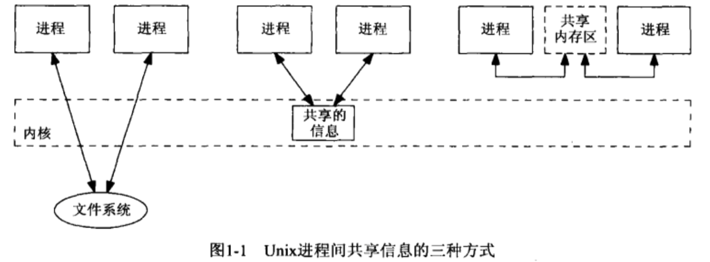
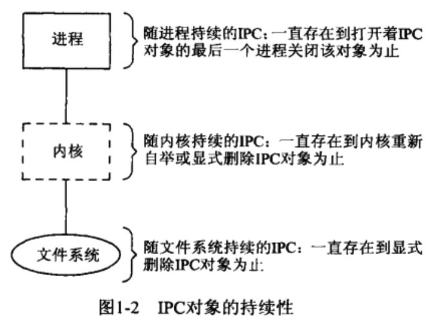
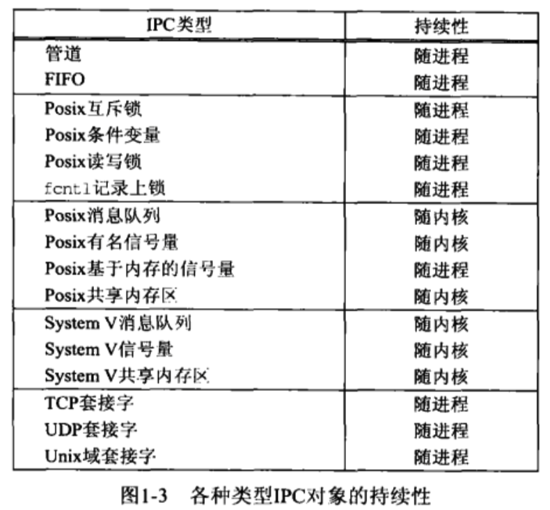
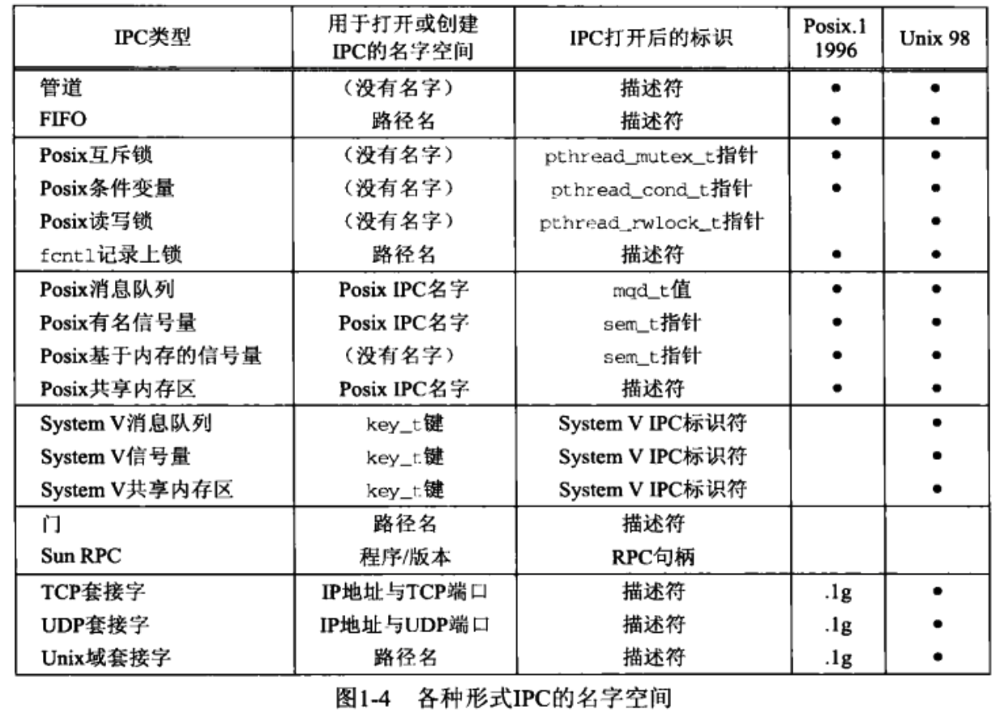
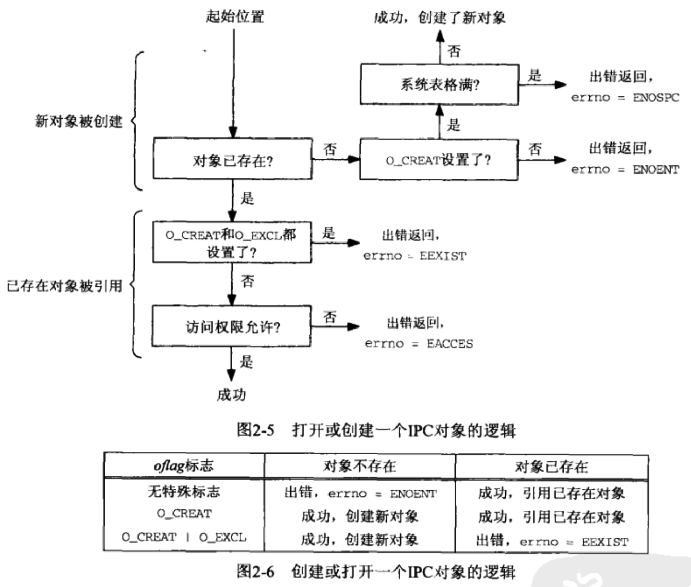
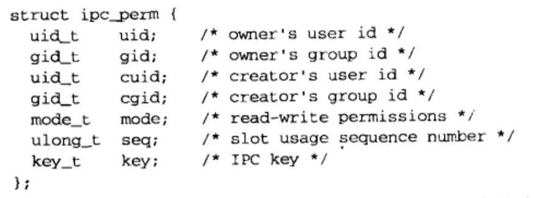
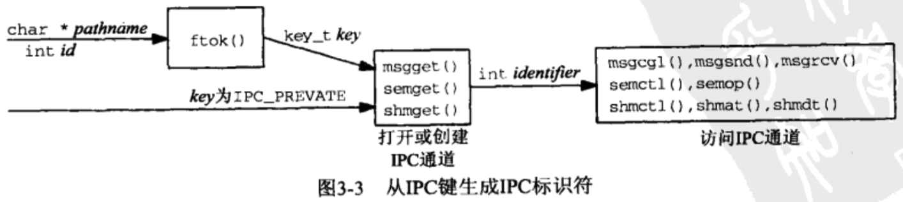
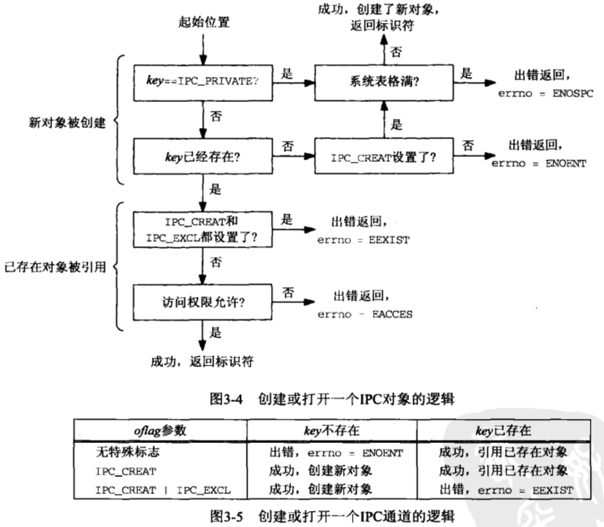
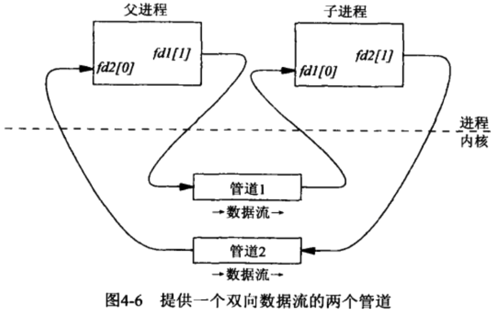
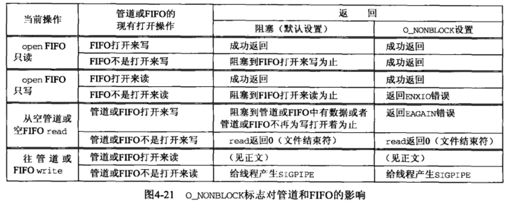

#UNP卷2：进程间通信

## 第1章 简介

### 1.2 进程、线程与信息共享

- Unix进程间共享信息的三种方式

  
  - 共享存留于文件系统中某个文件上的某些信息
  - 共享驻留于内核中的某些信息：管道、System V消息队列和System V信号量
  - 共享内存区

### 1.3 IPC对象的持续性

- IPC对象的持续性

  
  - 随进程持续的：管道和FIFO
  - 随内核持续的：System V的消息队列、信号量和共享内存区。Posix的消息队列、信号量和共享内存区必须至少是随内核持续的，但也可以是随文件系统持续的，具体取决于实现
  - 随文件系统持续的：Posix的消息队列、信号量和共享内存区如果是使用映射文件实现的，那么它们就是随文件系统持续的

- 各种类型IPC对象的持续性

  

### 1.4 命名空间

- 各种形式IPC的命名空间

  

### 1.5 fork、exec和exit对IPC对象的影响

- fork、exec和exit对IPC对象的影响
  - 

## 第2章 Posix IPC

### 2.1 概述

- Posix IPC函数汇总

  

### 2.2 IPC名字

- 三种类型的Posix IPC都是用路径名标识的。但是这些路径名既可以是文件系统中的实际路径名，也可以不是，而这点不一致会导致一个移植性问题

### 2.3 创建与打开IPC通道

- 打开或创建Posix IPC对象所用的各种oflag常值

  

- 打开或创建一个IPC对象的逻辑

  

## 第3章 System V IPC

### 3.1 概述

- System V IPC函数汇总

  

### 3.2 key_t键和ftok函数

- 三种类型的System V IPC使用key_t值作为它们的名字。头文件<sys/types.h>把key_t这个数据类型定义为一个整数，它通常是一个至少32位的整数。这些整数值通常是由ftok函数赋予的
- `key_t ftok(const char *pathname, int id)`函数把从pathname导出的信息与id的低序8位组合成一个整数IPC键

### 3.3 ipc_perm结构

- 内核为每个IPC对象维护一个信息结构，其内容跟内核给文件维护的信息类似

  

### 3.4 创建或打开IPC通道

- 从IPC键生成IPC标识符

  

- 创建或打开一个IPC对象的逻辑

  

### 3.6 标识符重用

### 3.8 内核限制

- System V IPC的多数实现有内在的内核限制，例如消息队列的最大数目、每个信号量集的最大信号量数

## 第4章 管道和FIFO

### 4.3 管道

- `int pipe(int fd[2])`
  - 该函数返回两个文件描述符，fd[0]和fd[1]，前者打开来读，后者打开来写
  - 半双工

- 提供一个双向数据流的两个管道

  

### 4.4 全双工管道

- 某些系统提供全双工管道

### 4.5 popen和pclose函数

- `FILE *popen(const char *command, const char *type)`
  - command是一个shell命令行。popen在调用进程和所指定的命令之间创建一个管道
  - 若type为r，那么调用进程读进command的标准输出
  - 若type为w，那么调用进程写到command的标准输入

- `int pclose(FILE *stream)`
  - pclose函数关闭由popen创建的标准IO流，等待其中的命令终止，然后返回shell的终止状态

### 4.6 FIFO

- 半双工
- 不同于管道，每个FIFO有一个路径名与之关联，从而允许无亲缘关系的进程访问同一个FIFO
- `int mkfifo(const char *pathname, mode_t mode)`
- 在创建一个FIFO后，它必须或者打开来读，或者打开来写，所用的可以是open函数，也可以是某个标准IO打开函数，例如fopen。FIFO不能打开来既读又写，因为它是半双工的

- 对管道或FIFO的write总是往末尾添加数据，对它们的read则总是从开头返回数据。如果对管道或FIFO调用lseek，那就返回ESPIPE错误
- FIFO和管道的区别
  - 创建并打开一个管道只需调用pipe。创建并打开一个FIFO则需在调用mkfifo后再调用open
  - 管道在所有进程最终都关闭它之后自动消失。FIFO的名字则只有通过调用unlink才从文件系统中删除

### 4.7 管道和FIFO的额外属性

- 一个描述符能以两种方式设置成非阻塞
  - 调用open时可指定O_NONBLOCK标志
  - 如果一个描述符已经打开，那么可以调用fcntl以启用O_NONBLOCK标志。对于管道来说，必须使用这种技术，因为管道没有open调用，在pipe调用中也无法指定O_NONBLOCK标志

- O_NONBLOCK标志对管道和FIFO的影响

  

- 关于管道或FIFO的读出与写入的若干额外规则
  - 如果请求读出的数据量多于管道或FIFO中当前可用数据量，那么只返回这些可用的数据
  - 如果请求写入的数据字节数小于或等于PIPE_BUF，那么write操作保证是原子的

### 4.11 管道和FIFO限制

- OPEN_MAX：一个进程在任意时刻打开的最大描述符数
- PIPE_BUF：可原子地写往一个管道或FIFO的最大数据量

## 第5章 Posix消息队列

### 5.1 概述

- 每个消息都是一个记录，它由发送者赋予一个优先级

- 在某个进程往一个队列写入消息之前，并不需要另外某个进程在该队列上等待消息的到达。这跟管道和FIFO是相反的，对后两者来说，除非读出者已存在，否则先有写入者是没有意义的
- 一个进程可以往消息队列写入一些消息，然后终止，再让另外一个进程在以后某个时刻读出这些消息。消息队列具有随内核的持续性，这跟管道和FIFO不一样。当一个管道或FIFO的最后一次关闭发生时，仍在该管道或FIFO上的数据将被丢弃

- 队列中的每个消息具有如下属性
  - 优先级
  - 消息的数据部分长度
  - 数据本身

### 5.2 mq_open、my_close和my_unlink函数

- `mqd_t mq_open(const char *name, int oflags, .../* mode_t mode, struct mq_attr *addr */)`
  - mq_open的返回值称为消息队列描述符，但它不必是（而且很可能不少）像文件描述符或套接字描述符那样的短整数

- `int my_unlink(const char *name)`
  - Posix消息队列至少具备随内核的持续性。这就是说，即使当前没有进程打开着某个消息队列，该队列及其上的各个消息也将一直存在，直到调用mq_unlink并让它的引用计数达到0以删除该队列为止

### 5.4 mq_send和mq_receive

- mq_receive总是返回所指定队列中最高优先级的最早消息，而且该优先级能随该消息的内容及其长度一同返回

### 5.6 mq_notify

- Posix消息队列允许异步事件通知，以告知何时有一个消息放置到了某个空消息队列。这种通知有两种方式可供选择
  - 产生一个信号
  - 创建一个线程来执行一个指定的函数

- `int mq_notify(mqd_t mqdes, const struct sigevent *notification)`
  - 该函数为指定队列建立或删除异步事件通知
  - 如果notification参数非空，那么当前进程希望在有一个消息到达所指定的先前为空的消息队列时得到通知
  - 如果notification参数为空指针，而且当前进程目前呗注册为接收所指定队列的通知，那么已存在的注册将被撤销
  - 任意时刻只有一个进程可以被注册为接收某个给定队列的通知
  - 当有一个 新消息到达某个先前为空的队列，而且已经有一个进程被注册为接收该队列的通知时，只有在没有任何线程阻塞在该队列的mq_receive调用中的前提下，通知才会发出
  - 当该通知被发送给它的注册进程时，其注册即被撤销，该进程必须再次调用mq_notify以重新注册