# 现代操作系统

## 第1章 引论

### 1.1 什么是操作系统

- 时间多路复用
- 空间多路复用

### 1.3 计算机硬件简介

#### 1.3.1 处理器

- 流水线：一个CPU可以有单独的取指单元、解码单元和执行单元，于是当它执行指令n时，还可以对指令n+1解码，并且读取指令n+2

- 超标量CPU：有多个执行单元，例如，一个CPU用于整数算术运算，一个CPU用于浮点算术运算，一个CPU用于布尔运算。两个或更多的指令被同时取出、解码并装入暂存缓冲区中，直至它们执行完毕。只要有一个执行单元空闲，就检查保持缓冲区中是否还有可处理的指令，如果有，就把指令从缓冲区移出并执行之

#### 1.3.2 存储器

- L1缓存总是在CPU中，通常用来将已解码的指令调入CPU的执行引擎。对于那些频繁使用的数据字，多数芯片安排有第二个L1缓存
- L2缓存，用来存放进来使用过的若干兆字节的内存字

#### 1.3.4 I/O设备

- I/O设备一般包括两个部分：设备控制器和设备本身
- 设备驱动程序与设备控制器对话，发出命令并接收响应
- 每个设备控制器都有少量用于通信的寄存器。要激活控制器，设备驱动程序从操作系统获得一条命令，然后翻译成对应的值，并写进设备寄存器中
- 实现输入输出的方式有三种
  - **繁忙等待：**用户程序发出一个系统调用，内核将其翻译成一个对应设备驱动程序的过程调用。然后设备驱动程序启动I/O并在一个连续不断的循环中检查该设备，看该设备是否完成了工作。当I/O结束后，设备驱动程序把数据送到指定的地方，并返回。然后操作系统将控制返回给调用者。繁忙等待的缺点是要占据CPU，CPU一直轮询设备直到对应的I/O操作完成
  - **中断：**设备驱动程序启动设备并且让该设备在操作完成时发出一个中断。设备驱动程序在这个时刻返回。操作系统接着在需要时阻塞调用者并安排其他工作进行。当设备驱动程序检测到该设备的操作完毕时，他发出一个中断通知操作完成。中断的过程：
    - 在第1步，设备驱动程序通过写设备寄存器通知设备控制器做什么。然后设备控制器启动该设备
    - 当设备控制器传送完毕被告知要进行读写的字节数量后，它在第2步使用特定的总线发信号给中断控制器芯片
    - 如果中断控制器已经准备接收中断（如果正忙于一个更高级的中断，也可能不接收），它会在CPU芯片的一个管脚上声明，这就是第3步
    - 在第4步中，中断控制器把该设备的编号放到总线上，这样CPU可以读总线，并且知道哪个设备刚刚完成了操作
    - 一旦CPU决定取中断，通常程序计数器和PSW（Program Status Word）就被压入当前栈中，并且CPU被切换到内核态。设备编号可以成为内存的一个引用，用于寻找该设备中断处理程序的地址。这部分内存称为中断向量。当中断处理程序（中断设备的设备驱动程序的一部分）开始后，它取走已入栈的程序计数器和PSW，并保存之，然后查询设备的状态。在中断处理程序全部完成之后，它返回到先前运行的用户程序中尚未执行的头一条指令
  - 为I/O使用一种特殊的**直接存储器访问（DMA）芯片**，它可以控制在内存和某些控制器之间的位流，而无需持续的CPU干预。CPU对DMA芯片进行设置，说明需要传送的字节数、有关的设备和内存地址以及操作方向，接着启动DMA。当DMA芯片完成时，它引发一个中断

### 1.6 系统调用

- 系统调用的过程
  - 调用程序首先把参数压入栈，接着是对库过程的实际调用
  - 在可能是由汇编语言写成的库过程中，一般把系统调用的编号放在操作系统所期望的地方，如寄存器中。然后执行一个trap指令，将用户态切换到内核态，并在内核态的一个固定地址开始执行
  - 跟随在trap指令后的内核代码开始检查系统调用编号，然后分派给正确的系统调用处理器，这通常是通过一张由系统调用编号所引用的、指向系统调用处理器的指针表来完成
  - 一旦系统调用处理器完成其工作，控制可能会在跟随trap指令后面的指令中返回给用户库过程
  - 为了完成整个工作，用户程序还必须清除栈

## 第2章 进程与线程

### 2.1 进程

#### 2.1.2 进程的创建

- 写时拷贝（copy-on-write）：子进程的初始地址空间是父进程的一个副本，但是这里涉及两个不同的地址空间，不可写的内存区是共享的。或者，子进程共享父进程的所有内存，这种情况下内存通过写时拷贝共享，这意味着一旦两者之一想要修改部分内存，则这块内存首先被明确地复制，以确保修改发生在私有内存区域

#### 2.1.4 进程的层次结构

- 在Unix中，进程和它的所有子进程以及后裔共同组成一个进程组。当用户从键盘发出一个信号时，该信号被送给当前与键盘相关的进程组的所有成员

#### 2.2.2 经典的线程模型

- 进程与线程
  - 进程是用某种方法把相关的资源集中在一起。进程有存放程序正文和数据以及其他资源的地址空间，这种资源中包括打开的文件、子进程、即将发生的定时器、信号处理程序、账号信息等
  - 进程拥有一个执行的线程，在线程中有一个程序计数器，用来记录接着要执行哪一条指令。线程拥有寄存器，用来保存线程当前的工作变量。线程还拥有一个栈，用来记录执行历史
  - 尽管线程必须在某个进程中执行，但是线程和它的进程是不同的概念，并且可以分别处理。进程用于把资源集中到一起，而线程则是在CPU上被调度执行的实体

- 当多线程进程在单个CPU系统中运行时，线程轮流切换。CPU在线程之间快速切换，制造了线程并行运行的假象
- 每个线程有其自己的栈

#### 2.2.4 在用户空间中实现线程

- 优点：用户级线程包可以在不支持线程的操作系统上实现
- 线程在一个运行时系统的上层运行，该运行时系统是一个管理线程的过程的集合。在用户空间管理线程时，每个线程需要有其专用的线程表，用来跟踪该进程中的线程。这些表和内核中的进程表类似，不过它仅仅记录各个线程的属性，如每个线程的程序计数器、栈指针、寄存器和状态等。该线程由运行时系统管理。当一个线程切换到就绪状态或阻塞状态时，在该线程表中存放重新启动该线程所需的信息，与内核在进程表中存放进程的信息完全一样
- 当线程做了一些会引起本地阻塞的事情之后，它调用一个运行时系统的过程，这个过程检查该线程是否必须进入阻塞状态。如果是，它在线程表中保存该线程的寄存器，查看表中可运行的就绪线程，并把新线程的保存值重新装入寄存器中。只要栈指针和程序计数器一被切换，新的线程又自动运入运行

- 如果机器有一条保存所有寄存器的指令和另一条装入全部寄存器的指令，那么整个线程的切换可以在几条指令内完成。进行这样的线程切换至少比陷入内核要快一个数量级

- 在线程完成运行时，例如，在它调用`pthread_yield`时，`pthread_yield`代码可以把该线程的信息保存在线程表中，进而，它可以调用线程调度程序来选择另一个要运行的线程。保存该线程的过程和调度程序都只是本地过程，所以启动它们比进行内核调用效率更高。另一方面，不需要陷入内核，不需要上下文切换，也不需要对主存高速缓存进行刷新，这就使得线程调度非常快捷

- 问题
  - **如何实现阻塞系统调用：**（1）假设在还没有任何击键之前，一个线程读取键盘。让该线程实际进行该系统调用是不可接受的，因为这会停止所有的线程。使用线程的一个主要目标是，首先要运行每个线程使用阻塞调用，但是还要避免阻塞的线程影响其他的线程；（2）系统调用可以全部改成非阻塞的，例如，如果没有被缓冲的字符，对键盘的read操作可以只返回0字节，但是这需要修改操作系统，所以这个办法也不吸引人。而且，用户级线程的一个长处就是它可以在现有的操作系统上运行；（3）还有一种可能的替代方案是，如果某个调用会阻塞，就提前通知。在某些Unix版本中，有一个系统调用select可以通知调用者预期的read是否会阻塞。若有这个调用，那么库过程read就可以被新的操作取代，首先进行select调用，然后只有在安全的情形下（即不会阻塞）才进行read调用。如果read调用会被阻塞，有关的调用就不进行，代之以运行另一个线程。到了下次有关的运行系统取得控制权之后，就可以再次检查看看现在进行read调用是否安全。在系统调用周围从事检查的这类代码称为包装器（jacket或wrapper）
  - **缺页中断问题：**如果有一个线程引起页面故障，内核由于甚至不知道有线程存在，通常会把整个进程阻塞直到磁盘I/O完成为止，尽管其他的线程是可以运行的
  - 如何进行线程调度

#### 2.2.5 在内核中实现线程

- 内核中有用来记录系统中所有线程的线程表。当某个线程希望创建一个新线程或撤销一个已有线程时，它进行一个系统调用，这个系统调用通过对线程表的更新完成线程创建或撤销工作
- 内核的线程表保存了每个线程的寄存器、状态和其他信息。这些信息和在用户空间的线程是一样的，但现在保存在内核中。这些信息是传统内核所维护的每个单线程进程信息的子集
- 所有能够阻塞线程的调用都以系统调用的形式实现，这与运行时系统过程相比，代价是比较大的。当一个线程阻塞时，内核根据其选择，可以运行同一个进程中的另一个线程（若有一个就绪线程）或者运行另一个进程中的线程
- 由于在内核中创建或撤销线程的代价比较大，某些系统采取“环保”的处理方式，回收其线程。当某个线程被撤销时，就把它标志为不可运行的，但是其内核数据结构没有受到影响。稍后，在必须创建一个新线程时，就重新启动某个旧线程，从而节省了一些开销
- 优点：内核线程不需要任何新的、非阻塞系统调用。另外，如果某个进程中的线程引起了页面故障，内核可以很方便地检查该进程是否有任何其他可运行的线程。如果有，在等待所需要的页面从磁盘读入时，就选择一个可运行的线程运行
- 问题
  - 当一个多线程进程创建一个新的进程时，会发生什么
  - 当一个信号到达时，应该由哪一个线程处理它

#### 2.2.6 混合实现

- 使用内核级线程，然后将用户级线程与某些或者全部内核线程多路复用起来
- 内核只识别内核级线程，并对其进行调度。其中一些内核级线程会被多个用户级线程多路复用
- 在这种模型中，每个内核级线程有一个可以轮流使用的用户级线程集合

#### 2.2.7 调度程序激活机制

### 2.3 进程间通信

#### 2.3.2 临界区

- 避免竞争条件的解决方案，需要满足以下4个条件
  - 任何两个进程不能同时处于临界区
  - 不应对CPU的速度和数量做任何假设
  - 临界区外运行的进程不得阻塞其他进程
  - 不得使进程无限期等待进入临界区

#### 2.3.3 忙等待的互斥

- 屏蔽中断
  - 在单处理器系统中，最简单的方法就是使每个进程在刚刚进入临界区后立即屏蔽所有中断，并在就要离开之前再打开中断。屏蔽中断后，时钟中断也被屏蔽。CPU只有发生时钟中断或其他中断时才会进行进程切换，这样，在屏蔽中断之后CPU将不会被切换到其他进程。于是，一旦某个进程屏蔽中断之后，它就可以检查和修改共享内存，而不必担心其他进程介入
  - 屏蔽中断对多处理器系统并不适用，因为屏蔽中断仅仅对执行disable指令的那个CPU有效，其他CPU仍将继续运行，并可以访问共享内存
  - 屏蔽中断对于操作系统本身而言是一项很有用的技术，但对于用户进程则不是一种合适的通用互斥机制
  
- 锁变量

- 严格轮换法
  - 忙等待：连续测试一个变量直到某个值出现为止
  - 在一个进程比另一个慢了很多的情况下，轮流进入临界区并不是一个好办法。这种情况违反了前面叙述的条件3：进程被一个临界区之外的进程阻塞

- Peterson算法

  ```assembly
  #define FALSE 0
  #define TRUE  1
  #define N     2
  
  int turn;
  int interested[N];
  
  void enter_region(int process)
  {
    int other = 1 - process;
    interested[process] = TRUE;
    turn = process;
    while (turn == process && interested[other] == TRUE);
  }
  
  void leave_region(int process)
  {
    interested[process] = FALSE;
  }
  ```

- TSL指令

  - 某些计算机中，特别是那些设计为多处理器的计算机，都有下面一条指令：`TSL RX, LOCK`，测试并加锁（test and set lock），它将一个内存字lock读到寄存器RX中，然后在该内存地址上存一个非零值。读字和写字操作保证是不可分割的，即该指令结束之前其他处理器均不允许访问该内存字。执行TSL指令的CPU将锁住内存总线，以禁止其他CPU在本指令结束之前访问内存

  - 为了使用TSL指令，要使用一个共享变量lock来协调对共享内存的访问。当lock为0时，任何进程都可以使用TSL指令将其设置为1，并读写共享内存。当操作结束时，进程用一条普通的move指令将lock的值重新设置为0。enter_region将导致忙等待，直到锁空闲为止。这样的锁叫做自旋锁

    ```assembly
    enter_region:
    	TSL REGISTER, LOCK # 复制锁到寄存器并将锁设为1
    	CMP REGISTER, $0   # 锁是零吗
    	JNE enter_region   # 若不是零，说明锁已被设置，所以循环
    	RET
    
    leave_region:
    	MOVE LOCK, $0      # 在锁中存入0
    	RET
    ```

  - 一个可替代TSL的指令是XCHG，它原子性地交换两个位置的内容，例如，一个寄存器与一个存储器字

    ```assembly
    enter_region:
    	MOVE REGISTER, $1   #在寄存器中放一个1
    	XCHG REGISTER, LOCK # 交换寄存器与锁变量的内容
    	CMP REGISTER, $0    # 锁是零吗
    	JNE enter_region    # 若不是零，说明锁已被设置，所以循环
    	RET
    
    leave_region:
    	MOVE LOCK, $0      # 在锁中存入0
    	RET
    ```

#### 2.3.4 睡眠与唤醒

- Peterson算法和TSL或XCHG解法都是正确的，但它们有忙等待的缺点。这些解法在本质上是这样的：当一个进程想进入临界区时，先检查是否允许进入，若不允许，则该进程将原地等待，直到允许为止
- 这种方法不仅浪费了CPU时间，而且还可能引发预想不到的结果。考虑一台计算机有两个进程，H优先级较高，L优先级较低。调度规则规定，只要H处于就绪态它就可以运行，在某一时刻，L处于临界区中，此时H变到就绪态，准备运行（例如，一条I/O操作结束）。现在H开始忙等待，但由于当H就绪时L不会被调度，也就无法离开临界区，所以H将永远忙等待下去。这种情况有时被称作**优先级反转问题**
- 几条进程通信原语，它们在无法进入临界区时将阻塞，而不是忙等待
  - sleep是一个将引起调用进程阻塞的系统调用，即被挂起，直到另外一个进程将其唤醒
  - weakup调用有一个参数，即要被唤醒的进程

- 含有严重竞争条件的生产者-消费者问题

  ```c
  #define N 100
  int count = 0;
  
  void producer()
  {
    int item;
    while (TRUE)
    {
      item = produce_item();
      if (count == N) sleep();
      insert_item();
      count = count + 1;
      if (count == 1) wakeup(consumer);
    }
  }
  
  void consumer()
  {
    int item;
    while (TRUE)
    {
      if (count == 0) sleep();
      item = remove_item();
      count = count - 1;
      if (count == N - 1) wakeup(producer);
      consume_item(item);
    }
  }
  ```

  - 这里可能会出现竞争条件，其原因是对count的访问未加限制。有可能出现以下情况：缓冲区为空，消费者刚刚读取count的值发现它为0。此时调度程序暂停消费者并启动运行生产者。生产者向缓冲区中加入一个数据项，count加1。现在count的值变成了1。它推断认为由于count刚刚为0，所以消费者此时一定在睡眠，于是生产者调用wakeup来唤醒消费者。但是，消费者此时在逻辑上并未睡眠，所以wakeup信号丢失。当消费者下次允许时，它将测试先前读到的count值，发现它为0，于是睡眠。生产者迟早会填满整个缓冲区，然后睡眠，这样以来，两个进程都将永远睡眠下去
  - 问题的实质在于发给一个尚未睡眠进程的wakeup信号丢失了。如果它没有丢失，则一切都很正常。一个快速弥补的方法是修改规则，加上一个唤醒等待位。当一个wakeup信号发送给一个清醒的进程信号时，将该位置1。随后，当该进程要睡眠时，如果唤醒等待位为1，则将该位清除，而该进程仍然保持清醒。但如果有更多进程，一个唤醒等待位就不够了，虽然可能增加唤醒等待位，但这并没有从根本上解决问题

#### 2.3.5 信号量

- 使用一个整型变量来累计唤醒次数，这个新的变量类型，称作信号量。一个信号量的取值可以为0（表示没有保存下来的唤醒操作），或者为正值（表示有一个或多个唤醒操作）

- 设立两种操作，down和up（分别为一般化后的sleep和wakeup）。对一信号量执行down操作，则是检查其值是否大于0。若该值大于0，则将其值减1（即用掉一个保存的唤醒信号）并继续；若该值为0，则进程将睡眠，而且此时down操作并未结束。**检查数值、修改变量以及可能发生的睡眠操作均作为一个单一的、不可分割的原子操作完成。**保证一旦一个信号量操作开始，则在该操作完成或阻塞之前，其他进程均不允许访问该信号量
- up操作对信号量的值增1。如果一个或多个进程在该信号量上睡眠，无法完成一个先前的down操作，则由系统选择其中的一个（如随机挑选）并允许该进程完成它的down操作。于是，对一个有进程在其上睡眠的信号量执行一次up操作之后，该信号量的值仍旧是0，但在其上睡眠的进程却少了一个。信号量的值增1和唤醒一个进程同样是不可分割的，不会有某个进程因执行up而阻塞

- 用信号量解决生产者-消费者问题

  - **为确保信号量能正确工作，最重要的是要采用一种不可分割的方式来实现它。通常是将up和down作为系统调用实现，而且操作系统只需在执行以下操作时暂时屏蔽全部中断**：测试信号量、更新信号量以及在需要时使某个进程睡眠。由于这些动作只需要几条指令，所以屏蔽中断不会带来什么副作用。如果使用多个CPU，则每个信号量应有一个锁变量进行保护。通过TSL或XCHG指令来确保同一时刻只有一个CPU在对信号量进行操作

  ```c
  #define N 100
  typedef int semaphore;        // 信号量是一种特殊的整型数据
  semaphore mutex = 1;          // 控制对临界区的访问
  semaphore empty = N;          // 计数缓冲区的空槽数目
  semaphore full = 0;           // 计数缓冲区的满槽数目
  
  void producer()
  {
    int item;
    while (TRUE)
    {
      item = produce_item();
      down(&empty);             // 将空槽数目减1
      down(&mutex);             // 进入临界区
      insert_item(item);
      up(&mutex);               // 离开临界区  
      up(&full);                // 将满槽数目加1
    }
  }
  
  void consumer()
  {
    int item;
    while (TRUE)
    {
      down(&full);
      down(&mutex);
      item = remove_item();
      up(&mutex);
      up(&empty);
      consume_item(item);
    }
  }
  ```

  - 以上例子实际上是通过两种不同的方式来使用信号量的。信号量mutex用于互斥，它用于保证任一时刻只有一个进程读写缓冲区和相关的变量。信号量的另一种用途是用于实现同步。信号量full和empty用来保障某种事件的顺序发生或不发生。在本例中，它们保证当缓冲区满的时候生产者停止运行，以及当缓冲区空的时候消费者停止运行

#### 2.3.6 互斥量

- 如果不需要信号量的计数能力，有时候可以使用信号量的一个简化版本，称为互斥量。互斥量仅仅适用于管理共享资源或一小段代码。由于互斥量在实现时即容易又有效，这使得互斥量在实现用户空间线程包时非常有用

- 互斥量是一个可以处于两态之一的变量：解锁和加锁

- 由于互斥量非常简单，所以如果有可用的TSL或XCHG，就可以很容易地在用户空间实现它们。用于用户级线程包的代码如下所示：

  ```assembly
  mutex_lock:
  	TSL REGISTER, MUTEX
  	CMP REGISTER, $0
  	JZE ok
  	CALL thread_yield
  	JMP mutex_lock
  ok:
  	RET
  	
  mutex_unlock:
  	MOVE MUTEX, $0
  	RET
  ```

- mutex_lock与忙等待中的enter_region代码很相似，但有一个关键的区别。当enter_region进入临界区失败时，它始终重复测试锁（忙等待）。实际上，由于时钟超时的作用，会调度其他进程运行，这样迟早拥有锁的进程会进入运行并释放锁。在（用户）线程中，情形有所不同，因为没有时钟停止运行时间过长的线程，结果是通过忙等待的方式来试图获得锁的线程将永远循环下去，绝不会得到锁，因为这个运行的线程不会让其他线程运行从而释放锁。mutex_lock在获取锁失败时，它调用thread_yield将CPU放弃给另一个线程，这样，就没有忙等待。在该线程下次运行时，它再一次对锁进行测试

- 由于thread_yield只是在用户空间中对线程调度程序的一个调用，所以它的运行非常快捷。**这样，mutex_lock和mutex_unlock都不需要任何内核调用**。通过使用这些过程，用户线程完全可以实现在用户空间中的同步，这些过程仅仅需要少量的指令

- 有时线程包提供一个调用mutex_trylock，这个调用或者获得锁或者返回失败码，但并不阻塞线程。这就给了调用线程一个灵活性，用以决定下一步做什么，是使用替代办法还是只是等待下去

- 在用户级线程包中，多个线程访问同一个互斥量是没有问题的，因为所有的线程都在一个公共的地址空间中操作。但是，对于大多数早起解决方案，诸如Peterson算法和信号量等，都有一个未说明的前提，即这些多个进程至少应该访问一些共享内存，也许仅仅是一个字。如果进程有不连续的地址空间，那么在Peterson算法、信号量或公共缓冲区中，它们如何共享turn变量呢：
  - 第一种方法，有些共享数据结构，如信号量，可以放在内核中，并且只能通过系统调用来访问
  - 第二种方法，多数现代操作系统提供一种方法，让进程与其他进程共享其部分地址空间。在这种方法中，缓冲区和其他数据结构可以共享。在最坏的情况下，如果没有可共享的途径，则可以使用共享文件

  如果两个或多个进程共享其全部或大部分地址空间，进程和线程之间的差别就变得模糊起来，但无论怎样，两者的差别还是有的
  
- 随着并行的增加，有效的同步和锁机制对性能而言非常重要。如果等待时间短的话，自旋锁会很快，但如果等待时间长，则会浪费CPU周期。如果有很多竞争，那么阻塞此进程，并仅当锁被释放的时候让内核解除阻塞会更加有效。然而，这却带来了相反的问题：它在竞争激烈的情况下效果不错，但如果一开始只有很小的竞争，那么不停地内核切换将花销很大。更糟的是，预测锁竞争的数量并不容易

- 快速用户区互斥量futex（fast userspace mutex）
  - futex是Linux的一个特性，它实现了基本的锁（**很像互斥锁**），但避免了陷入内核，除非它真的不得不这样做。一个futex包含两个部分：一个内核服务和一个用户库
  - 内核服务提供一个等待队列，它允许多个**进程**在一个锁上等待。它们将不会运行，除非内核明确地对它们解除阻塞。将一个进程放到等待队列需要代价很大的系统调用，我们应该避免这种情况。因此，没有竞争时，futex完全在用户空间工作
  - 特别地，这些进程共享通用的锁变量。线程通过执行原子操作“减少并检验”来夺取锁，接下来，这个线程检查结果，看锁是否被释放，如果未处于被锁状态，那么一切顺利，我们的线程成功夺取该锁。然而，如果该锁被另一个线程持有，那么线程必须等待。这种情况下，futex库不自旋，而是使用一个系统调用把这个线程放到内核的等待队列上。可以期望的是，切换到内核的开销已是合乎情理的了，因为无论如何线程被阻塞了。当一个线程使用完该锁，它通过原子操作“增加并检验”来释放锁，并检查结果，看看是否仍有进程阻塞在内核等待队列上。如果有，它会通知内核可以对等待队列里的一个或多个进程解除阻塞。如果没有锁竞争，内核则不需要参与其中
  - 参考：[futex机制介绍](https://blog.csdn.net/y33988979/article/details/82252266)

- pthread中的互斥量

  - 除互斥量之外，pthread提供了另一种同步机制：条件变量。互斥量在允许或阻塞对临界区的访问上是很有用的，条件变量则允许线程由于一些未到达的条件而阻塞
  - pthread_cond_wait阻塞调用线程直到另一其他线程向它发信号（使用pthread_cond_signal）。条件变量允许这种等待与阻塞原子性地进行
  - 条件变量与互斥量经常一起使用。这种模式用于让一个线程锁住一个互斥量，然后当它不能获得期待的结果时等待一个条件变量。最后另一个线程会向它发信号，使它可以继续执行。pthread_cond_wait原子性地调用并解锁它持有的互斥量。由于这个原因，互斥量是参数之一
- 值得指出的是，条件变量（不像信号量）不会存在内存中。如果将一个信号传递给一个没有线程在等待的条件变量，那么这个信号就会丢失
  
  ```c
  #include <stdio.h>
  #include <pthread.h>
  
  #define MAX 1000000
  
  pthread_mutex_t the_mutex;
  pthread_cond_t cnodc, condp;
  int buffer = 0;
  
  void* producer(void* ptr)
  {
    int i;
    for (i = 1; i < MAX; i++)
    {
      pthread_mutex_lock(&the_mutex);
      while (buffer != 0) pthread_cond_wait(&condp, &the_mutex);
      buffer = i;
      pthread_cond_signal(&condc);
      pthread_mutex_unlock(&the_mutex);
    }
    pthred_exit(0);
  }
  
  void* consumer(void* ptr)
  {
    int i;
    for (i = 1; i < MAX; i++)
    {
      pthread_mutex_lock(&the_mutex);
      while (buffer == 0) pthread_cond_wait(&condc, &the_mutex);
      buffer = 0;
      pthread_cond_signal(&condp);
      pthread_mutex_unlock(&the_mutex);
    }
    pthread_exit(0);
  }
  
  int main()
  {
    pthread_t pro, con;
    pthread_mutex_init(&the_mutex, 0);
    pthread_cond_init(&condc, 0);
    pthread_cond_init(&condp, 0);
    pthread_create(&cond, 0, consumer, 0);
    pthread_create(&pro, 0, producer, 0);
    pthread_join(pro, 0);
    pthread_join(con, 0);
    pthread_cond_destroy(&condc);
    pthread_cond_destroy(&condp);
    pthread_mutex_destroy(&the_mutex);
  }
  ```

#### 2.3.7 管程

- 管程（monitor）是一种更高级的同步原语
- 一个管程是一个由过程、变量及数据结构等组成的一个集合，它们组成一个特殊的模块或软件包。进程可在任何需要的时候调用管程中的过程，但它们不能在管程之外声明的过程中直接访问管程内的数据结构
- 管程有一个很重要的特性，即任一时刻管程中只能有一个活跃进程，这一特性使管程能有效地完成互斥
- 管程是编程语言的组成部分，编译器知道它们的特殊性，因此可以采用与其他过程调用不同的方法来处理对管程的调用。典型的处理方法是，当一个进程调用管程过程时，**该过程中的前几条指令将检查在管程中是否有其他的活跃进程**。如果有，调用进程将被挂起，直到另一个进程离开管程将其唤醒。如果没有活跃进程在使用管程，则该调用进程可以进入。进入管程时的互斥由编译器负责，但通常的做法是用一个互斥量或二元信号量
- 尽管管程提供了一种实现互斥的简单途径，但这还不够，还需要一种办法使得进程在无法继续运行时被阻塞。**解决的方法是引入条件变量以及相关的两个操作：wait和signal**。当一个管程过程发现它无法继续运行时（例如，生产者发现缓冲区满），它会在某个条件变量上执行wait操作。该操作导致调用进程自身阻塞，并且还将另一个以前等在管程之外的进程调入管程。另一个进程，比如消费者，可以唤醒正在睡眠的伙伴进程，这可以通过对其伙伴正在等待的一个条件变量执行signal完成
- 为了避免管程中同时有两个活跃进程，我们需要一条规则来通知在signal之后该怎么办。Hoare建议让新唤醒的进程运行，而挂起另一个进程。Brinch Hansen则建议执行signal的进程必须立即退出管程，即signal语句只可能作为一个管程过程的最后一条语句。后者在概念上更简单，并且更容易实现。这里H oare和Hansen都没有提及第三种方法，该方法让发信号者继续运行，并且只有在发信号者退出管程后，才允许等待的进程开始运行

```pascal
monitor ProducerConsumer
	condition full, empty;
	integer count;
	
	procedure insert(item: integer);
	begin
		if count = N then wait(full);
		insert_item(item);
		count := count + 1;
		if count = 1 then signal(empty)
	end;
	
	function remove: integer;
	begin
		if count = 0 then wait(empty);
		remove = remove_item;
		count := count - 1;
		if count = N - 1 then signal(full)
	end;
	
	count := 0;
end monitor;

procedure producer;
begin
	while true do
	begin
		item = produce_item;
		ProducerConsumer.insert(item);
	end
end;

procedure consumer;
begin
	while true do
	begin
		item = ProducerConsumer.remove;
		consume_item(item)
	end
end;
```

- wait和signal操作看起来像前面提到的sleep和wakeup，但是它们有个很关键的区别：sleep和wakeup之所以失败是因为当一个进程想睡眠时另一个进程试图去唤醒它（从而使得信号丢失了）。使用管程则不会发生这种情况。对管程过程的自动互斥保证了这一点：如果管程过程中的生产者发现缓冲区满，它将能够完成wait操作而不用担心调度程序可能会在wait完成之前切换到消费者（这样会导致signal信号丢失）。**甚至，在wait执行完成而且把生产者标志为不可运行之前，根本不会允许消费者进入管程**

- Java支持用户级线程，Java通过关键字synchronized支持管程。Java保证一旦某个线程执行该方法，**就不允许其他线程执行该对象中的任何synchronized方法**。使用Java管程解决生产者-消费者问题的解法如下：

  ```java
  public class ProducerConsumer {
    static final int N = 100;
    static producer p = new producer();
    static consumer c = new consumer();
    static our_monitor mon = new our_monitor(); // 初始化一个新的管程
    
    public static void main(String args[]) {
      p.start();
      c.start();
    }
    
    static class producer extends Thread {
      public void run() {
        int item;
        while (true) {
          item = produce_item();
          mon.insert(item);
        }
      }
      private int produce_item() {
        // 实际生产
      }
    }
    
    static class consumer extends Thread {
      public void run() {
        int item;
        while (true) {
          item = mon.remove();
          consume_item(item);
        }
      }
      private void consume_item(int item) {
        // 实际消费
      }
    }
    
    static class our_monitor { // 这是一个管程
      private int buffer[] = new int[N];
      private int count = 0, lo = 0, hi = 0;
      
      public synchronized void insert(int val) {
        if (count == N) go_to_sleep();
        buffer[hi] = val;
        hi = (hi + 1) % N;
        count = count + 1;
        if (count == 1) notify();
      }
      
      public synchronized int remove() {
        int val;
        if (count == 0) go_to_sleep();
        val = buffer[lo];
        lo = (lo + 1) % N;
        count = count - 1;
        if (count == N - 1) notify();
        return val;
      }
      private void go_to_sleep() {
        try{
          wait();
        }catch(InterruptedException exc) {};
      }
    }
  }
  ```

- Java中的同步方法与其他经典管程有本质差别：Java中没有内嵌的条件变量。反之，Java提供了两个过程wait和notify，分别与sleep和wakeup等价。不过，当它们在同步方法中使用时，它们不受竞争条件约束。理论上，方法wait可以被中断，它本身就是与中断有关的代码

- 通过临界区互斥的自动化，管程比信号量更容易保证并行编程的正确性

#### 2.3.8 消息传递

- 消息传递的方法使用两条原语send和receive，它们像信号量而不像管程，是系统调用而不是语言成分
- 消息传递系统的设计要点
  - 消息传递系统面临着许多信号量和管程所未涉及的问题和设计难点，特别是位于网络中不同机器上的通信进程的情况。例如，消息有可能被网络丢失，为了防止消息丢失，发送方和接收方可以达成如下一致：一旦接收到消息，接收方马上回送一条特殊的确认信息。如果发送发在一段时间间隔内未收到确认，则重发消息
  - 消息系统还需要解决进程命名的问题，在send和receive调用中所指定的进程必须是没有二义性的
  - 身份认证也是一个问题
  - 对于发送者和接受者在同一台机器上的情况，也存在若干设计问题，其中一个设计问题就是性能问题。将消息从一个进程复制到另一个进程通常比信号量操作和进入管程要慢

#### 2.3.9 屏障

- barrier

#### 2.3.10 避免锁：读-复制-更新

- 读-复制-更新（Read-Copy-Update，RCU）
- 在这种情况下，我们可以允许写操作来更新数据结构，即便还有其他的进程正在使用它。敲门在于确保每个读操作要么读取旧的数据版本，要么读取新的数据版本，但绝不能是新旧数据的一些奇怪组合

### 2.4 调度

- 何时调度
  - 在创建一个新进程后，需要决定是运行父进程还是运行子进程
  - 在一个进程退出时必须作出调度决策
  - 当一个进程阻塞在I/O和信号量上或由于其他原因阻塞时，必须选择另一个进程运行
  - 在一个I/O中断发生时，必须作出调度决策

- 调度算法的目标
  - 对于所有系统
    - 公平——给每个进程公平的CPU份额
    - 策略强制执行——保证规定的策略被执行
    - 平衡——保持系统的所有部分忙碌
  - 批处理系统
    - 吞吐量——每小时最大作业数
    - 周转时间——从提交到终止间的最小时间
    - CPU利用率——保持CPU始终忙碌
  - 交互式系统
    - 响应时间——快速响应请求
    - 均衡性——满足用户的期望
  - 实时系统
    - 满足截止时间——避免丢失数据
    - 可预测性——在多媒体系统中避免品质降低

#### 2.4.2 批处理系统中的调度

- 先来先服务（first-come first-served）
  - 非抢占式

- 最短作业优先（shortest job first）
  - 非抢占式
- 最短剩余时间优先（shortest remaining time next）
  - 抢占式

#### 2.4.3 交互式系统中的调度

- 轮转调度（round robin）
  - 时间片设得太短会导致过多的进程切换，降低了CPU效率；而设得太长又可能引起对短的交互请求的响应时间变长

- 优先级调度
  - 为达到某种目的，优先级也可以由系统动态确定。例如，有些进程为I/O密集型，其多数时间用来等待I/O结束。当这样的进程需要CPU时，应立即分配给它CPU，以便启动下一个I/O请求，这样就可以在另一个进程计算的的同时执行I/O操作。使这类I/O密集型进程长时间等待CPU只会造成它无谓地长时间占用内存。使I/O密集型进程获得较好服务的一种简单算法是，将其优先级设为1/f，f为该进程在上一时间片中所占的部分。一个在其50ms的时间片中只使用1ms的进程将获得优先级50，而在阻塞之前用掉25ms的进程将具有优先级2，而使用掉全部时间片的进程将得到优先级1
  - 可以很方便地将一组进程按优先级分成若干类，并且在各类之间采用优先级调度，而在各类进程的内部采用轮转调度

- 多级队列
  - 使用优先级类，属于最高优先级类的进程运行一个时间片，属于次高优先级类的进程运行2个时间片，再次一级运行4个时间片。当一个进程用完分配的时间片后，它被移到下一类

- 最短进程优先

- 保证调度
- 彩票调度
- 公平分享调度

#### 2.4.6 线程调度

- 用户级线程
  - 内核不知道有线程的存在，选取一个进程，假设为A，并给予A以时间片的控制。A中的线程调度程序决定哪个线程运行，假设为A1。由于多道线程并不存在时钟中断，所以这个线程可以按其意愿任意运行多长时间。如果该线程用完了进程的全部时间片，内核就会选择另一个进程运行

- 内核级线程
  - 内核选择一个特定的线程运行，它不用考虑该线程属于哪个进程，不过如果有必要的话，它可以这样做。对被选择的线程赋予一个时间片，而且如果超过了时间片，就会强制挂起该线程

### 2.5 经典IPC问题

#### 2.5.1 哲学家就餐问题

```c
#define N 5
#define LEFT (i+N-1)%N
#define RIGHT (i+1)%N
#define THINKING 0
#define HUNGRY 1
#define EATING 2

typedef int semaphore;
int state[N];
semaphore mutex = 1;
semaphore s[N]; // 每个哲学家一个信号量

void philosopher(int i)
{
  while (TRUE)
  {
    think();
    take_forks(i);
    eat();
    put_forks(i);
  }
}

void take_forks(int i)
{
  down(&mutex);
  state[i] = HUNGRY;
  test(i); // 尝试获取两把叉子
  up(&mutex);
  down(&s[i]);
}

void put_forks(int i )
{
  down(&mutex);
  state[i] = THINKING;
  test(LEFT); // 检查左边的邻居现在可以吃吗
  test(RIGHT);
  up(&mutex);
}

void test(i)
{
  if (state[i] == HUNGRY && state[LEFT] != EATING && state[RIGHT] != EATING)
  {
    state[i] = EATING;
    up(&s[i]);
  }
}
```

#### 2.5.2 读者-写者问题

## 第3章 内存管理

### 3.2 一种存储抽象：地址空间

- 把物理地址暴露给进程会带来下面几个严重问题
  - 如果用户程序可以寻址内存的每个字节，它们就可以很容易地破坏操作系统
  - 使用这种模式，想要同时运行多个程序是很困难的

#### 3.2.1 地址空间的概念

- 要使多个应用程序同时处于内存中并且不相互影响，需要解决两个问题：保护和重定位
- 地址空间是一个进程可用于寻址内存的一套地址集合。每个进程都有一个自己的地址空间，并且这个地址空间独立于其他进程的地址空间（除了在一些特殊情况下进程需要共享它们的地址空间外）
- 地址空间的一个简单的方法：动态重定位，简单地把每个进程的地址空间映射到物理内存的不同部分
  - 给每个CPU配置两个特殊硬件寄存器，通常叫做基址寄存器和界限寄存器。当使用基址寄存器和界限寄存器时，程序装载到内存中连续的空闲位置且装载期间无须重定位。当一个程序运行时，程序的起始物理地址装载到基址寄存器，程序的长度装载到界限寄存器
  - 每次一个进程访问内存，取一条地址，读或写一个数据字，CPU硬件会在把地址发送到内存总线前，自动把基址值加到进程发出的地址上，同时，它检查程序提供的地址是否等于或大于界限寄存器里的值，如果访问的地址超过了界限，会产生错误并中止访问

#### 3.2.2 交换技术

- 把一个进程完整调入内存，使该进程运行一段时间，然后把它存回磁盘
- 交换在内存中产生了多个空闲区，通过把所有的进程尽可能向下移动，又可能将这些小的空闲区合并成一大块，该技术称为内存紧缩。通常不进行这个操作，因为它要消耗大量的CPU时间
- 有一个问题值得注意，即当进程被创建或换入时应该为它分配多大的内存

#### 3.2.3 空闲内存管理

- 使用位图的存储管理
  - 内存可能被划分成小到几个字或大到几千字节的分配单元。每个分配单元对应于位图中的一位，0表示空闲，1表示占用
  - 这种方法的问题是：在决定把一个占k个分配单元的进程调入内存时，存储管理器必须搜索位图，在位图中找出有k个连续0的串。查找位图中指定长度的连续0串是耗时的操作，因为在位图中该串可能跨越字的边界

- 使用链表的存储管理
  - 维护一个记录已分配内存段和空闲内存段的链表
  - 当按照地址顺序在链表中存放进程和空闲区时，有几种算法可以用来为创建的进程分配内存
    - 首次适配（first fit）算法
    - 下次适配（next fit）算法：每次找到合适的空闲区时都记录当时的位置，以便在下次寻找空闲区时从上次结束的地方开始搜索。仿真程序表明，下次适配算法的性能略低于首次适配算法
    - 最佳适配（best fit）算法：它比首次适配算法和下次适配算法浪费更多的内存，因为它会产生大量无用的小空闲区
    - 最差适配（worst fit）算法：仿真程序表明最差适配算法也不是一个好主意
    - 快速适配（quick fit）算法：它为那些常用大小的空闲区维护单独的链表。例如，有一个n项的表，该表的第一项是指向大小为4KB的空闲区链表表头的指针，第二项是指向大小为8KB的空闲区链表表头的指针
  - 如果进程和空闲区维护各自独立的链表，那么这四个算法的速度都能得到提高，但一个不可避免的代价就是增加复杂度和内存释放速度变慢
  - 在与进程分离的单独链表保存空闲区时，可以做一个小小的优化，不必用单独的数据结构存放空闲区链表，而可以利用空闲区存储这些信息。每个空闲区的第一个字可以是空闲区大小，第二个字指向下一个空闲区

### 3.3 虚拟内存

- 每个程序拥有自己的地址空间，这个空间被分割成多个块，每一块称作一页或页面。每一页有连续的地址范围。这些页被映射到物理内存，但并不是所有的页都必须在内存中才能运行程序。当程序引用到一部分在物理内存中的地址空间时，由硬件立刻执行必要的映射。当程序引用到一部分不在物理内存中的地址空间时，由操作系统负责将缺失的部分装入物理内存并重新执行失败的指令

### 3.3.1 分页

- 在使用虚拟内存的情况下，当程序执行`MOVE REG, 1000`时，虚拟地址不是被直接送到内存总线上，而是被送到内存管理单元（Memory Management Unit，MMU），MMU把虚拟地址映射为物理内存地址

- 虚拟地址空间按照固定大小划分成被称为页面（page）的若干单元，在物理内存中的对应单元称为页框（page frame）。RAM和磁盘之间的交换总是以整个页面为单元进行的
- 通过恰当地设置MMU，可以把16个虚拟页面映射到8个页框中的任何一个。在实际的硬件中，用一个“在/不在”位记录页面在内存中的实际存在情况
- 当程序访问了一个未映射的页面，MMU注意到该页面没有被映射，于是使CPU陷入到操作系统，这个陷阱被称为缺页中断或缺页错误（page fault）。操作系统找到一个很少使用的页框且把它的内容写入磁盘（如果它不在磁盘上）。随后把需要访问的页面读到刚刚才回收的页框中，修改映射关系，然后重新启动引起陷阱的指令

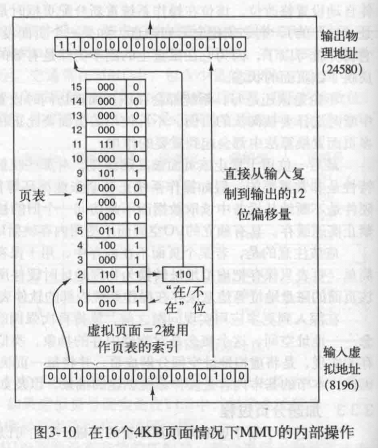

#### 3.3.2 页表

- 虚拟地址被分成虚拟页号（高位部分）和偏移量（地位部分）两部分
- 页表的目的是把虚拟页面映射为页框

- 页表项的结构

  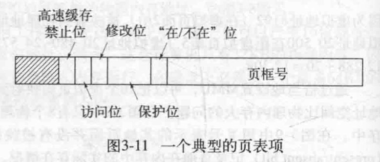

  - 保护位指出一个页允许什么类型的访问。最简单的形式是这个域只有一位，0表示读/写，1表示只读。一个更先进的方法是使用三位，各位分别对应是否启动读、写、执行该页面
  - 在写入一页时由硬件自动设置修改位。该位在操作系统重新分配页框时是非常有用的。如果一个页面已经被修改过，则必须把它写回磁盘。如果一个页面没有被修改过，则只简单地把它丢弃就可以了。这一位有时候也被称为脏位
  - 无论是读还是写，系统都会在该页面被访问时设置访问位。它的值用来帮助操作系统在发生缺页中断时选择要被淘汰的页面。不再使用的页面要比正在使用的页面更适合淘汰。这一位在页面置换算法中会起到重要作用
  - 高速缓存禁止位用于禁止该页面被高速缓存。对那些映射到设备寄存器而不是常规内存的页面而言，这个特性是非常重要的。假如操作系统正在紧张地循环等待某个I/O设备对它刚发出的命令作出响应，保证硬件是不断地从设备中读取而不是访问一个旧的被高速缓存的副本是非常重要的。具有独立的I/O空间而不使用内存映射的机器不需要这一位
  - 应该注意的是，若某个页面不在内存中，用于保存该页面的磁盘地址不是页表的组成部分，原因很简单，操作系统在处理缺页中断时需要把该页面的磁盘地址等信息保存在操作系统内部的软件表格中，硬件不需要它

#### 3.3.3 加速分页过程

- 在任何分页系统中，都需要考虑两个主要问题
  - 虚拟地址到物理地址的映射必须非常快
  - 如果虚拟地址空间很大，页表也会很大

- 转换检测缓冲区

  - 大多数程序总是对少量的页面进行多次访问，而不是相反
  - 为计算机设置一个小型的硬件设备，将虚拟地址直接映射到物理地址，而不必再访问页表。这种设备称为转换检测缓冲区（Translation Lookaside Buffer，TLB），有时又称为相联存储器（associate memory）或快表
  - 它通常在MMU中，包含少量的表项。每个表项纪录了一个页面的相关信息，包括虚拟页号、页面的修改位、保护码和该页所对应的物理页框。另外，还有一位来记录这个表项是否有效

  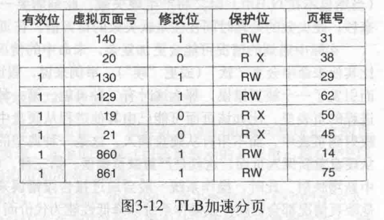
  
  - 将一个虚拟地址放入MMU中进行转换时，硬件首先通过将该虚拟页号与TLB中所有表项同时（即并行）进行匹配，判断虚拟页面是否在其中。如果发现了一个有效的匹配并且要进行的访问操作并不违反保护位，则将页框号直接从TLB中取出而不必再访问页表。如果虚拟页号确实在TLB中，但指令试图在一个只读页面上进行写操作，则会产生一个保护错误，就像对页表进行非法访问一样
  - 如果MMU检测到没有有效的匹配项，就会进行正常的页表查询。接着从TLB中淘汰一个表项，然后用新找到的页表项替代它。当一个页表项被清除出TLB时，将修改位复制到内存中的页表项，而除了访问位，其他的值不变。当页表项从页表中装入TLB时，所有的值都来自内存

#### 3.3.4 针对大内存的页表

- 多级页表

  - 引入多级页表的原因是避免把全部页表一直保存在内存中，特别是那些从不需要的页表就不应该保留

  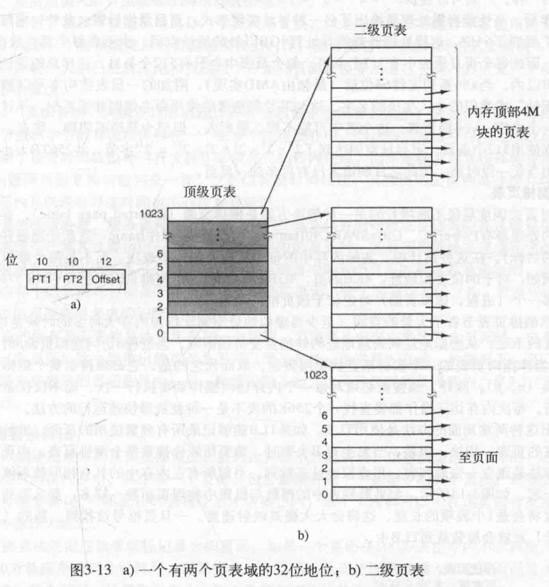

- 倒排页表

### 3.4 页面置换算法

- 所有页面置换算法都存在一个问题：当需要从内存中换出某个页面时，它是否只能是缺页进程自己的页面，这个要换出的页面是否可以属于另外一个进程

#### 3.4.1 最优页面置换算法

#### 3.4.2 最近未使用页面置换算法

- 可以用R位（访问位）和M位（修改位）来构造一个简单的页面置换算法：当启动一个进程时，它的所有页面的两个位都由操作系统设置成0，R位被定期地（比如在每次时钟中断时）清零，以区别最近没有被访问的页面和被访问的页面。当发生缺页中断时，操作系统检查所有的页面并根据它们当前的R位和M位的值，把它们分为4类：
  - 第0类：没有被访问，没有被修改
  - 第1类：没有被访问，已被修改
  - 第2类：已被访问，没有被修改
  - 第3类：已被访问，已被修改

- 需要注意，一个第3类的页面在它的R位被时钟中断清零后就成了第1类
- NRU（Not Recently Used，最近未使用）算法随机地从类编号最小的非空类中挑选一个页面淘汰

#### 3.4.3 先进先出页面置换算法

#### 3.4.4 第二次机会页面置换算法

- 对先进先出做一个简单的修改：检查最老页面的R位，如果R位是0，那么这个页面既老又没有被使用，可以立刻置换掉；如果是1，就将R位清0，并把该页面放到链表的尾端，修改它的装入时间使它就像刚装入的一样，然后继续搜索

#### 3.4.5 时钟页面置换算法

- 把所有的页面都保存在一个类似钟面的环形链表中，一个表针指向最老的页面
- 当发生缺页中断时，算法首先检查表针指向的页面，如果它的R位是0就淘汰该页面，并把一个新的页面插入到这个位置，然后把表针前移一个位置；如果R位是1就清除R位并把表针前移一个位置

#### 3.4.6 最近最少使用页面置换算法

- 在缺页中断发生时，置换未使用时间最长的页面，这个策略被称为LRU（Least Recently Used，最近最少使用）
- 使用特殊硬件实现LRU的方法
  - 这个方法要求硬件有一个64位计数器C，它在每条指令执行完后自动加1，每个页表项必须有一个足够容纳这个计算器值的羽。在每次访问内存后，将当前的C值保存到被访问页面的页表项中。一旦发生缺页中断，操作系统就检查所有页表项中计数器的值，找到值最小的一个页面，这个页面就是最近最少使用的页面

#### 3.4.7 用软件模拟LRU

- 一种可能的方案称为NFU（Not Frequently Used，最不常用）算法。该算法将每个页面与一个软件计数器相关联，计算器的初值为0。每次时钟中断后，由操作系统扫描内存中所有的页面，将每个页面的R位加到它的计算器上。这个计数器大体上跟踪了各个页面被访问的频繁程度。发生缺页中断时，则置换计数器最小的页面
- NFU的主要问题是它从来不忘记任何事情。幸运的是，只需对LFU做一个小小的修改就能使它很好地模拟LRU。其修改分为两部分：首先，在R位被加进之前先将计数器右移一位；其次，将R降到计数器最左端的位，而不是最右端的位
- 修改以后的算法称为老化算法。发生缺页中断时，将置换计数器值最小的页面

#### 3.4.8 工作集页面置换算法

- 一个进程当前正在使用的页面的集合称为它的工作集
- 不少分页系统都会设法跟踪进程的工作集，以确保在让进程运行以前，它的工作集就已在内存中了。该方法称为工作集模型，其目的在于大大减少缺页中断率。在进程运行前预先装入其工作集页面也称为预先调页（相对于请求调页）
- TODO

#### 3.4.9 工作集时钟页面置换算法

- TODO

#### 3.4.10 页面置换算法小结

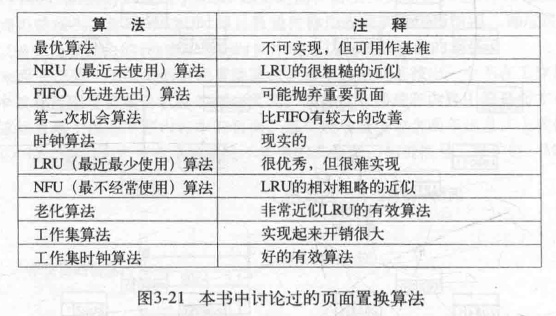

### 3.5 分页系统中的设计问题

#### 3.5.1 局部分配策略与全局分配策略

- TODO

## 第4章 文件系统

### 4.1 文件

#### 4.1.2 文件结构

- 字节序列
  - Unix和Windows都采用这种方法
- 记录序列
- 树

#### 4.1.3

- 普通文件
  - ASCII文件
  - 二进制文件
- 目录
  - 目录是管理文件系统结构的系统文件

- 字符特殊文件
  - 和输入/输出有关，用于串行I/O类设备
- 块特殊文件
  - 用于磁盘类设备

#### 4.1.4 文件访问

- 顺序访问
- 随机访问

### 4.2 目录

#### 4.2.4 目录操作

- 硬链接（hard link）
- 符号链接（symbol link）

### 4.3 文件系统的实现

#### 4.3.1 文件系统布局

- 文件系统存放在磁盘上。多数磁盘划分为一个或多个分区，每个分区中有一个独立的文件系统

- 磁盘的0号扇区称为主引导记录（Master Boot Record， MBR），用来引导计算机。在MBR的结尾是分区表。该表给出了每个分区的起始和结束地址。表中的一个分区被标记为活动分区。在计算机被引导时，BIOS读入并执行MBR。MBR做的第一件事就是确定活动分区，读入它的第一个块，称为引导块（boot block），并执行之。引导块中的程序将装载该分区中的操作系统

  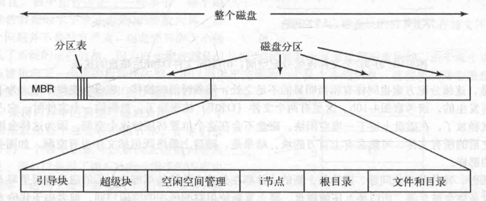

- 超级块（superblock）：包含文件系统的所有关键参数，在计算机启动时，或者在该文件系统首次使用时，超级块会被读入内存。超级块中的典型信息包括：确定文件系统类型用的魔数、文件系统中块的数量以及其他重要的管理信息
- 空闲块空间管理：位图或指针列表
- i节点：这是一个数据结构数组，每个文件一个，i节点说明了文件的方方面面
- 根目录：存放文件系统目录树的根部

#### 4.3.2 文件的实现

- 文件存储实现的关键问题是记录各个文件分别用到哪些磁盘块
- 连续分配
  - 把每个文件作为一连串连续数据块存储在磁盘上
  - 优势：（1）实现简单，记录每个文件用到的磁盘块简化为只需记住两个数字即可，第一块的磁盘地址和文件的块数；（2）读操作性能较好，因为在单个操作中就可以从磁盘上读出整个文件。只需要一次寻找，之后不再需要寻道和旋转延迟。所以，磁盘以全带宽的速率输入
  - 问题：随着时间的推移，磁盘会变得零碎
  - 连续分配在CD-ROM（只读光盘）上被广泛使用，还有DVD、蓝光光盘以及其他一次性写光学介质

- 链表分配
  - 为每个文件构造磁盘块链表，每个块的第一个字作为指向下一块的指针，块的其他部分存放数据
  - 优势：（1）可以充分利用每个磁盘块，不会因为磁盘碎片而浪费存储空间；（2）同样，在目录项中，只需要存放第一块的磁盘地址，文件的其他块就可以从这个首块地址查找到
  - 问题：（1）随机访问相当缓慢；（2）由于指针占去了一些字节，每个磁盘块存储数据的字节数不再是2的整数次幂

- 采用内存中的表进行链表分配
  - 如果取出每个磁盘块的指针字，把它们放在内存的一个表中，就可以解决上述链表的两个不足。内存中的这样一个表格称为文件分配表（File Allocation Table，FAT）
  - 问题：（1）整个块都可以存放数据；（2）随机访问也容易得多
  - 不足：太占用内存

- i节点（i-node）

  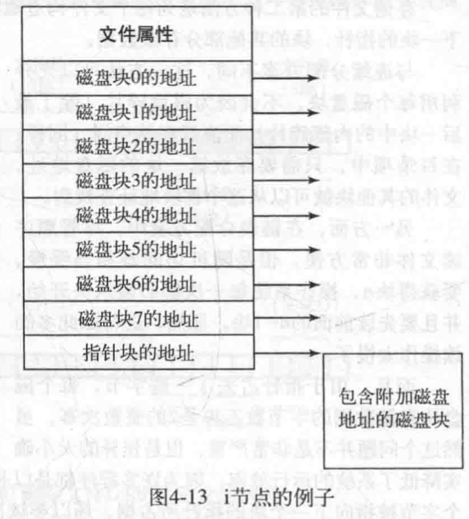

  - 为每个文件赋予一个称为i节点（index-node）的数据结构，其中列出了文件属性和文件块的磁盘地址
  - 优势：节省内存，只有在文件打开时，其i节点才在内存中
  - 问题：如果每个i节点只能存储固定数量的磁盘地址，那么当一个文件所含的磁盘块的数目超出了i节点所能容纳的数目怎么办：一个解决方案是最后一个“磁盘地址”不指向数据块，而是指向一个包含额外磁盘块地址的块的地址，更高级的解决方案是，可以有两个或更多个包含磁盘块地址的块，或者指向其他存放地址的磁盘块的磁盘块

#### 4.3.3 目录的实现

- 在读文件前，必须先打开文件。打开文件时，操作系统利用用户给出的路径名找到相应的目录项。目录项中提供了查找文件磁盘块所需要的信息

- 在何处存放文件属于
  - 一种显而易见的方法是把文件属性直接存放在目录项中
  - 对于采用i节点的系统，还存在另一种方法，即把文件属性存放在i节点中而不是目录项中，在这种情况下，目录项会更短：只有文件名和i节点号

- 如何实现可变长度的文件名

  - 最简单的方法是给予文件名一个长度限制，典型值为255个字符。这种处理很简单，但是浪费了大量的目录空间

  - 每个目录项有一个固定部分，这个固定部分通常以目录项的长度开始，后面是固定格式的数据，通常包括所有者、创建时间、保护信息以及其他属性。这个固定长度的头的后面是一个任意长度的实际文件名。为了使每个目录项从字的边界开始，每个文件名被填充成整数个字，如下图：

    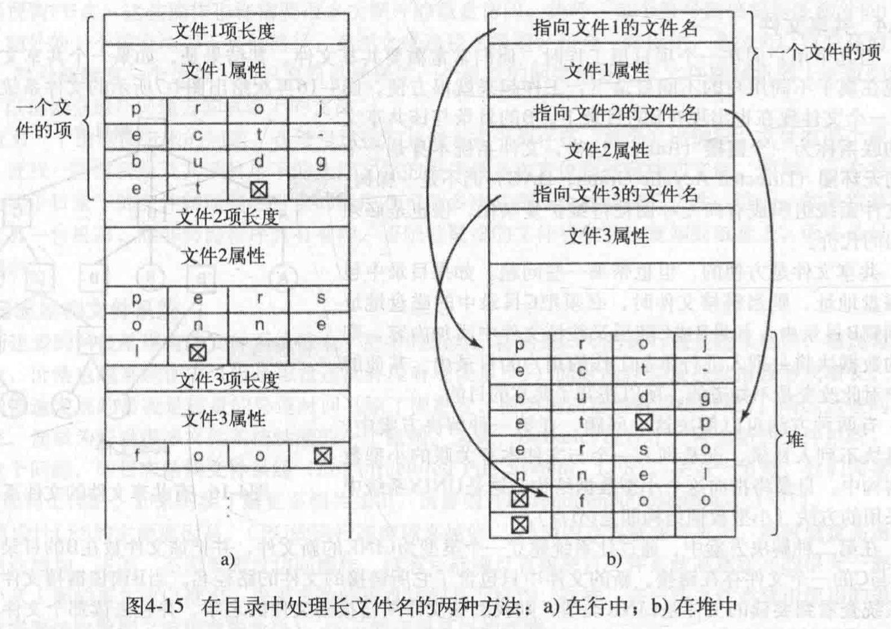

    - 问题：（1）这种方法的缺点是，当移走文件后，就引入了一个长度可变的空隙，而下一个进来的文件不一定正好适合这个空隙，由于整个目录在内存中，所以只有对目录进行紧凑操作才可节省空间；（2）一个目录项可能会分布在多个页面上，在读取文件名时可能发生缺页中断

  - 使目录项自身都有固定长度，而将文件名放置在目录后面的堆中

    - 优点：（1）当一个文件目录项被移走后，另一个文件的目录项总是可以适合这个空隙；（2）文件名不再需要从字的边界开始

- 加速文件名查询
  - 在每个目录中使用散列表
  - 将查找结果存入高速缓存，在开始查找之前，先查看文件名是否在高速缓存中。如果是，该文件可以立即定位。当然，只有在查询目标集中在相对小范围的文件集合的时候，高速缓存的方案才有效果

#### 4.3.4 共享文件

- 当几个用户同在一个项目里工作时，他们常常需要共享文件。其结果是，如果一个共享文件同时出现在属于不同用户的不同目录下，工作起来就很方便

- 共享文件是方便的，但也带来一些问题。如果目录中包含磁盘地址，则当链接文件时，必须把C目录中的磁盘地址复制到B目录中如果B或C随后又往该文件中添加内容，则新的数据块将只列入进行添加工作的用户的目录中。其他的用户对此改变是不知道的，所以违背了共享的目的。有两种方法可以解决这一问题：

  - 磁盘块不列入目录，而是列入一个与文件本身关联的小型数据结构中，目录将指向这个小型数据结构。这是Unix系统中所采用的方法，小型数据结构即是i节点。这种方法的问题如下图所示：

    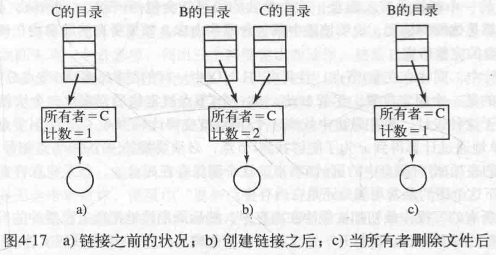

  - 让系统建立一个类型为LINK的新文件，并把该文件放在B的目录下，使得B与C的一个文件存在链接。新的文件中只包含了它锁链接的文件的路径名。当B读该链接文件时，操作系统查看到要读的文件是LINK类型，则找到该文件所链接的文件的名字，并且去读那个文件。这一方法称为符号链接（symbolic linking）。这种方法不存在上述问题，因为只有真正的文件所有者才有一个指向i节点的指针。链接到该文件上的用户只要路径名，没有指向i节点的指针。当文件所有者删除文件时，该文件被销毁。以后若试图通过符号链接访问该文件将导致失败，因为系统找不到该文件。符号链接方法的问题是：（1）需要额外的开销，必须读取包含路径的文件，然后要一个部分一个部分地扫描路径，直到找到i节点，这些操作也需要很多次额外的磁盘访问；（2）此外，每个符号链接都需要额外的i节点，以及额外的一个磁盘块用于存储路径；（3）如果允许链接，文件有两个或多个路径，查找一指定目录及其子目录下的全部文件的程序将多次定位到被链接的文件

#### 4.3.5 日志结构文件系统

- 日志结构文件系统（Log-structured File System，LFS）。促使设计LFS的主要原因
  - 未来多数的磁盘访问是写操作
  - 在大多数文件系统中，写操作往往都是零碎的

- 出于上述原因，LFS的设计者决定重新实现一种Unix文件系统，该系统即使面对一个大部分由零碎的随机写操作组成的任务，同样能够充分利用磁盘的带宽
- LFS基本思想是将整个磁盘结构化为一个日志。每隔一段时间，或是有特殊需要时，被缓冲在内存中的所有未决的写操作都被放到一个单独的段中，作为在日志末尾的一个邻接段写入磁盘。这个单独的段可能会包含i节点、目录块、数据块或者都有。每一个段的开始都是该段的摘要，说明该段中都包含哪些内容。如果所有的段平均在1MB左右，那么就几乎可以利用磁盘的完整带宽

- TODO

#### 4.3.6 日志文件系统

- TODO

#### 4.3.7 虚拟文件系统

- 即使在同一台计算机上或在同一个操作系统下，都会使用很多不同的文件系统

- 绝大多熟Unix操作系统都使用虚拟文件系统（VFS）概念尝试将多种文件系统统一成一个有序的结构。关键的思想就是抽象出所有文件系统都共有的部分，并且将这部分代码放在单独的一层，该层调用底层的实际文件系统来具体管理数据，如图：

  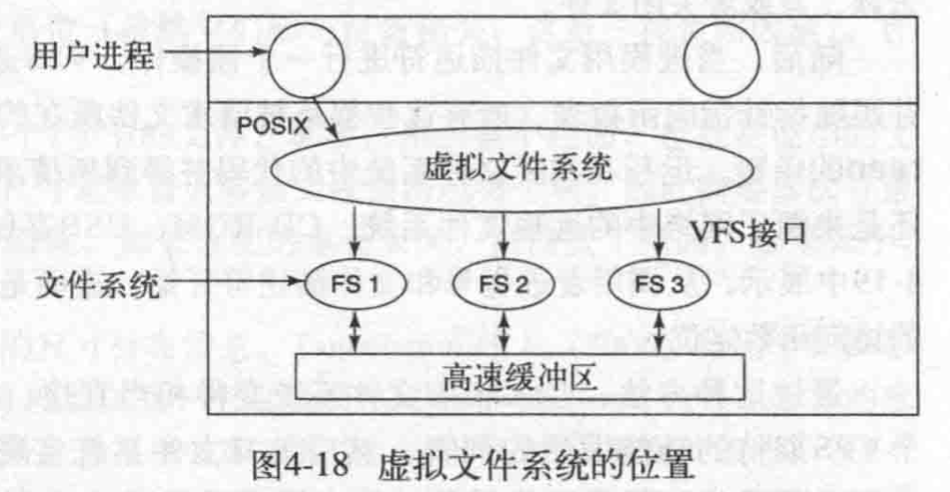
  - VFS对用户进程有一个上层接口，它就是著名的POSIX接口
  - VFS也有一个对于实际文件系统的下层接口，这个接口包含许多功能调用，这样VFS可以使每一个文件系统完成任务。因此，当创造一个新的文件系统和VFS一起工作时，新文件系统的设计者就必须确定它提供VFS所需要的功能调用
  - 大多数VFS应用本质上都是面向对象的，有几种通常支持的主要的对象类型，包括超块（描述文件系统）、v节点（描述文件）和目录。这些中的每一个都有实际文件系统必须支持的相关操作。另外，VFS有一些供它自己使用的内部数据结构，包括用于跟踪用户进程中所有打开文件的装载表和文件描述符的数组
  - VFS是如何工作的：（1）当装载一个文件系统时，不管在启动时还是在操作过程中，他们必须在VFS中注册。当一个文件系统注册时，它做的最基本的工作就是提供一个包含VFS所需要的函数地址的列表。因此，只要一个文件系统在VFS注册，VFS将知道如何从它那里读一个块；（2）当解析路径时，如`/usr/include/unistd.h`，VFS看到该文件系统被装载在/usr，并且通过搜索已经装载文件系统的超块表来确定它的超快；（3）做完这些，它可以找到它所装载的文件的根目录，在那里查找路径include/unistd.h；（4）然后VFS创建一个v节点并调用实际文件系统，以返回所有的在文件i节点中的信息。这些信息和其他信息一起复制到v节点中（在内存中），而这些所谓其他信息中最重要的是指向包含调用v节点操作的函数表的指针，比如read、write和close等；（5）当v节点被创建以后，为了进程调用，VFS在文件描述符表中创建一个表项，并且将它指向新的v节点；（6）最后，VFS向调用者返回文件描述符，所以调用者可以用它去读、写或者关闭文件；（7）随后，当进程用文件描述符进行一个读操作，VFS通过进程表和文件描述符确定v节点的位置，并跟随指针指向函数表，这样就调用了处理read的函数，运行在实际文件系统中的代码并得到所请求的块。VFS并不知道数据是来源于本地硬盘，还是来源于网络中的远程文件系统、CD-ROM、USB存储或者其他介质

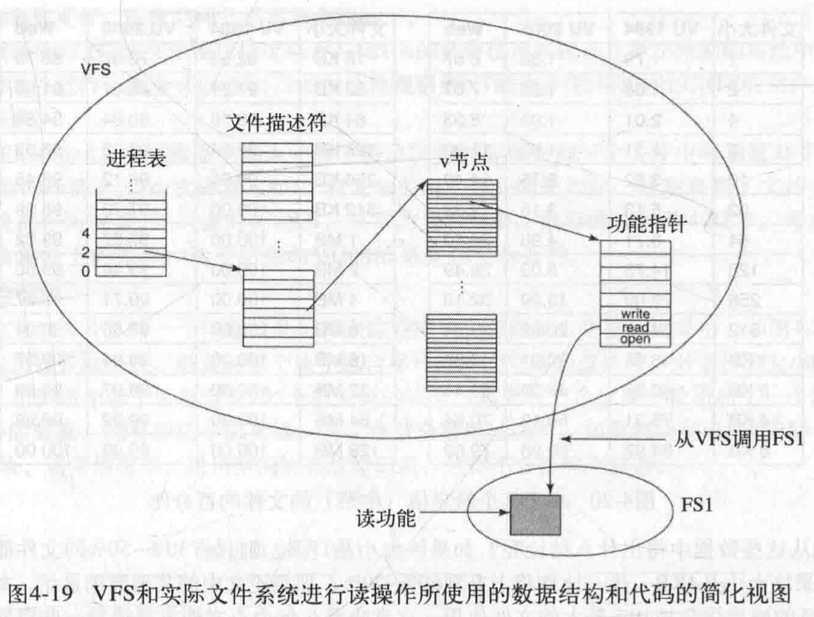

### 4.4 文件系统管理和优化

#### 4.4.1 磁盘空间管理

- 块大小

- 记录空闲块

  - 链表

    - 如果空闲块倾向于成为一个长的连续分块的话，则空闲链表可以改成记录连续分块而不是单个的块；在另一方面，如果磁盘产生了很严重的碎片，记录连续分块会比记录单独的块效率要低，因为不仅要存储地址，而且还要存储计数

    - 只需要在内存中保存一个指针块。当文件创建时，所需的块从指针块中取出。现有的指针块用完时，从磁盘中读入一个新的指针块。类似地，当删除文件时，其磁盘块被释放，并添加到内存的指针块中。当这个块填满时，就把它写入磁盘

    - 在某些特定的情形下，这个方法会产生不必要的磁盘I/O。具体来说，当指针块几乎为空时，一系列短期的临时文件就会引起大量的磁盘I/O。一个可以避免过多磁盘I/O的替代策略是，拆分满了的指针块。这里的思想是：保持磁盘上的大多数指针块为满的状态（减少磁盘的使用）但在内存中暴露一个半满的指针块，这样，它可以既处理文件的创建又同时保留处理文件的删除操作，而不会为空闲表进程磁盘I/O

      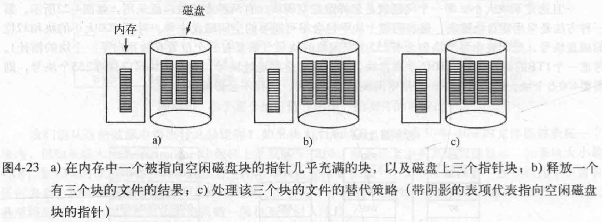

  - 位图

    - 在内存中只保留一个块是有可能的，只有在该块满了或空了的情形下，才到磁盘上取另一块。这样处理的附加好处是，通过在位图的单一块上进行所有的分配操作，磁盘块会较为紧密地聚集在一起，从而减少了磁臂的移动。由于位图是一种固定大小的数据结构，所以如果内核是（部分）分页的，就可以把位图放在虚拟内存内，在需要时将位图的页面调入

- 磁盘配额

#### 4.4.2 文件系统备份

- 做磁带备份主要是处理好两个潜在问题中的一个
  - 从意外的灾难中恢复
  - 从错误的操作中恢复
    - Windows的回收站

- TODO

#### 4.4.3 文件系统的一致性

- TODO

#### 4.4.4 文件系统的性能

- 高速缓存
  - 最常用的减少磁盘访问次数技术是块高速缓存或者缓冲区高速缓存
  - 由于在高速缓存中有许多块，所以需要有某种方法快速确定所需要的块是否存在。常用方法是将设备和磁盘地址进行散列操作，然后，在散列表中查找结果

- 块提前读
- 减少磁臂运动
  - 把有可能顺序访问的块放在一起，当然最好是在同一个柱面上，从而减少磁臂的移动次数

#### 4.4.5 磁盘碎片整理

- TODO

### 4.5 文件系统实例

- TODO

## 第5章 输入/输出

### 5.1 I/O硬件原理

#### 5.1.1 I/O设备

- 块设备
  - 块可寻址
  - 硬盘、蓝光光盘、USB盘
- 字符设备
  - 不可寻址
  - 打印机、网络接口、鼠标

- 其它
  - 时钟
  - 显示器

#### 5.1.2 设备控制器

- I/O设备一般由机械部件和电子部件两部分组成
- 电子部件称作设备控制器（device controller）或适配器（adapter），在个人计算机上，它经常以主板上的芯片的形式出现，或者以插入（PCI）扩展槽中的印刷电路板的形式出现
- 控制器的任务是把串行的位流转换为字节块，并进行必要的错误校正工作。字节块通常首先在控制器内部的一个缓冲区中按位进行组装，然后再对校验和进行校验并证明字节块没有错误后，再将它复制到主存中

#### 5.1.3 内存映射I/O

- 每个控制器有几个寄存器用来于CPU进行通信。通过写入这些寄存器，操作系统可以命令设备发送数据、接收数据、开启或关闭，或者指向某些其他操作。通过读取这些寄存器，操作系统可以了解设备的状态，是否准备好接收一个新的命令等
- 除了这些控制寄存器以外，许多设备还要一个操作系统可以读写的数据缓冲区
- CPU如何与设备的控制寄存器和数据缓冲区进行通信，存在两个可选的方法：
  - 每个控制寄存器被分配一个I/O端口号，所有I/O端口号形成I/O端口空间，并且受到保护使得普通的用户程序不能对其进行访问。使用一条特殊的I/O指令，例如`IN REG, PORT`，CPU可以读取控制寄存器PORT的内容并将结构存入到CPU寄存器REG中
  - 将所有控制寄存器映射到内存空间中。每个控制寄存器被分配唯一的一个内存地址，并且不会有内存被分配到这一地址。这样的系统称为内存映射I/O（memory-mapped I/O）

- 这些方案实际上是怎样工作的：
  - 当CPU想要读入一个字的时候，不论是从内存中读还是从I/O端口中读入，它都将需要的地址放到总线的地址线上，然后在总线的一条控制线上置起一个READ信号。还要用到第二条信号线来表明需要的是I/O空间还是内存空间
  - 如果只有内存空间，那么每个内存模块和每个I/O模块都会将地址线和它所服务的地址范围进行比较，如果地址落在这一范围内，它就会响应请求

- 内存映射I/O的优点
  - I/O设备驱动程序可以完全由C语言编写。如果不使用内存映射I/O，就要用到某些汇编代码
  - 不需要特殊的保护机制来组织用户进程执行I/O操作。操作系统要做的全部事情只是避免把包含控制寄存器的那部分地址空间放入任何用户的虚拟地址空间之中。更为有利的是，如果每个设备在地址空间的不同页面上拥有自己的控制寄存器，操作系统之遥简单地通过在其页表中包含期望的页面就可以让用户控制特定的设备而不是其他设备。这样的方案可以使不同的设备驱动程序放置在不同的地址空间中，不但可以减小内核的大小，而且可以防止驱动程序之间相互干扰
  - 可以引用内存的每一条指令也可以引用控制寄存器。如果不是内存映射I/O，那么必须首先将控制寄存器读入CPU，然后再执行相应的指令

- 内存映射I/O的缺点

  - 对一个设备控制寄存器进行高速缓存可能是灾难性的。为了避免这一情形，硬件必须能够针对每个页面有选择性地禁用高速缓存，操作系统必须管理选择性高速缓存，所以这一特性为硬件和操作系统两者增添了额外的复杂性

  - 所有的内存模块和所有的I/O设备都必须检查所有的内存引用，以便了解由谁做出响应。如果计算机具有单一总线，那么让内存模块和I/O设备查看每个地址是简单易行的。然而，对于具有单独的内存总线的现代个人计算机来说，必须采取特殊的措施使内存映射I/O工作在具有多总线的系统上，如图

    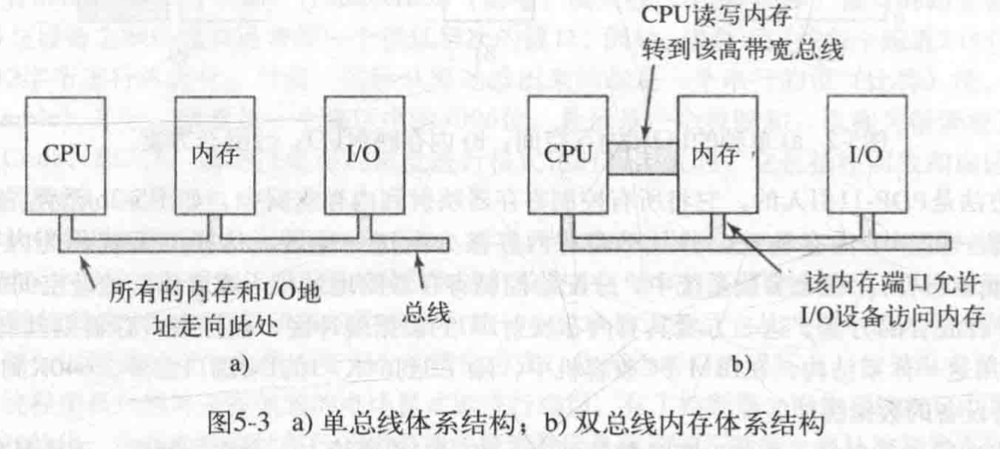

#### 5.1.4 直接存储器存取

- 无论一个CPU是否具有内存映射I/O，它都需要寻址设备控制器以便与他们交换数据。CPU可以从I/O控制器每次请求一个字节的数据，但是这样做浪费CPU的时间，所以经常用到一种称为直接存储器存取（Direct Memory Access，DMA）的不同方案
- 只有硬件具有MDA控制器时操作系统才能使用DMA，而大多数系统都有DMA控制器。有时DMA控制器集成到磁盘控制器和其他控制器之中，但是这样的设计要求每个设备有一个单独的MDA控制器。更加普遍的是，只有一个MDA控制器可利用（例如，在主板上），由它调控到多个设备的数据传送，而这些数据传送经常是同时发生的
- 物理DMA控制器在物理上处于什么地方，它都能够独立于CPU而访问系统总线。它包括若干个可被CPU读写的寄存器，其中包括一个内存地址寄存器、一个字节计数寄存器和一个或多个控制寄存器。控制寄存器指定要使用的I/O端口、传送方向、传送单位以及在一次突发传送中要传送的字节数

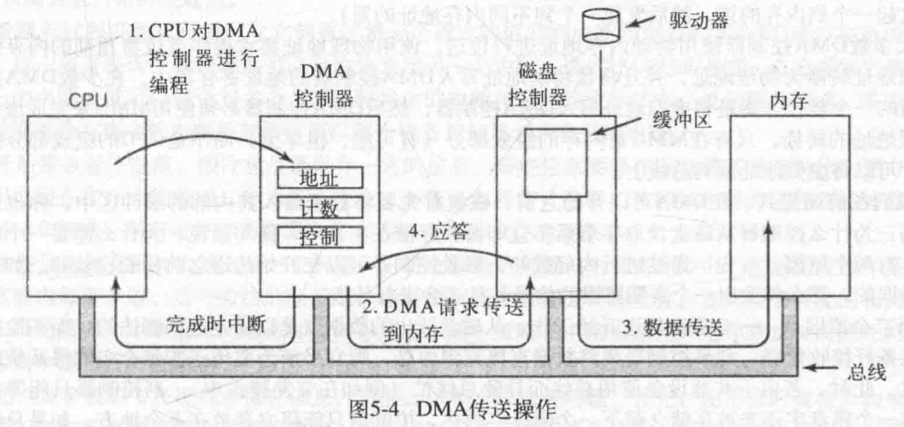

- 没有使用DMA时磁盘如何读
  - 首先，控制器从磁盘驱动器串行地、一位一位地读一个块，直到将整个块信息放入控制器的内部缓冲区中
  - 接着，它计算校验和，以保证没有读错误发生
  - 然后控制器产生一个中断
  - 当操作系统开始运行时，它重复地从控制器的缓冲区中一次一个字节或一个字地读取该块的信息，并将其存入内存中

- 使用DMA时磁盘如何读
  - 首先，CPU通过设置DMA控制器的寄存器对它进行编程，所以DMA控制器知道将什么数据传送到什么地方
  - DMA控制器向磁盘控制器发出一个命令，通知它从磁盘读数据到其内部的缓冲区中，并且对检验和进行检验
  - DMA控制器通过在总线上发出一个读请求到磁盘控制器而发起DMA传送。一般情况下，要写的内存地址在总线的地址线上，所以当磁盘控制器从其内部缓冲区中读取下一个字的时候，它知道将该字写到什么地方
  - 当写操作完成时，磁盘控制器在总线上发出一个应答信号到DMA控制器。于是，DMA控制器步增要使用的内存地址，并且步减字节技术。如果字节计数仍然大于0，则继续，知道字节计算到达0
  - DMA控制器中断CPU以便让CPU知道传送现在已经完成了。当操作系统开始工作时，用不着将磁盘复制到内存中，因为它已经在内存中了

- TODO
- 大多数DMA控制器使用物理内存地址进行传送
- TODO

#### 5.1.5 重温中断

- 精确中断：将机器保留在一个明确状态的中断。精确中断具有4个特性
  - PC保存在一个已知的地方
  - PC所指向的指令之前的所有指令已经完全执行
  - PC所指向的指令之后的所有指令都没有指执行
  - PC所指向的指令的执行状态是已知的

## 第6章 死锁

### 6.1 资源

#### 6.1.1 可抢占资源和不可抢占资源

- 可抢占资源：可以从拥有它的进程中抢占而不会产生任何副作用

- 不可抢占资源：再在不引起相关的计算失败的情况下，无法把它从占有它的进程处抢占过来

### 6.2 死锁简介

- 死锁的规范定义：如果一个进程集合中的每个进程都在等待只能由该进程集合中的其它进程才能引发的事件，那么，该进程集合就是死锁的

#### 6.2.1 资源死锁的条件

- 互斥条件：每个资源要么已经分配给了一个进程，要么就是可用的
- 占有和等待条件：已经得到了某个资源的进程可以再请求新的资源
- 不可抢占条件
- 环路等待条件

#### 6.2.2 死锁建模

- 资源分配图：有向图
- 有四种处理死锁的策略
  - 忽略该问题
  - 检测死锁并恢复
  - 仔细对资源进行分配，动态地避免死锁
  - 通过破坏引起死锁的四个必要条件之一，防止死锁的产生

### 6.3 鸵鸟算法

- 把头埋到沙子里，假装根本没有问题发生

### 6.4 死锁检测和恢复

#### 6.4.1 每种类型一个资源的死锁检测

- 判断资源分配图（有向图）是否存在环

#### 6.4.2 每种类型多个资源的死锁检测

- 死锁检测算法如下
  - 寻找一个没有标记的进程$P_i$，对于它而言R矩阵的第i行向量小于或等于A
  - 如果找到了这样的一个进程，那么将C矩阵的第i行向量加到A上，标记该进程，并转到第1步
  - 如果没有找到这样的进程，那么算法终止。算法结束时，所有没有标记过的进程都是死锁进程

#### 6.4.3 从死锁中恢复

- **利用抢占恢复**
  - 在不通知原进程的情况下，将某一资源从一个进程强行取走给另一个进程使用，接着又送回，这种做法是否可行主要取决于该资源本身的特性。用这种方法恢复通常比较困难或者说不太可能。若选择挂起某个进程，则在很大程度上取决于哪一个进程拥有比较容易收回的资源

- **利用回滚恢复**
  - 周期性地对进程进行checkpoint，该checkpoint中包括存储映像资源状态，还包括资源状态，即哪些资源分配给了该进程

- **通过杀死进程恢复**
  - 一种方法是杀死一个环中的进程
  - 另一种方法是选一个环外的进程作为牺牲品以释放该进程的资源

### 6.5 死锁避免

#### 6.5.1 资源轨迹图

- 两个进程的资源轨迹图

  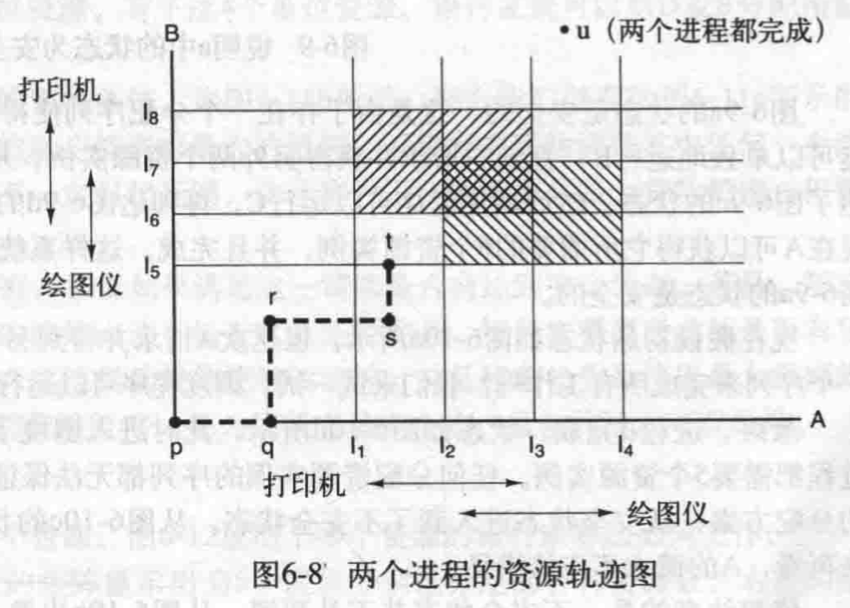

#### 6.5.2 安全状态和不安全状态

- 安全状态：如果没有死锁发生，并且即使所有进程突然请求对资源的最大需求，也仍然存在某种调度次序能够使得每一个进程运行完毕

- 安全状态和不安全状态的区别是：从安全状态出发，系统能够保证所有进程都完成，而从不安全状态出发，就没有这样的保证

#### 6.5.3 单个资源的银行家算法

- 算法要做的是判断对请求的满足是否会导致进入不安全状态。如果是，就拒绝请求，如果满足请求后系统仍然是安全的，就予以分配

#### 6.5.4 多个资源的银行家算法

- 类似于每种类型多个资源的死锁检测算法

### 6.6 死锁预防

#### 6.6.1 破坏互斥条件

- 避免分配那些不是绝对必需的资源，尽量做到尽可能少的进程可以真正请求资源

#### 6.6.2 破坏占有并等待条件

- 一种实现方法是规定所有进程在开始执行前请求所需的全部资源
- 另一种方法是，要求当一个进程请求资源时，先暂时释放其当前所占用的所有资源，然后再尝试一次获得所需的全部资源

#### 6.6.3 破坏不可抢占条件

- 一些资源可以通过虚拟化的方式来避免

#### 6.6.4 破坏环路等待条件

- 保证每一个进程在任何时刻只能占用一个资源，如果要请求另一个资源，它必须先释放第一个资源

- 另一种方法是将所有资源统一编号，规则是：进程可以在任何时刻提出资源请求，但是所有请求必须按照资源编号的顺序（升序）提出。按此规则，资源分配图中肯定不会出现环
  - 该算法的一个变种是取消必须按升序请求资源的限制，而仅仅要求不允许进程请求比当前所占有资源编号低的资源

### 6.7 其它问题

#### 6.7.1 两阶段加锁

#### 6.7.2 通信死锁

#### 6.7.3 活锁

- 活锁的例子

  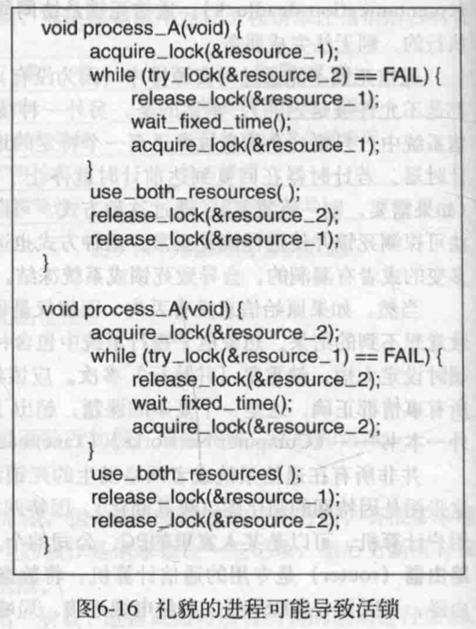

#### 6.7.4 饥饿

## 第7章 虚拟化和云

### 7.2 虚拟化的必要条件

- 虚拟机管理程序需要在以下三个维度上有良好的表现
  - 安全性：虚拟机管理程序应完全掌控虚拟资源
  - 保真性：程序在虚拟机上执行的行为应与在裸机上相同
  - 高效性：虚拟机中运行的大部分代码应不受虚拟机管理程序的干涉

### 7.3 第一类和第二类虚拟机管理程序

- 第一类虚拟机管理程序：运行在裸机上
- 第二类虚拟机管理程序：依赖于底层操作系统提供的服务和抽象

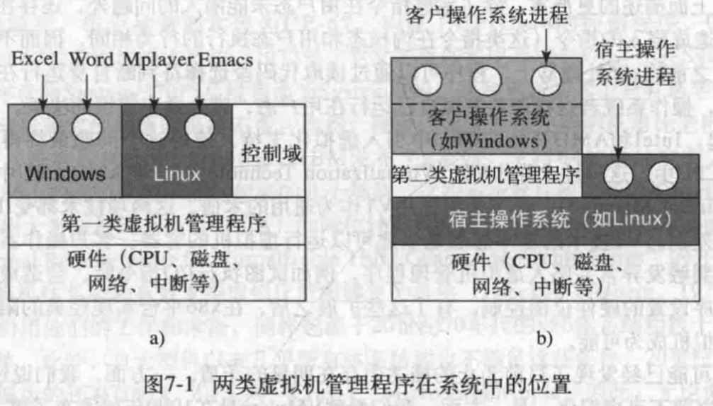

## 第10章 实例研究

### 10.2 Linux简介

#### 10.2.5 内核结构

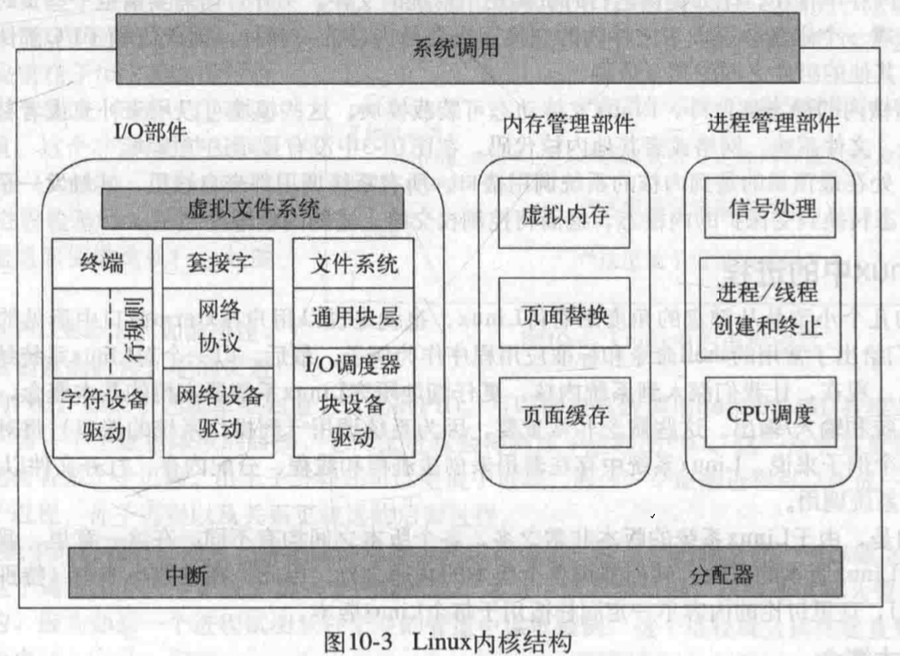

### 10.3 Linux中的进程

#### 10.3.3 Linux中进程与线程的实现

- `pid = clone(function, stack_ptr, sharing_flags, arg)`
  - 调用这个函数可以在当前进程或新的进程中创建一个新线程，具体依赖于参数sharing_flags
  - 如果新线程在当前进程中，它将与其它已存在的线程共享地址空间，任何一个线程对地址空间做出修改对于同一进程中的其它线程而言都是立即可见的；另一种情况，如果地址空间不是共享的，新线程会获得地址空间的完整副本，但是新线程对这个副本进行的修改对于旧的线程来说是不可可见
  - 新线程都从function处开始执行，并以arg作为唯一的参数
  - 同时，新线程还拥有私有堆栈，其中私有堆栈的指针被初始化为stack_ptr

- sharing_flags位图中的各个位

  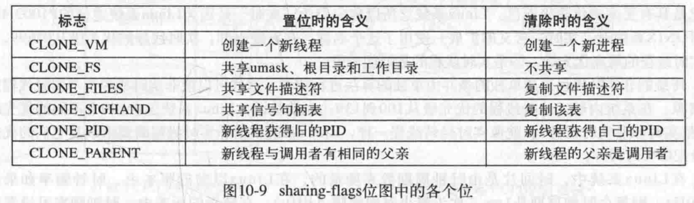

#### 10.3.4 Linux中的调度

- Linux系统的线程是内核线程，所以Linux系统的调度是基于线程的，而不是基于进程的
- 为了进行调度，Linux系统将线程区分为三类
  - **实时先入先出：**具有最高的优先级，它不会被其它线程抢占，除非那是一个刚刚准备好的、拥有更高优先级的实时先入先出线程
  - **实时轮转：**每个实时轮转线程都有一个时间量，时间到了之后就可以被抢占。实时线程的优先级从0到99
  - **分时：**传统的非实时线程形成单独的类并由单独的算法进行调度，这样可以使非实时线程不与实时线程竞争资源。优先级从100到139

- 在Linux系统中，时间片是由时钟周期数来衡量的

- Linux系统为每个线程分配一个nice值，范围从-20到+19，默认值是0。这个值决定了线程的静态优先级

- Linux调度队列和优先级队列

  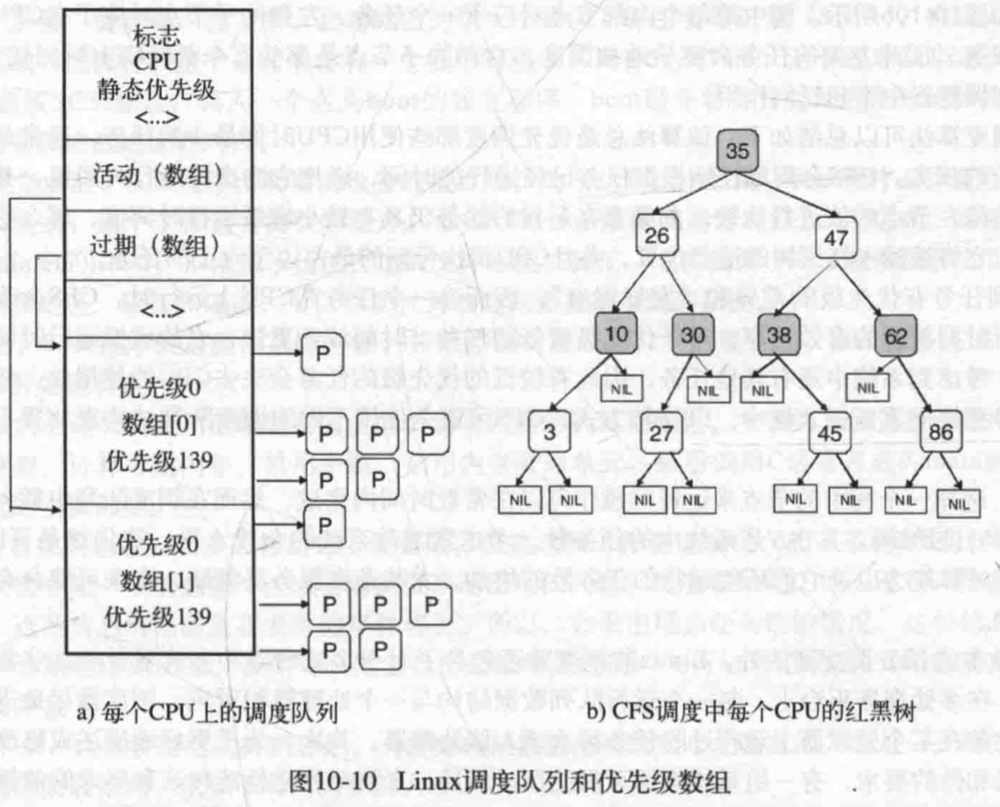

- **Linux O(1)调度器**
  - 在O(1)调度器里，调度队列被组织成两个数组，一个是任务正在活动的数组，一个是任务过期失效的数组。每个数组包含了140个链表头，每个链表具有不同的优先级。链表头指向给定优先级的双向进程链表
  - 调度器从正在活动数组中选择一个优先级最高的任务。如果这个任务的时间片过期失效了，就把它移动到过期失效数组中（可能会插入到优先级不同的列表中）。当正在活动数组中没有其他的任务了，调度器交换指针，使得正在活动数组变为过期失效数组，过期失效数组变为正在活动数组。这种方法可以保证低优先级的任务不会被饿死（除非实时先入先出线程完全占用CPU，但是这种情况是不会发生的）
  - 不同的优先级被赋予不同的时间片长度，高优先级的进程拥有较长的时间片
  - 由于实现不知道一个任务究竟是IO密集型的，还是CPU密集型的，它只是依赖于连续保持的交互启发式方法。通过这种方式，Linux系统区分静态优先级和动态优先级。线程的动态优先级不断地被重新计算，其目的在于：（1）奖励交互进程；（2）惩罚占用CPU的进程
  - O(1)调度器的缺点是，利用启发式方法来确定一个任务的交互性，会使该任务的优先级复杂且不完善，从而导致在处理交互任务时性能很糟糕

- **完全公平调度器（CFS）**
  - CFS的主要思想是使用一棵黑红树作为调度队列的数据结构，根据任务在CPU上运行的时间长短而将其有序地排列在树中，这种时间称为虚拟运行时间。CFS采用ns级的粒度来说明任务的运行时间
  - CFS调度算法可以总结如下，该算法总是优先调度那些使用CPU时间最少的任务，通常是在树中最左边节点上的任务。CFS会周期性地根据任务已经运行的时间，递增它的虚拟运行时间值，并将这个值与树中当前最左节点的值进行比较，如果正在运行的任务仍具有较小虚拟运行时间值，那么它将继续运行，否则，它将被插入黑红树的适当位置，并且CPU将执行新的最左边节点上的任务
  - 考虑到任务有优先级的差异和nice程度，因而当一个任务在CPU上运行时，CFS会改变该任务的虚拟运行时间流逝的有效速率。对于优先级较低的任务，时间流逝更快，它的虚拟运行时间也将增加得更快。以这种方式，CFS可避免使用不同的调度队列结构来放置不同优先级的任务